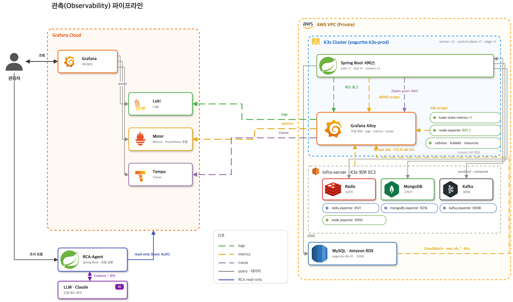

<div align="center">

# rca-agent

**장애 원인 분석을 자동화한 Spring AI 기반 RCA(Root Cause Analysis) 에이전트**

자연어 질문 하나로 Grafana 스택(Tempo · Loki · Mimir)의 트레이스 · 로그 · 메트릭을 뒤져
장애 구간을 찾고, 근거 · 확신도 · 반증 데이터가 붙은 원인 후보를 내놓습니다.


개인 프로젝트 · 1인 개발 · 2026.07 ~ 08

</div>

---

## 한눈에

운영 중인 3-서비스 MSA(사용자/인증 · 채팅/알림 · 컨텐츠, K3s on AWS)에 Grafana Tempo · Loki · Mimir 관측
환경을 직접 구축하고, 그 위에서 **LLM이 장애 원인을 찾게 하는 에이전트**를 만들었습니다.
에이전트를 만드는 것만큼 **성능을 측정 가능하게 만드는 것**이 이 프로젝트의 목적입니다.
그래서 **12종의 장애를 직접 주입**하고, 정답 기준을 주입 **전에** 박제한 뒤 **블라인드로 채점**해
그 숫자로 다음에 무엇을 고칠지 정했습니다.

```
자연어 질문 → [탐색] 장애 구간 · 사건 후보 → [분석] Trace · Log · Metric 수집 → Evidence 정제 → LLM 분석 → 원인 · 근거 · 조치
```

| 지표 | 결과 | 비고 |
|---|---|---|
| **RCA 정확도** (11문항 실행 평균) | **72점 → 95점** | 최대 개선 문항 **4 → 100점** (에러 없는 지연 장애) |
| **조사당 비용** | **33 ~ 47% 절감** | 분석 컨텍스트 토큰 −39 ~ −62% (같은 문항 재실행 실측) |
| 장애 시나리오 | **12종 정의 · 11종 실행** | MongoDB · Kafka · Redis 다운, 컨슈머 전멸, NPE, 유니크 위반, 인증 다운 등 |
| 채점 기준 | **6항목 100점** · 문항당 **N ≥ 2** 반복 | 원인 40 · 근거 25 · 탐색 15 · 영향 10 · 오귀인 5 · 조치 5 |

> 점수의 정의와 인용 규칙은 [§얼마나 잘 하나](#얼마나-잘-하나--장애-주입-블라인드-평가)에,
> 회차별 판정 근거 전문은 [채점 대장](docs/scoring/README.md)에 있습니다.

## 데모

**자연어만으로** 조사합니다. 탐색이 시간창과 대상 서비스를 정하고 분석으로 넘깁니다.

```bash
curl -X POST localhost:8080/diagnose \
  -H 'Content-Type: application/json' \
  -d '{"question":"어젯밤에 댓글 알림이 안 왔어요"}'
```

**대상을 이미 아는 경우**에는 탐색을 건너뛰고 분석만 합니다. 분석 능력만 따로 재거나
과거 회차와 비교할 때 쓰는 경로입니다.

```bash
curl -X POST localhost:8080/investigate \
  -H 'Content-Type: application/json' \
  -d '{"traceId":"4bf92f3577b34da6a3ce929d0e0e4736","question":"왜 알림이 늦었어?"}'
```

모든 조사는 `reports/`에 `.md`(사람용) · `.json`(기계용)으로 남고, 아래 측정치가 함께 기록됩니다.

```
| tokens  | in 42,651 / out 4,950 · cost $0.4234 |
| elapsed | total 79,749ms (tempo 1146 · loki 261 · mimir 355 · llm 77969) |
- trace 24,619B / 30 spans · metrics 3 수집, 누락 1 · context 40,981 chars
```

실제 프로덕션 트레이스 보고서 전문은 **[docs/sample-report.md](docs/sample-report.md)** 에 있습니다.
에이전트는 Kafka 뒤 chat-service `PushDispatcher.dispatch`의 **약 995ms** 를 병목으로 특정하면서,
그 구간이 미계측이라 **로그 부재를 근거로 확신도를 스스로 낮췄습니다.**

## 시스템 구조

### 관측 파이프라인

에이전트가 읽는 데이터는 전부 이 파이프라인에서 옵니다. 에이전트의 상한은 관측 커버리지가 정합니다.



| 층 | 구성 | 역할 |
|---|---|---|
| **애플리케이션** | Spring Boot 3 서비스 (사용자/인증 ×1 · 채팅/알림 ×1 · 컨텐츠 ×2) on **K3s** (worker ×2 · control-plane ×1 · edge ×1) | Brave 계측으로 트레이스, 파드 로그, `/actuator/prometheus` 메트릭 |
| **인프라** | Redis · MongoDB · Kafka (K3s 외부 EC2) · MySQL (Amazon RDS) | 각 exporter(redis · mongodb · kafka · node) + CloudWatch `aws_rds_*` |
| **수집** | **Grafana Alloy** (클러스터 내 수집 허브) | 로그 · 메트릭 · 트레이스를 한 곳에서 받아 Grafana Cloud로 전송, kube-state-metrics · cadvisor · node-exporter scrape |
| **저장 · 조회** | **Grafana Cloud** Loki · Mimir · Tempo | 관리자는 Grafana 대시보드로, **RCA 에이전트는 read-only Basic Auth**로 같은 백엔드를 조회 |
| **분석** | RCA-Agent (Spring Boot, 로컬 실행) + LLM (Claude) | Evidence를 조립해 단일 패스로 분석 |

댓글 작성 한 건이 `notification-publish` → Kafka → chat-service consume → push dispatch까지
**하나의 traceId로** 이어집니다. 비동기 경계에서도 trace context가 전파되는 것을 실측으로 확인했습니다.


zero-code 계측을 노린 OTel Agent 전환을 검토했지만, 대표 흐름 3종(정상 · 에러 · 비동기)의
E2E 트레이스를 비교해 Brave 계측으로도 요건이 충족됨을 확인하고 유지했습니다
([ADR-001](docs/decisions/adr-001-brave-over-otel.md) · 수집 구성 실측 원본은 [monitoring_v16.drawio](docs/monitoring_v16.drawio)).

### 에이전트 구조: 탐색과 분석, LLM 두 번

진입점은 둘이지만 **분석 경로는 하나**입니다. 탐색은 자연어를 `Scope`(시간창 · 대상 서비스 · traceId?)로
바꿔 분석에 넘기는 앞단이고, `POST /investigate`는 같은 `Scope`를 사람이 직접 주는 것입니다.


두 단계는 같은 백엔드를 보지만 **쿼리 종류가 다릅니다.** 탐색은 집계라 12시간 창도 응답이 작고,
분석은 원본이라 좁힌 뒤에만 안전합니다. 넓은 창은 싸게 훑고, 비싼 해상도는 좁힌 구간에만 씁니다.

| 단계 | 누가 정하나 | 들어가는 값 | 나오는 값 | 이 단계만의 실패 |
|---|---|---|---|---|
| (1) 창 파싱 | **코드** | 질문 문자열 · `from`/`to`(있으면 우선) | `TimeWindow` + 해석 근거 | 표현을 못 찾으면 기본 24시간 |
| (2) 스윕 · 후보화 | **코드** | `TimeWindow` | 3채널 집계 + Incident 후보군 | 채널이 죽어도 나머지로 완주 |
| (3) 후보 선택 | **LLM ①** | 후보군 + 도달 요약 + 질문 | `Scope(창 · 서비스 · traceId?)` | 파싱 실패 시 스윕 창을 그대로 씀 |
| (4) 심층 수집 | **코드** | `Scope` | 원본 + 호출 그래프 (접기 · 압축 후) | 소스별 실패를 문자열로 모아 계속 |
| (5) 분석 | **LLM ②** | 컨텍스트 (수집 실패 · 누락이 맨 앞) | 원인 후보 · 확신도 · 반증 · 조치 | - |

**LLM이 구조를 만드는 곳은 (3) 하나뿐입니다.** 탐색 LLM의 출력은 후보 번호 선택이고
시간창 · 서비스명은 선택된 후보에서 코드가 파생합니다. (1)을 LLM에 맡기지 않는 이유는 재현성입니다.
같은 질문이 회차마다 다른 창을 만들면 *"시간창을 맞게 잡았는가"* 를 분석 점수와 분리해서 잴 수 없습니다.

<details>
<summary><b>빈 값과 실패를 어떻게 다루나</b> — 관측 데이터는 정상적으로 비어 있고, "없다"가 곧 신호인 장애가 실재합니다</summary>

| 무엇이 비거나 실패하면 | 어떻게 되나 | 어디에 남나 |
|---|---|---|
| 질문에 시간 표현이 없다 | 지어내지 않고 기본 최근 24시간 | `Triage.timeExpression` |
| 창이 상한 48시간을 넘는다 | **끝을 기준으로** 자른다. 장애는 대개 창의 끝에 가깝다 | 같은 필드에 `(상한 48시간으로 잘림)` |
| 에러 트레이스 검색이 0건 | 실패가 아니라 **신호로 넘긴다**. *"트레이스가 생성되지 않는 장애일 수 있으니 이 사실 자체를 근거로 쓸 것"* | `SurveyResult.failures` → 컨텍스트 맨 앞 |
| LLM이 계획 JSON을 안 준다 | 조사를 멈추지 않고 **스윕 창 전체**를 분석 범위로 쓴다 | `Triage.parsed=false` · `notes` |
| 좁힌 창이 스윕 창을 벗어난다 | 스윕 창 안으로 클램프. 탐색이 근거로 삼은 데이터와 분석이 보는 데이터가 어긋나면 판단 과정을 추적할 수 없다 | `notes`에 원래 창과 잘린 창을 **둘 다** |
| LLM이 없는 서비스 이름을 준다 | 설정에 없는 값은 버린다(`appsPattern`) | 셀렉터가 조용히 0 스트림이 되는 것을 막는다 |
| `traceId`가 `null`이다 | **정상 입력이다.** 트레이스 조회 2개를 건너뛰고 로그 · 메트릭만으로 수집 | `CollectedData.failures` |

마지막 줄이 핵심입니다. 컨슈머가 전멸하면 consume span이 생성되지 않고 파드가 0이면 ingress가
끊겨 트레이스가 아예 없습니다. **`traceId`를 필수로 두면 그런 장애에서 파이프라인이 그 자리에서
끊깁니다.** CH-2 · AU-2가 실제로 그랬고, 둘 다 메트릭 단절만으로 정답에 도달했습니다.
</details>

전체 흐름(단계 A~Z · LLM 두 호출의 경계 · 토큰이 어디서 부풀어 오르나)은 **[docs/workflow.md](docs/workflow.md)**,
실제로 나가는 쿼리 · 컨텍스트 구성 · 리포트 구조는 **[docs/architecture.md](docs/architecture.md)** 에 있습니다.

### 프로젝트 구조

```
rca-agent/
├── src/main/java/com/yogurtte/rca/
│   ├── api/           RcaController — POST /diagnose(자연어) · /investigate(traceId)
│   ├── service/       RcaService — 탐색 → 수집 → 분석 → 리포트 오케스트레이션
│   ├── triage/        탐색 단계
│   │   ├── window/    TimeExpressionParser — "어젯밤" → TimeWindow (코드 · 결정적)
│   │   ├── survey/    Surveyor — Tempo·Loki·Mimir 집계 스윕
│   │   ├── incident/  SignalExtractor · Signal · Incident — 이상 신호를 조사 후보군으로 접기
│   │   └── plan/      SurveyContextAssembler · TriagePlan — 탐색 LLM 입출력
│   ├── collector/     Scope(탐색↔분석의 유일한 계약) · Collector — 선택 범위 원본 수집
│   ├── client/        TempoClient · LokiClient · MimirClient
│   │                  · RawResponseStore — 응답 원본 박제 → 주입 없이 오프라인 재생
│   ├── analyzer/      분석 컨텍스트 조립
│   │                  · ServiceGraphExtractor — span 속성으로 호출 그래프 복원
│   │                  · TraceCompact · LogStackFold · LokiLogDedup — 접기·압축
│   │                  · ContextAssembler · EvidenceExtractor · MetricSummaryProbe
│   ├── llm/           LlmClient — claude-cli(기본) · anthropic · openai 중 하나만 활성
│   │                  · TokenCounter — 오버헤드 프로브 (측정 규칙: docs/round-1-input-tokens.md)
│   ├── time/          시간 표현 도메인 — 별칭·상대 단위·부분일·확신도
│   ├── report/        RcaReport · ServiceGraph · ReportStore — .md(사람용)·.json(기계용)
│   ├── notify/        Notifier — console(기본) · slack · discord
│   └── error/         공통 오류 응답
├── src/test/java/     WireMock 클라이언트 테스트 · fake LLM 전체 흐름 · 저장 응답 재생 도구
├── prompts/           triage-prompt.md · system-prompt.md · review-prompt.md — 조사마다 다시 읽음
├── reports/           조사 산출물 (.md·.json) + raw/ 응답 원본
├── scripts/           run-local.ps1 — .env 로드 후 bootRun · round-N-request.json — 회차별 질문 문안
└── docs/              판단 과정·실측 기록 — docs/README.md에서 시작
    ├── scoring/       채점 대장 · 루브릭 · 대외용 보고서
    ├── round-N/       회차 N에 적용할 변경 대기열 (회차 N-1 조사에서 나온 결함)
    ├── charts/        관측 파이프라인 구조도 · 점수·토큰 차트와 생성 스크립트
    ├── decisions/     ADR — OTel vs Brave · 단일 패스 baseline · LLM provider · 측정 하네스
    └── <문항 ID>/     장애별 회차 기록 (ch-1 · ap-2 · au-4 …)
```

인터페이스는 `LlmClient`와 `Notifier` 둘뿐이고, `@ConditionalOnProperty`로 구현체 하나만 뜹니다.
시스템 프롬프트는 코드가 아니라 `prompts/*.md` 파일이고 **조사할 때마다 다시 읽으므로**
재시작 없이 고치고 리포트의 `promptSource`로 버전별 결과를 비교합니다.

## 얼마나 잘 하나: 장애 주입 블라인드 평가

같은 자(자연어 질문 문안 박제 · 앵커 v2 · 루브릭 v3)로 채점한 세 회차의 문항별 총점과 입력 토큰입니다.


> 차트의 **회차 1 · 2 · 3**은 레포 문서의 **회차 2 · 3 · 5**입니다. 레포의 회차 1은 traceId 입력 · 루브릭 v1이라
> 자가 달라 비교판에 넣지 않고, 회차 4는 2문항만 실행한 프롬프트 단독 검증입니다.

| 회차 (레포) | 변경군 | 11문항 평균 | 무엇이 움직였나 |
|---|---|---:|---|
| 2 | 자연어 입력 전환 · 앵커 v2 · 루브릭 v3 | **72** | 탐색이 처음으로 채점됨. 에러 없는 지연 장애(CH-3)는 **4점** |
| 3 | 조사 도구(B) — Signal→Incident 후보화 · 지연 트레이스 채널 · 스택 수집 · 호출 그래프 | **81** | 채널이 막혔던 문항만 올랐다: CH-3 4 → 85 · AP-2 53 → 88 · AU-2 65 → 85. 90점 이상이던 6문항은 −1.3 |
| 4 | 프롬프트(C) 단독 | (2문항) | 도구를 고정하고 프롬프트만 바꿔 CH-3 85 → 100 · IN-2 98 → 100 |
| 5 | 접기 · 압축(B) — 같은 점수를 더 싸게 | **95** | 컨텍스트가 절반 이하로 줄어도 **점수가 내려간 문항이 없다** |

### 채점 규칙

- **블라인드.** 정답지와 채점 기준은 에이전트가 읽는 경로에 두지 않습니다. 자기 채점은 무효.
  CLI가 레포의 `CLAUDE.md`를 자동 로드하던 오염 경로를 실측으로 확인하고
  **중립 임시 디렉터리에서 실행하도록 차단**했습니다(`31e2a85`).
- **기준 선박제.** 문항별 정답과 만점 · 부분점 · 0점 요건을 주입 **전에** 확정합니다.
  결과를 보고 고치면 그 회차는 무효이고 개정은 다음 회차부터 적용합니다.
- **6항목 채점.** 원인 40 · 근거 25 · **탐색 15** · **영향 10** · 오귀인 5 · 조치 5
  ([루브릭 v3](docs/scoring/rubric-v3.md)). 원인만 맞히고 영향 범위를 틀리거나 탐색에서
  엉뚱한 대상을 고른 경우를 따로 구분해, **운 좋게 맞힌 것과 관측 근거로 도달한 것을 가릅니다.**
- **반복 측정.** 문항당 최소 2회, 평균 ± 최대편차. 편차 ±10 초과면 인용 보류.
  같은 버전 · 같은 장애에서 25점 차가 실제로 났고(AU-4), 이 규칙이 그 사고를 막습니다.
- **변경군 분리.** 앱 계측(A) · 조사 도구(B) · 프롬프트(C)를 한 회차에 섞지 않습니다.
  섞으면 점수가 올라도 무엇 때문인지 증명할 수 없습니다.
- **낮은 점수는 원인을 역추적합니다.** *원본 데이터가 있었나 → 쿼리가 가져왔나 → 수집 · 변환에서
  보존됐나 → 최종 Evidence에 포함됐나 → 그런데도 LLM이 놓쳤나.* 채점자가 백엔드를 직접 쿼리해
  **모델의 문제인지 관측 데이터의 문제인지** 구분합니다.

### 이 점수를 읽을 때 주의할 것

- **회차 1(v0)과 회차 2~(v1)는 자가 다릅니다.** 입력 모델(traceId ↔ 자연어)과 루브릭이 달라
  총점을 나란히 두고 개선/악화라고 말하지 않습니다.
- **회차 2 → 3 → 5 총점은 같은 자로 채점됐지만** 도구 세대 · 조사 창 · 주입이 회차마다 달라
  문항별 델타의 귀속은 각 회차 문서를 따릅니다.
- **N ≥ 2가 성립한 점수만 인용합니다.** CH-2 100 ± 0 · AP-3 97.5 ± 2.5 · AU-4 85.5 ± 2.5 ·
  IN-2 99 ± 1 등. AU-2 회차 2는 65 ± 11로 편차 초과라 인용 보류입니다.
- 비용은 구독 CLI의 **API 환산 추정치**이고 실제 청구액이 아닙니다.
  토큰은 CLI 고정 오버헤드를 회차마다 실측해 뺀 컨텍스트 토큰만 인용합니다
  ([측정 기준](docs/measurement.md) · [오버헤드 실측](docs/round-1-input-tokens.md)).

**측정하지 못한 것이 곧 못한 것은 아닙니다.** 트레이스가 아예 생성되지 않은 장애(AU-2)에서
메트릭 3계열 단절만으로 원인에 도달한 회차가 질적으로는 가장 인상적이었습니다.

## 핵심 문제 해결 사례

각 사례의 전문(상황 → 무엇이 일어났나 → 바꾼 것 → 반증 조건)은 링크 끝의 회차 문서에 있습니다.

### 1. 탐색 구조: 범위를 넓히는 것이 답이 아니었다

조사 창 안에 장애가 있었는데 원인을 못 찾는 문항이 있었습니다. 실제 장애는 05:22:01 ~ 05:22:38에
발생했고, LLM이 분석 범위를 04:57 ~ 05:22로 좁히면서 **장애 발생 1초 전에 탐색이 끝났습니다.**
처음에는 창이 좁은 탓으로 보고 범위를 2.26배 넓혀 재실행했지만 컨텍스트 +72% · 비용 +39%에
점수는 그대로였습니다.

원인은 둘이었습니다. 장애가 에러가 아닌 **23초 지연**이라 `status=error` 중심 트레이스 검색에
안 걸렸고, 메트릭은 5분 순간값이라 짧은 장애가 빠졌습니다. 그리고 분석 대상과 범위를 **LLM이
추정**하고 있어 첫 후보가 틀리면 되돌릴 장치가 없었습니다.

그래서 탐색 방식을 바꿨습니다. 지연 · 에러 트레이스, 임계 이탈 메트릭, 에러 로그 급증 같은
**Signal을 코드가 규칙으로 추출**하고, 같은 흐름에서 시간이 겹치는 신호를 하나의 **Incident 후보**로
묶어 LLM은 후보 중에서 고르기만 합니다. 분석 범위도 선택된 사건의 신호 시간 범위에서 코드가
파생합니다. 그 결과 해당 문항이 **4 → 85점**, 이후 프롬프트 개선으로 **100점**.
→ [docs/round-3/README.md](docs/round-3/README.md) · [ch-3/](docs/ch-3/README.md)

### 2. 관측 데이터 재구성: 필요한 것은 빠지고 같은 것은 두 번 들어왔다

원인을 못 찾은 사례를 하나씩 열어 보니 LLM의 추론 실패보다 **필요한 로그 · 트레이스가 컨텍스트에
도달하지 못한 경우**가 많았습니다. 팔로우 목록 NPE의 실제 원인은 `FollowCondition.java:25`였지만
로그 조회가 ERROR/WARN 헤더 줄만 가져와 예외 종류도 위치도 알 수 없었고, 시간창 조회와 traceId
조회가 같은 로그를 이중으로 실어(traceId 조회분의 약 27%가 중복) 토큰만 쓰고 있었습니다.
트레이스는 span 목록 그대로라 서비스 간 호출 관계를 LLM이 매번 다시 엮어야 했습니다.

`Exception` · `Caused by` · 파일:라인 패턴을 조회 조건에 추가해 스택을 복원하고, 두 조회 경로는
유지하되 합치는 단계에서 timestamp + 내용이 같은 줄만 제거했습니다. 트레이스는 호출 관계를
먼저 복원해 `A → B → 지연/실패` 요약을 앞에 싣고, 호출 대상이 다운돼 span이 없는 경우는 호출한 쪽
WebClient 속성으로 관계를 채웠습니다. 정답이 로그 스택에만 있던 문항이 **53 → 88점**.
→ [docs/round-3/관측개선-통합.md](docs/round-3/관측개선-통합.md)

### 3. 비용 최적화: 컨텍스트를 줄이되 근거는 버리지 않았다

범위를 좁힌 뒤에도 입력 토큰의 98%가 분석 단계에 몰려 있었고 대부분이 로그 · 트레이스였습니다.
조회 창을 17.6% 줄여 봤지만 로그 크기는 거의 안 줄었습니다. 그래서 **기존 리포트가 실제로 인용한
정보**를 역추적해 공급 데이터와 대조했습니다. 스택 트레이스의 라이브러리 내부 프레임이 전체
바이트의 71%인데 인용 0회, 서비스 코드 프레임은 3.7%인데 32회 인용. **토큰을 차지하는 정보와
근거로 쓰이는 정보가 달랐습니다.**

서비스 코드 · 예외 메시지 · 수치는 그대로 두고 반복되는 라이브러리 프레임만 `… N frames`로
접었습니다. 완전 동일한 반복 로그는 한 건 + 횟수 · 시간 범위 · 평균 간격으로, 숫자만 다른 근사
반복은 첫 발생과 마지막 발생을 원문으로 보존했습니다. 트레이스는 OTLP 중첩 구조를 key-value로
펴고 span 간 공통 속성을 한 블록에 한 번만 썼습니다. 탐색 단계에서는 집계 원본 JSON(탐색
컨텍스트의 94%)을 빼도 후보 선택 결과가 같음을 A/B로 확인하고 요약만 전달합니다.

| 개선 | 결과 | 검증 |
|---|---|---|
| 로그 접기 | **−57.0%** | 저장된 Loki 응답 112건 · 스택 많은 응답은 최대 약 83% |
| 트레이스 압축 | **−30.0%** | 저장된 트레이스 238건 · 1,992 span |
| 탐색 원본 제외 | **−82.8%** (탐색 컨텍스트) | 원본 포함/제외 두 조건에서 후보 선택 동일 |
| 조사당 비용 | **−33 ~ −47%** | 같은 문항 재실행 (AP-3 −33.1% ~ AP-1 −47.0%) · 점수 하락 문항 0 |

→ [docs/round-5/토큰개선.md](docs/round-5/토큰개선.md)

### 4. 기술 도입 전 실익 검증: OTel Agent 전환을 검토하고 유지를 택했다

Kafka 구간의 트레이스가 끊기는 것을 보고 OTel Agent 전환을 검토했습니다. 판단 근거를 만들기 위해
정상 · 에러 · 비동기 대표 흐름 3종의 E2E 트레이스를 비교했고, 그 과정에서 **Brave 계측에 필요한
Kafka 설정이 빠져 있던 것**을 확인했습니다. 설정을 보완하고 재측정해 RCA에 필요한 트레이스가
수집되는 것을 확인한 뒤, OTel Agent의 효과와 메모리 · CPU 오버헤드를 비교해 현 계측을 유지했습니다.
→ [ADR-001](docs/decisions/adr-001-brave-over-otel.md)

## 검증에 쓴 장애 12종

MongoDB 다운(지연 흡수 · DLQ 적재 두 갈래), Kafka 브로커 다운, Redis 다운, 알림 컨슈머 전멸,
조회 API NPE, 댓글 길이 초과, 중복 해시태그 유니크 위반, 인증 서버 전면 다운, 인증 다운 중 캐시
만료로 익명 폴백, JWT 시크릿 드리프트, 커넥션 풀 고갈. 운영 중인 K3s 클러스터에
직접 주입하고 Grafana 3채널로 채록했습니다.

장애별 상황 · 함정 · 채점 요건 · 결과는 **[평가 보고서](docs/scoring/report.md)** 한 문서에 있고,
주입 하네스와 정답 기준은 서비스 레포(toy-content `docs/chaos/`)에 있습니다.

## 빠른 시작

```bash
cp .env.example .env       # 필수값과 설명은 .env.example 주석 참고
./gradlew bootRun          # JDK 21
# 또는
docker compose up --build  # 컨테이너엔 claude CLI가 없음 → RCA_LLM_PROVIDER=anthropic|openai
```

설정은 전부 env var입니다. 핵심 셋만 적고, 나머지는 `.env.example`에 있습니다.

| 변수 | 값 |
|---|---|
| `TEMPO/LOKI/MIMIR_URL·USER` + `GRAFANA_TOKEN` | Grafana Cloud 접속 (필수) |
| `RCA_LLM_PROVIDER` | `claude-cli`(기본) · `anthropic` · `openai` |
| `RCA_NOTIFIER` | `console`(기본) · `slack` · `discord` |

```bash
./gradlew test   # WireMock 클라이언트 테스트 + fake LLM 전체 흐름
```

## 문서

결론만이 아니라 **판단 과정과 실측 수치**를 남깁니다.

| 문서 | 내용 |
|---|---|
| **[종합 문서](docs/README.md)** | **여기서 시작.** 정의 · 측정 체계 · 결과 · 문서 지도 |
| **[평가 보고서](docs/scoring/report.md)** | 장애 12종의 상황 · 함정 · 채점 요건 · 결과를 한 문서로 |
| **[기술 의사결정](docs/portfolio.md)** | 탐색 채널 감사 · 감점 원인 귀속 · N ≥ 2 규칙 · OTel vs Brave · 단일 패스 |
| [채점 대장](docs/scoring/README.md) | 회차별 점수와 판정 근거 · [항목별 점수표](docs/scoring/summary.md) |
| [루브릭 v3](docs/scoring/rubric-v3.md) | 채점 항목을 어떻게 정했나 |
| [워크플로](docs/workflow.md) | 단계 A~Z · LLM 두 호출의 경계 · 토큰 해부 |
| [아키텍처 상세](docs/architecture.md) | 소스별 실제 쿼리 · 컨텍스트 구성 · 리포트 구조 · 알려진 공백 |
| [관측 개선 통합](docs/round-3/관측개선-통합.md) | 로그 · 트레이스 · 메트릭을 RCA Evidence로 바꾼 과정 |
| [토큰 절감](docs/round-5/토큰개선.md) | 공급 데이터와 실제 인용을 대조해 로그 −57% · 트레이스 −30% |
| [측정 기준](docs/measurement.md) | 어떤 숫자를 개선 근거로 쓰나 (토큰 · 비용 · 통제 변수) |
| [의사결정 기록 (ADR)](docs/decisions/README.md) | OTel vs Brave · 단일 패스 baseline · LLM provider · 측정 하네스 |
| [관측 파이프라인 구조도](docs/charts/monitoring-pipeline.png) | 실측 기반 구성도 · 원본 [monitoring_v16.drawio](docs/monitoring_v16.drawio) · 계측 범위는 서비스 레포 `docs/observability/` |
| [현황판 (STATUS)](docs/STATUS.md) | 지금 어디까지 왔나, 다음 할 일, 활동 로그 |
| [변경 ID 색인](docs/changes.md) | B-17이 뭐였더라 — ID → 한 줄 → 상태 → 원문 위치 |
| 샘플 리포트 | [rca 모드](docs/sample-report.md) · [review 모드](docs/sample-review-report.md) |

## 로드맵과 한계

회차마다 변경군 하나만 넣고 전후를 같은 자로 채점해 그 변경의 효과를 잰다. 이것이 진행 방식
자체입니다. 각 단계의 진입 게이트는 [전략 문서](docs/strategy.md)에 있습니다.

| 회차 | 변경군 | 결과 |
|---|---|---|
| 1 | v0 baseline — 단일 패스 · traceId 입력 ([왜 루프를 안 썼나](docs/decisions/adr-002-single-pass-baseline.md)) | 실전 조사 9회 · 앵커/루브릭 결함을 대량 발견해 자(尺) 자체를 개정 |
| 2 | 입력 모델 전환 — 자연어 질문 하나 · 앵커 v2 · 루브릭 v3 | 11문항 실행 · 탐색이 처음으로 채점됨 |
| 3 | 조사 도구(B) — Incident 후보화 · 지연 트레이스 · 스택 수집 · 호출 그래프 | 최저점 문항 4 → 85 · 53 → 88 |
| 4 | 프롬프트(C) 단독 | CH-3 85 → 100 · IN-2 98 → 100 (2문항) |
| 5 | 접기 · 압축(B) — 같은 점수를 더 싸게 | 로그 −57% · 트레이스 −30% · 비용 −33 ~ 47% |
| 6 | 신호 공급(B) — 지나간 서비스 · 예외 지문 · 대조군 트레이스 | AP 3문항 100 · 93 · 100. 창을 좁혔는데 컨텍스트는 늘었다 |
| 7 | **지금 여기** — 대조군 하류 접기 · 로그 절삭 수정 · 트레이스 반복 span 접기 | [round-7 대기열](docs/round-7/README.md) |
| 이후 | 도구 호출 에이전트 루프 (실측된 실패가 남을 때만) | 계획 |

**알려진 한계.** Loki 조회의 `limit=1000` + `direction=forward`가 창 뒤쪽을 잘라 복구 신호를
놓칠 수 있고(B-39), 트레이스 반복 span 접기는 미적용입니다(B-36, 저장 231건 전수에서 36.3% 절감
실측만 완료). 정답 기준과 채점을 1인이 했으므로 채점자 편향을 규칙(선박제 · 앵커 기준 채점 ·
N ≥ 2)으로만 통제했다는 한계도 있습니다.

> **탐색이 분석에 넘기는 것은 traceId가 아닙니다.** 앵커 전수 감사에서 **CH-2 · AU-2는 이상
> 트레이스가 아예 생성되지 않는다**는 것이 확인됐습니다(컨슈머 사망 · auth pod 0).
> 그래서 인터페이스는 `(시간창 + 대상 서비스 + 신호 종류)`이고, **Tempo 에러 검색만으로는
> 12문항 중 6문항을 못 찾습니다.** 3채널을 다 거는 것이 요건입니다.

## License

[MIT](LICENSE)
