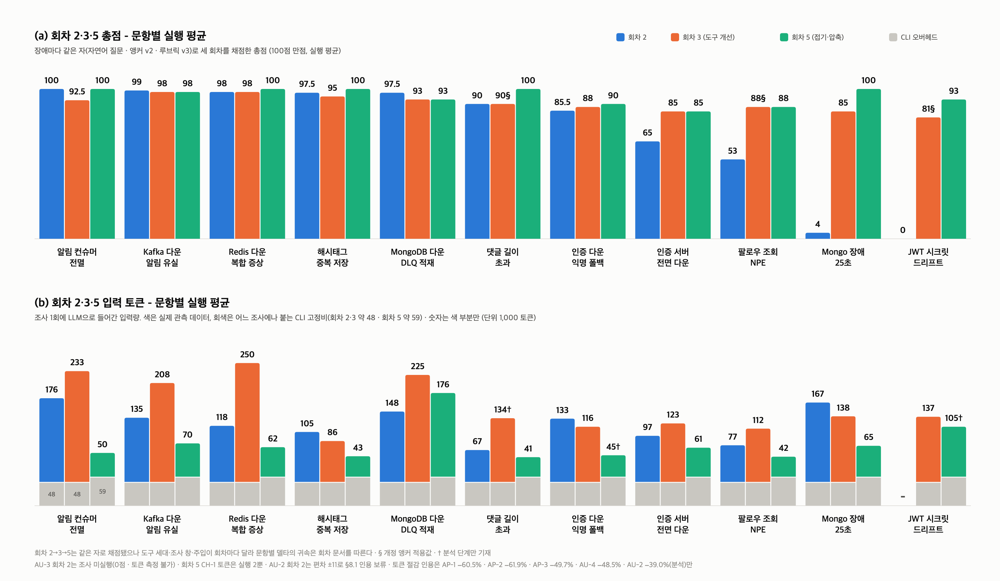
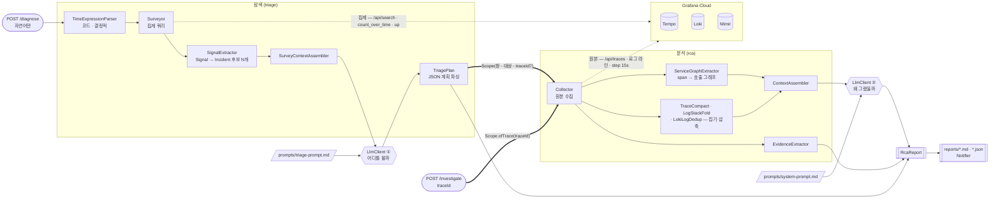

<div align="center">

# rca-agent

**모니터링 데이터로 장애를 찾아내고, 근거와 함께 원인 후보를 제시하는 AI RCA 에이전트**


</div>

Grafana 스택(Tempo·Loki·Mimir)에 쌓이는 트레이스·로그·메트릭을 근거로,
**어디를 볼지 찾는 것부터 근거 기반 원인 후보를 내놓는 것까지** 자동화하는 것이 목표입니다.
후보마다 **어느 관측값에서 나왔는지 · 확신도 · 반증 데이터**를 붙여, 담당자가 바로 검증하고
손을 쓸 수 있게 합니다 — 이름만 나열하면 결국 사람이 처음부터 다시 확인해야 합니다.

실무에서 장애가 나면 traceId를 아는 사람이 없습니다. 담당자가 대시보드를 뒤져
*언제·어디를* 볼지 정하고, 그 다음에야 분석이 시작됩니다 —
**그 뒤지는 행위가 원인 분석의 절반**입니다. 그래서 두 단계를 모두 범위에 넣습니다.

```
자연어 질문 → [탐색] 스윕 → Incident 후보군 → 후보 선택 → [분석] 신호 상관 → 근거 기반 원인 후보 + 다음 조치
```

북극성 지표는 **원인 적중률(Top-1)** — 실제 원인을 1순위로 지목한 비율입니다.

| 단계 | 하는 일 | 상태 |
|---|---|---|
| **탐색 (triage)** | "어젯밤" → 시간창 파싱 · 3채널 스윕 → **Signal→Incident 후보화** → LLM이 조사 후보 선택 | 구현 완료 · 루브릭 v3 **탐색 15점**으로 회차 2부터 채점 |
| **분석 (RCA)** | 선택 범위의 트레이스·로그·메트릭을 **호출 그래프 · 스택 수집 · 접기(압축)** 를 거쳐 원인·근거·확신도·**다음 조치** 리포트로 | 회차 5까지 — **장애 11종 반복 평가** |

> **잘 작동하는지는 주장이 아니라 숫자로 말합니다.** 운영 중인 3-서비스 시스템에
> **실제로 장애를 주입**하고, 정답을 주입 **전에** 박제한 뒤 블라인드로 채점해서
> 그 결과로 다음에 뭘 고칠지 정합니다. 개선은 회차마다 **변경군 하나씩만** 넣어
> (도구 → 프롬프트 → 압축) 점수 변화의 원인을 가릴 수 있게 합니다.

## 데모

**자연어만으로** — 탐색부터 시작합니다.

```bash
curl -X POST localhost:8080/diagnose \
  -H 'Content-Type: application/json' \
  -d '{"question":"어젯밤에 댓글 알림이 안 왔어요"}'
```

**대상을 이미 아는 경우** — 탐색을 건너뛰고 분석만 합니다. 분석 능력만 따로 재려면
대상이 고정된 입력이 필요하고, 과거 회차와의 비교도 이 경로로만 성립합니다.

```bash
curl -X POST localhost:8080/investigate \
  -H 'Content-Type: application/json' \
  -d '{"traceId":"4bf92f3577b34da6a3ce929d0e0e4736","question":"왜 알림이 늦었어?"}'
```

실제 프로덕션 트레이스 보고서 전문 → **[docs/sample-report.md](docs/sample-report.md)**.
에이전트는 병목이 Kafka 뒤 chat-service `PushDispatcher.dispatch`의 **약 995ms**임을
특정하면서, 그마저도 미계측 구간이라 **로그 부재를 근거로 확신도를 스스로 낮췄습니다.**

모든 조사는 아래 측정치와 함께 `reports/`에 `.md`(사람용)·`.json`(기계용)으로 남습니다.

```
| tokens  | in 42,651 / out 4,950 · cost $0.4234 |
| elapsed | total 79,749ms (tempo 1146 · loki 261 · mimir 355 · llm 77969) |
- trace 24,619B / 30 spans · metrics 3 수집, 누락 1 · context 40,981 chars
```

## 얼마나 잘 하나 — 장애 주입 블라인드 평가

| | 2026-08-10 기준 |
|---|---|
| 정의된 장애 시나리오 | **12종** (실행 11 · 미실행 1 · 별도 보류 1) |
| 평가 회차 | **회차 1**(traceId 입력 v0) → **회차 2**(자연어 전환) → **3**(조사 도구) → **4**(프롬프트) → **5**(접기·압축) |
| 인용 규칙 | 문항당 **N≥2** · 평균 ± 최대편차 · 편차 ±10 초과는 인용 보류 |
| 조사 산출물 | `reports/` 리포트 + `reports/raw/` 응답 원본 (오프라인 재생용) |

회차 2부터는 **같은 자**(자연어 질문 문안 박제 · 앵커 v2 · 루브릭 v3)로 채점합니다.



- **회차 3 (조사 도구)** — Loki 셀렉터·스택 라인 수집·slow trace 채널·Signal→Incident
  후보화 등 변경군 B. 회차 2에서 4점(CH-3)·53점(AP-2)이던 문항이 85·88로 올라왔습니다.
- **회차 4 (프롬프트)** — 도구를 고정하고 프롬프트만 바꿔 **CH-3 85 → 100 · IN-2 98 → 100**.
  전 문항 실행이 아니라 위 비교판에는 넣지 않습니다.
- **회차 5 (접기·압축)** — 점수가 아니라 **같은 점수를 더 싸게**가 목표. 리포트에서 실제로
  인용된 정보를 역추적해 로그 **-57.0%** · 트레이스 **-30.0%**(바이트 기준)를 줄였고,
  컨텍스트 토큰 절감으로 인용하는 값은 재실행으로 실측한
  AP-1 -60.5% · AP-2 -61.9% · AP-3 -49.7% · AU-4 -48.5% · AU-2 -39.0%(분석 단계)입니다.
  상세: [docs/round-5/토큰개선.md](docs/round-5/토큰개선.md)

### 채점 규칙

- **블라인드** — 정답지와 채점 기준은 에이전트가 읽는 경로에 두지 않습니다. 자기 채점은 무효.
  CLI가 레포의 `CLAUDE.md`를 자동 로드하던 오염 경로를 실측으로 확인하고
  **중립 임시 디렉터리에서 실행하도록 차단**했습니다(`31e2a85`).
- **기준 선박제** — 채점 기준은 주입 **전에** 확정합니다. 결과를 보고 고치면 그 회차는 무효.
- **반복 측정** — 시나리오당 최소 2회, 평균 ± 최대편차. 편차 ±10 초과면 인용 보류.
  같은 버전·같은 장애에서 25점 차가 실제로 났고(AU-4), 이 규칙이 그 사고를 막습니다.
- **변경군 분리** — 앱 계측(A) · 조사 도구(B) · 프롬프트(C)를 한 회차에 섞지 않습니다.
  섞으면 점수가 올라도 무엇 때문인지 증명할 수 없습니다.

배점은 원인 40 · 근거 25 · 탐색 15 · 영향 10 · 오귀인 5 · 조치 5
([루브릭 v3](docs/scoring/rubric-v3.md)). 원칙은 **"어떻게든 원인을 맞히는 것이 첫째"**.

### 이 점수를 읽을 때 주의할 것

- **회차 1(v0)과 회차 2~(v1)는 자가 다릅니다** — 입력 모델(traceId ↔ 자연어)과 루브릭이
  달라 총점을 나란히 두고 개선/악화라고 말하지 않습니다.
- **회차 2→3→5 총점은 같은 자로 채점됐지만**, 도구 세대·조사 창·주입이 회차마다 달라
  문항별 델타의 귀속은 각 회차 문서를 따릅니다.
- **N≥2가 성립한 점수만 인용합니다** — CH-2 100 ± 0 · AP-3 97.5 ± 2.5 · AU-4 85.5 ± 2.5 ·
  AP-2 53 ± 0(최초의 완전 재현) 등. AU-2는 65 ± 11로 편차 초과라 인용 보류입니다.
- 회차별 점수·판정 근거 전문은 **[채점 대장](docs/scoring/README.md)** ·
  [항목별 점수표](docs/scoring/summary.md)에 있습니다.

**측정하지 못한 것이 곧 못한 것은 아닙니다** — 트레이스가 아예 생성되지 않은 장애(AU-2)에서
메트릭 3계열 단절만으로 원인에 도달한 회차가 질적으로는 가장 인상적이었습니다.

## 아키텍처

진입점은 둘이지만 **분석 경로는 하나**입니다. 탐색은 자연어를 `Scope`로 바꿔 그 하나뿐인
경로에 태워 보내는 앞단이고, `POST /investigate`는 같은 `Scope`를 사람이 직접 주는 것입니다.



**굵은 화살표가 `Scope`입니다** — 탐색과 분석 사이의 유일한 계약이고, 여기에 traceId가
없어도 됩니다. 진입점이 둘이어도 `Collector`부터는 **완전히 같은 코드**를 지나갑니다.

점선은 둘 다 같은 Grafana Cloud를 향하지만 **쿼리 종류가 다릅니다** — 위는 집계라
12시간 창도 응답이 작고, 아래는 원본이라 좁힌 뒤에만 안전합니다.

탐색과 분석은 같은 데이터를 봐도 목적이 다릅니다. 탐색 LLM은 **어디를 조사할지** 고르므로
개수 곡선·Incident 후보·도달 요약만 받고, 분석 LLM은 **왜 발생했는지** 설명하므로
원본 로그(스택 포함)·span·호출 그래프를 받습니다. 두 프롬프트 모두 코드가 아니라 파일이고
**조사할 때마다 다시 읽으므로**, 재시작 없이 고쳐 `promptSource`로 버전별 결과를 비교합니다.

**전체 흐름을 그림으로 한 번에** — 단계 A~Z · LLM 두 호출의 경계 · **토큰이 어디서 부풀어 오르나**
→ **[docs/workflow.md](docs/workflow.md)**

**어떤 쿼리가 실제로 나가는지, 컨텍스트에 무엇이 들어가는지, 리포트에 무엇이 남는지**는
→ **[docs/architecture.md](docs/architecture.md)** (시퀀스 다이어그램 · 소스별 쿼리 · 알려진 공백)

### 프로젝트 구조

```
rca-agent/
├── src/main/java/com/yogurtte/rca/
│   ├── api/           RcaController — POST /diagnose(자연어) · /investigate(traceId)
│   ├── service/       RcaService — 탐색 → 수집 → 분석 → 리포트 오케스트레이션
│   ├── triage/        탐색 단계
│   │   ├── window/    TimeExpressionParser — "어젯밤" → TimeWindow (코드 · 결정적)
│   │   ├── survey/    Surveyor — Tempo·Loki·Mimir 집계 스윕
│   │   ├── incident/  SignalExtractor · Signal · Incident — 이상 신호를 조사 후보군으로 접기
│   │   └── plan/      SurveyContextAssembler · TriagePlan — 탐색 LLM 입출력
│   ├── collector/     Scope(탐색↔분석의 유일한 계약) · Collector — 선택 범위 원본 수집
│   ├── client/        TempoClient · LokiClient · MimirClient
│   │                  · RawResponseStore — 응답 원본 박제 → 주입 없이 오프라인 재생
│   ├── analyzer/      분석 컨텍스트 조립
│   │                  · ServiceGraphExtractor — span 속성으로 호출 그래프 복원
│   │                  · TraceCompact · LogStackFold · LokiLogDedup — 접기·압축
│   │                  · ContextAssembler · EvidenceExtractor · MetricSummaryProbe
│   ├── llm/           LlmClient — claude-cli(기본) · anthropic · openai 중 하나만 활성
│   │                  · TokenCounter — 오버헤드 프로브 (측정 규칙: docs/round-1-input-tokens.md)
│   ├── time/          시간 표현 도메인 — 별칭·상대 단위·부분일·확신도
│   ├── report/        RcaReport · ServiceGraph · ReportStore — .md(사람용)·.json(기계용)
│   ├── notify/        Notifier — console(기본) · slack · discord
│   └── error/         공통 오류 응답
├── src/test/java/     WireMock 클라이언트 테스트 · fake LLM 전체 흐름 · 저장 응답 재생 도구
├── prompts/           triage-prompt.md · system-prompt.md · review-prompt.md — 조사마다 다시 읽음
├── reports/           조사 산출물 (.md·.json) + raw/ 응답 원본
├── scripts/           run-local.ps1 — .env 로드 후 bootRun
└── docs/              판단 과정·실측 기록 — docs/README.md에서 시작
    ├── scoring/       채점 대장 · 루브릭 · 대외용 보고서
    ├── round-N/       회차 N에 적용할 변경 대기열 (회차 N-1 조사에서 나온 결함)
    ├── charts/        점수·토큰 차트와 생성 스크립트
    └── <문항 ID>/     장애별 회차 기록 (ch-1 · ap-2 · au-4 …)
```

인터페이스는 `LlmClient`와 `Notifier` 둘뿐이고, `@ConditionalOnProperty`로 구현체 하나만
뜹니다. 기동 로그 `rca-agent ready: llm=... notifier=...`로 선택 결과를 확인합니다.

### 자연어 한 줄이 코드 안에서 무엇으로 바뀌나

`POST /diagnose`는 문장 하나를 받아 **다섯 번 형태를 바꿔** 리포트가 됩니다.
단계 경계를 클래스 하나와 값 하나로 딱 떨어지게 잘라 뒀습니다 — **어느 단계가 틀렸는지를
따로 채점하려면** 그래야 합니다(탐색 15점이 원인 40점과 별도 항목인 이유).

아래 수치는 설명용 예시가 아니라 **실제 조사 한 건**입니다
(`reports/6a69c37f…-20260729T091658` · Incident 후보화 도입 전 회차).

```
"최근 1시간 안에 피드 작성이 실패했다는 제보가 있다. 원인을 조사해줘"
  |
  |  (1) TimeExpressionParser  — 정규식과 분기. LLM을 쓰지 않는다
  v      TimeWindow(08:13:16Z ~ 09:13:16Z) + 근거 문자열 "상대 표현 '최근 1시간'"
  |
  |  (2) Surveyor + SignalExtractor  — 집계 쿼리 (Tempo·Loki·Mimir) 후
  v      이상 신호를 Incident 후보로 접음 -> SurveyContextAssembler
  |
  |  (3) LlmClient (1) + triage-prompt.md  — "어디를 볼까". 출력은 후보 선택이고
  v      시간창·서비스·traceId는 선택된 후보에서 코드가 파생 -> Scope
  |
  |  (4) Collector  — 좁힌 창의 원본 수집 + 호출 그래프 추출 + 접기·압축
  v      CollectedData -> ContextAssembler
  |
  |  (5) LlmClient (2) + system-prompt.md  — "왜 그랬을까". 단일 패스 · 도구 없음
  v
 RcaReport = 분석 + Triage(선정 근거) + Evidence(관측값) + Coverage(읽은 범위)
             -> reports/*.md · *.json · Notifier
```

| 단계 | 누가 정하나 | 들어가는 값 | 나오는 값 | 이 단계만의 실패 |
|---|---|---|---|---|
| (1) 창 파싱 | **코드** | 질문 문자열 · `from`/`to`(있으면 우선) | `TimeWindow` + 해석 근거 | 표현을 못 찾으면 기본 24시간 |
| (2) 스윕·후보화 | **코드** (`rca.survey`) | `TimeWindow` | 3채널 집계 + Incident 후보군 | 채널이 죽어도 나머지로 완주 |
| (3) 후보 선택 | **LLM** | 후보군 + 도달 요약 + 질문 | `Scope(창 · 서비스 · traceId?)` | 파싱 실패 시 스윕 창을 그대로 씀 |
| (4) 심층 수집 | **코드** (`rca.collect`) | `Scope` | 원본 + 호출 그래프 (접기·압축 후) | 소스별 실패를 문자열로 모아 계속 |
| (5) 분석 | **LLM** | 컨텍스트 (수집 실패·누락이 맨 앞) | 원인 후보·확신도·반증·조치 | — |

**LLM이 구조를 만드는 곳은 (3) 하나뿐입니다.** LLM이 조사 시간이나 서비스명을 자유롭게
만들어 내지 않도록, 탐색 LLM의 출력은 후보 선택이고 이후 값은 코드가 파생합니다.
(1)을 LLM에 맡기지 않는 이유는 재현성입니다 — 같은 질문이 회차마다 다른 창을 만들면
*"시간창을 맞게 잡았는가"* 를 분석 점수와 분리해서 잴 수 없습니다.

**빈 값과 실패를 어떻게 다루는지가 이 경로의 설계 대부분입니다.** 관측 데이터는 정상적으로
비어 있고, *"없다"* 가 곧 신호인 장애가 실재합니다.

| 무엇이 비거나 실패하면 | 어떻게 되나 | 어디에 남나 |
|---|---|---|
| 질문에 시간 표현이 없다 | 지어내지 않고 기본 최근 24시간 | `Triage.timeExpression` |
| 창이 상한 48시간을 넘는다 | **끝을 기준으로** 자른다 — 장애는 대개 창의 끝에 가깝고, 앞을 남기면 봐야 할 구간이 잘린다 | 같은 필드에 `(상한 48시간으로 잘림)` |
| 에러 트레이스 검색이 0건 | 실패가 아니라 **신호로 넘긴다** — *"트레이스가 생성되지 않는 장애일 수 있으니 이 사실 자체를 근거로 쓸 것"* | `SurveyResult.failures` → 컨텍스트 맨 앞 |
| LLM이 계획 JSON을 안 준다 | 조사를 멈추지 않고 **스윕 창 전체**를 분석 범위로 쓴다 | `Triage.parsed=false` · `notes` |
| 좁힌 창이 스윕 창을 벗어난다 | 스윕 창 안으로 클램프 — 탐색이 근거로 삼은 데이터와 분석이 보는 데이터가 어긋나면 판단 과정을 추적할 수 없다 | `notes`에 원래 창과 잘린 창을 **둘 다** |
| LLM이 없는 서비스 이름을 준다 | 설정에 없는 값은 버린다(`appsPattern`) | 셀렉터가 조용히 0 스트림이 되는 것을 막는다 |
| `traceId`가 `null`이다 | **정상 입력이다.** 트레이스 조회 2개를 건너뛰고 로그·메트릭만으로 수집 | `CollectedData.failures` |

마지막 줄이 핵심입니다 — 컨슈머가 전멸하면 consume span이 생성되지 않고 파드가 0이면
ingress가 끊겨 트레이스가 아예 없습니다. **`traceId`를 필수로 두면 그런 장애에서 파이프라인이
그 자리에서 끊깁니다**(CH-2 · AU-2가 실제로 그랬고, 둘 다 메트릭 단절만으로 정답에 도달했습니다).

**알려진 한계** — Loki 조회의 `limit=1000` + `direction=forward`가 창 뒤쪽을 잘라
복구 신호를 놓칠 수 있고(B-39, 회차 5에서 확인), 트레이스 반복 span 접기는 미적용입니다
(B-36, 저장 231건 전수에서 36.3% 절감 실측만 완료). 수정안과 반증 조건은
[docs/round-6/](docs/round-6/README.md)에 있습니다.

## 빠른 시작

```bash
cp .env.example .env       # 필수값과 설명은 .env.example 주석 참고
./gradlew bootRun          # JDK 21
# 또는
docker compose up --build  # 컨테이너엔 claude CLI가 없음 → RCA_LLM_PROVIDER=anthropic|openai
```

설정은 전부 env var입니다. 핵심 셋, 나머지는 `.env.example`에.

| 변수 | 값 |
|---|---|
| `TEMPO/LOKI/MIMIR_URL·USER` + `GRAFANA_TOKEN` | Grafana Cloud 접속 (필수) |
| `RCA_LLM_PROVIDER` | `claude-cli`(기본) · `anthropic` · `openai` |
| `RCA_NOTIFIER` | `console`(기본) · `slack` · `discord` |

시스템 프롬프트는 코드가 아니라 `prompts/system-prompt.md` 파일이고 **조사할 때마다 다시
읽습니다.** 재시작·리빌드 없이 고치고, `reports/`의 `promptSource`로 버전별 결과를 비교합니다.

```bash
./gradlew test   # WireMock 클라이언트 테스트 + fake LLM 전체 흐름
```

## 관측 기반

에이전트의 상한은 관측 커버리지가 정합니다. zero-code를 노린 OTel Agent 전환을 검토했으나
**대표 흐름 3종의 E2E 트레이스를 실측**해 Brave 계측으로도 요건이 충족됨을 확인했습니다
([ADR-001](docs/decisions/adr-001-brave-over-otel.md) · 인벤토리 23 타깃은 [monitoring.md](docs/monitoring.md)).


댓글 작성 한 건이 `notification-publish` → Kafka → chat-service consume → push dispatch까지
**하나의 traceId로** 이어집니다 — 비동기 경계에서도 trace context가 전파됩니다.

## 문서

결론만이 아니라 **판단 과정과 실측 수치**를 남깁니다.

| 문서 | 내용 |
|---|---|
| **[종합 문서](docs/README.md)** | **여기서 시작** — 이 문서 하나로 전체 파악. 정의·측정 체계·결과·문서 지도 |
| **[기술 의사결정](docs/portfolio.md)** | 판단 과정을 남길 만한 것들 (탐색 채널 감사 · 감점 원인 귀속 · N≥2 규칙 · OTel vs Brave · 단일 패스 …) |
| **[평가 보고서](docs/scoring/report.md)** | 장애 12종의 상황·함정·채점 요건·결과를 한 문서로 |
| [현황판 (STATUS)](docs/STATUS.md) | 지금 어디까지 왔나, 다음 할 일, 활동 로그 |
| [관측 개선 통합](docs/round-3/관측개선-통합.md) | 로그·트레이스·메트릭을 RCA Evidence로 바꾼 과정 — 실측·반증 포함 |
| [토큰 절감](docs/round-5/토큰개선.md) | 공급 데이터와 실제 인용을 대조해 로그 -57% · 트레이스 -30% |
| [아키텍처 상세](docs/architecture.md) | 소스별 실제 쿼리 · 컨텍스트 구성 · 리포트 구조 · 알려진 공백 |
| [채점 대장](docs/scoring/README.md) | 회차별 점수와 판정 근거 · [항목별 점수표](docs/scoring/summary.md) |
| [루브릭 v3](docs/scoring/rubric-v3.md) | 채점 항목을 어떻게 정했나 — 탐색부터 원인 분석까지 |
| [측정 기준](docs/measurement.md) | 어떤 숫자를 개선 근거로 쓰나 (토큰·비용·통제 변수) |
| [변경 ID 색인](docs/changes.md) | B-17이 뭐였더라 — ID → 한 줄 → 상태 → 원문 위치 |
| [의사결정 기록 (ADR)](docs/decisions/README.md) | OTel vs Brave, 단일 패스 baseline, LLM provider 등 |
| [Findings](docs/findings/README.md) | 실전 조사로 찾아낸 결함 (정답지 겸용) |
| 샘플 리포트 | [rca 모드](docs/sample-report.md) · [review 모드](docs/sample-review-report.md) |

## 로드맵

목표는 **자연어 한 줄 → 원인**입니다. 회차마다 변경군 하나만 넣고, 전후를 같은 자로 채점해
그 변경의 효과를 잰다 — 이것이 진행 방식 자체입니다. 각 단계의 진입 게이트는
[전략 문서](docs/strategy.md)에 논증돼 있습니다.

| 회차 | 변경군 | 결과 |
|---|---|---|
| 1 | v0 baseline — 단일 패스 · traceId 입력 ([왜 루프를 안 썼나](docs/decisions/adr-002-single-pass-baseline.md)) | 실전 조사 9회 · 앵커/루브릭 결함을 대량 발견해 자(尺) 자체를 개정 |
| 2 | 입력 모델 전환 — 자연어 질문 하나 · 앵커 v2 · 루브릭 v3 | 11문항 실행. 탐색이 처음으로 채점됨 (메트릭 단절만으로 정답 도달 실증) |
| 3 | 조사 도구(B) — Loki 셀렉터·스택 수집·slow trace·Incident 후보화 | 회차 2의 최저점 문항이 4→85 · 53→88 |
| 4 | 프롬프트(C) 단독 | CH-3 85→100 · IN-2 98→100 (2문항 검증) |
| 5 | 접기·압축(B) — 같은 점수를 더 싸게 | 로그 -57% · 트레이스 -30% · 컨텍스트 토큰 -39~-62% 실측 |
| 6 | **지금 여기** — 접기 몫 오프라인 A/B 분리 · 트레이스 반복 span 접기(B-36) · log-limit 절삭 수정(B-39) | [round-6 대기열](docs/round-6/README.md) |
| 이후 | 도구 호출 에이전트 루프 (실측된 실패가 남을 때만) | 계획 |

> **탐색이 분석에 넘기는 것은 traceId가 아닙니다.** 앵커 전수 감사에서 **CH-2·AU-2는 이상
> 트레이스가 아예 생성되지 않는다**는 것이 확인됐습니다 (컨슈머 사망 · auth pod 0).
> 그래서 인터페이스는 `(시간창 + 대상 서비스 + 신호 종류)`이고, **Tempo 에러 검색만으로는
> 12문항 중 6문항을 못 찾습니다** — 3채널을 다 거는 것이 요건입니다.

## License

[MIT](LICENSE)
