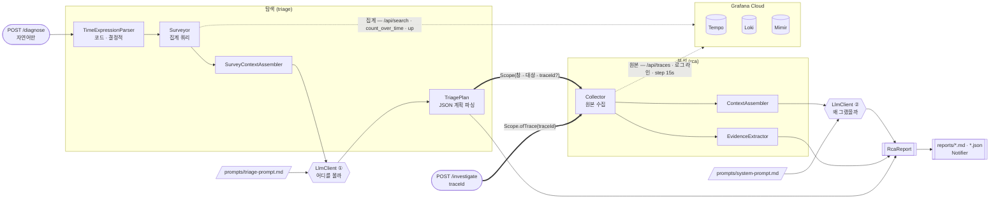
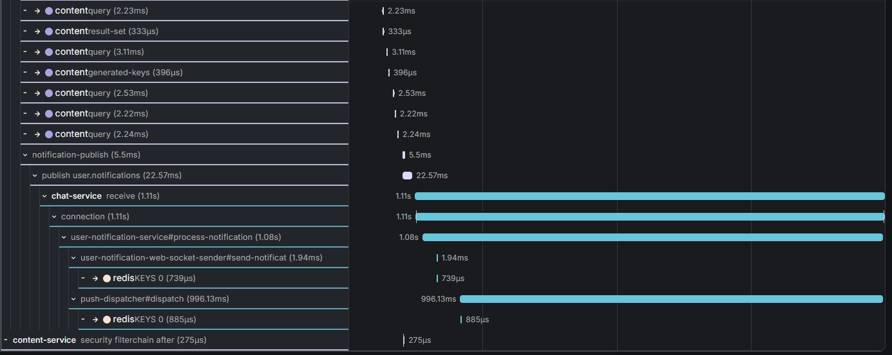

<div align="center">

# 🔍 rca-agent

**모니터링 데이터로 장애를 찾아내고, 근거와 함께 원인 후보를 제시하는 AI RCA 에이전트**


</div>

Grafana 스택(Tempo·Loki·Mimir)에 쌓이는 트레이스·로그·메트릭을 근거로,
**어디를 볼지 찾는 것부터 근거 기반 원인 후보를 내놓는 것까지** 자동화하는 것이 목표입니다.
후보마다 **어느 관측값에서 나왔는지 · 확신도 · 반증 데이터**를 붙여, 담당자가 바로 검증하고
손을 쓸 수 있게 합니다 — 이름만 나열하면 결국 사람이 처음부터 다시 확인해야 합니다.

실무에서 장애가 나면 traceId를 아는 사람이 없습니다. 담당자가 대시보드를 뒤져
*언제·어디를* 볼지 정하고, 그 다음에야 분석이 시작됩니다 —
**그 뒤지는 행위가 원인 분석의 절반**입니다. 그래서 두 단계를 모두 범위에 넣습니다.

```
자연어 질문 → [탐색] 시간창·대상 선정 → [분석] 신호 상관 → 근거 기반 원인 후보 + 다음 조치
```

북극성 지표는 **원인 적중률(Top-1)** — 실제 원인을 1순위로 지목한 비율입니다.

| 단계 | 하는 일 | 상태 |
|---|---|---|
| **탐색 (triage)** | "어젯밤" → 시간창 파싱 · 3채널(에러 트레이스 · 광역 로그 · 메트릭 단절)로 **볼 대상**을 좁힘 | ✅ 구현 · **점수는 아직 없음** |
| **분석 (RCA)** | 대상 구간의 트레이스·로그·메트릭을 엮어 원인 · 근거 · 확신도 · **다음 조치**를 리포트로 | ✅ v0 동작 · **실전 조사 9회** |

> **잘 작동하는지는 주장이 아니라 숫자로 말합니다.** 운영 중인 3-서비스 시스템에
> **실제로 장애를 주입**하고, 정답을 주입 **전에** 박제한 뒤 블라인드로 채점해서
> 그 결과로 다음에 뭘 고칠지 정합니다.

## 데모

**자연어만으로** — 탐색부터 시작합니다.

```bash
curl -X POST localhost:8080/diagnose \
  -H 'Content-Type: application/json' \
  -d '{"question":"어젯밤에 댓글 알림이 안 왔어요"}'
```

**대상을 이미 아는 경우** — 탐색을 건너뛰고 분석만 합니다. 분석 능력만 따로 재려면
대상이 고정된 입력이 필요하고, 과거 회차와의 비교도 이 경로로만 성립합니다.

```bash
curl -X POST localhost:8080/investigate \
  -H 'Content-Type: application/json' \
  -d '{"traceId":"4bf92f3577b34da6a3ce929d0e0e4736","question":"왜 알림이 늦었어?"}'
```

실제 프로덕션 트레이스 보고서 전문 → **[docs/sample-report.md](docs/sample-report.md)**.
에이전트는 병목이 Kafka 뒤 chat-service `PushDispatcher.dispatch`의 **약 995ms**임을
특정하면서, 그마저도 미계측 구간이라 **로그 부재를 근거로 확신도를 스스로 낮췄습니다.**

모든 조사는 아래 측정치와 함께 `reports/`에 `.md`(사람용)·`.json`(기계용)으로 남습니다.

```
| tokens  | in 42,651 / out 4,950 · cost $0.4234 |
| elapsed | total 79,749ms (tempo 1146 · loki 261 · mimir 355 · llm 77969) |
- trace 24,619B / 30 spans · metrics 3 수집, 누락 1 · context 40,981 chars
```

## 얼마나 잘 하나 — 장애 주입 블라인드 평가

| | 2026-07-28 기준 |
|---|---|
| 정의된 장애 시나리오 | **12개** (실행 8 · 미실행 4, 별도 보류 1) |
| 조사 완주 | **9회** |
| 유효 채점 | **5회** — 평균 **82** / 100 |
| 채점 불가 · 유보 | 3회 + 1회 — **전부 채점 기준의 결함** |
| **인용 가능한 점수** | **0개** — 규정상 문항당 N≥2인데 전부 N=1 |
| 누적 비용 | 약 **$9.2** (구독 계정 · API 환산 추정치) |

### 채점 규칙

- **블라인드** — 정답지와 채점 기준은 에이전트가 읽는 경로에 두지 않습니다. 자기 채점은 무효.
- **기준 선박제** — 채점 기준은 주입 **전에** 확정합니다. 결과를 보고 고치면 그 회차는 무효.
- **반복 측정** — 시나리오당 최소 2회, 평균 ± 최대편차. 편차 ±10 초과면 인용 보류.
- **도구 제약 면제 없음** — 도구가 못 모아 만점이 불가능해도 감점합니다. 면제하면 도구를
  고쳤을 때 개선폭이 안 잡힙니다.

배점은 원인 40 · 근거 25 · 탐색 15 · 영향 10 · 오귀인 5 · 조치 5
([루브릭 v3](docs/scoring/rubric-v3.md)). 원칙은 **"어떻게든 원인을 맞히는 것이 첫째"**.

### 시나리오와 결과

| ID | 주입한 장애 | 시험하는 것 | 결과 |
|---|---|---|---|
| **AP-3** | 중복 해시태그 → 유니크 제약 위반 | AP-1과 같은 예외를 **원문으로** 가르는가 | **100** |
| **CH-1** | MongoDB 4.5분 중단 → 재시도 소진 → DLQ | 지연을 **유실로 오판**하지 않는가 | **80** |
| **IN-2** | Kafka 브로커 7분 21초 중단 | 200 응답 뒤의 **조용한 유실**을 보는가 | **80** |
| **AP-1** | 250자 댓글 → varchar(200) 위반 | 인프라가 정상일 때 "왜 **이 요청만**" | **75** |
| **AU-4** | 인증 서버 중단 + 캐시 TTL 만료 | **의도된 품질 저하**를 장애와 구별하는가 | **75** |
| **AP-2** | 팔로우 `size` 미기본값 → 언박싱 NPE | 정답이 **로그에만** 있는 문항 | 채점 유보 ² |
| **CH-2** | 알림 소비자 전멸 → lag 적체 | 발행측 정상 판단 + 적체 판정 | 채점 불가 ¹ |
| **AU-2** | 인증 서버 전면 중단 (캐시로 흡수) | **트레이스 무신호**에서 도달하는가 | 채점 불가 ¹ |

¹ 에이전트가 아니라 앵커(채점 기준)의 결함. **채점된 항목만 보면 CH-2 60/60 · AU-2 30/30**입니다.
² 기준 미박제 상태로 주입 — 절대 점수는 인용 불가, 델타 baseline으로는 유효.

미실행 4문항 — **CH-3**(오류가 하나도 없는 장애) · **IN-1**(Redis 중단, 3서비스의 상이한 증상을
단일 근원으로) · **IN-3**(커넥션 풀 고갈) · **AU-3**(JWT 시크릿 드리프트).
정의·함정·채점 요건 전문은 **[평가 보고서](docs/scoring/report.md)** 에 있습니다.

### 이 숫자를 아직 인용하지 않는 이유

- **반복 부족** — 유효 5회가 전부 1회차입니다. **같은 버전이 같은 장애에서 75점과 약 95점**을
  냈고, 차이는 버전이 아니라 출력 분량(2,980 vs 10,511 tok)이었습니다.
- **한 항목이 변별력을 잃었습니다** — 구 루브릭의 오귀인 20점이 9회 전부 만점이었습니다.
  항목 설계가 아니라 **정상 상황을 한 번도 준 적 없는 문항 세트**가 원인입니다.
- **아직 반쪽만 잽니다** — 탐색은 구현했지만 **채점이 0회**라, 지금 점수는 **대상이 주어진
  상태**의 적중률입니다. 인용할 숫자는 자연어에서 시작하는 end-to-end 적중률입니다.

**측정하지 못한 것이 곧 못한 것은 아닙니다** — 채점 불가 회차들이 질적으로는 가장
인상적이었습니다. AU-2는 트레이스 무신호에서 메트릭 단절만으로 정답에 도달했습니다.

## 아키텍처

진입점은 둘이지만 **분석 경로는 하나**입니다. 탐색은 자연어를 `Scope`로 바꿔 그 하나뿐인
경로에 태워 보내는 앞단이고, `POST /investigate`는 같은 `Scope`를 사람이 직접 주는 것입니다.



**굵은 화살표가 `Scope`입니다** — 탐색과 분석 사이의 유일한 계약이고, 여기에 traceId가
없어도 됩니다. 진입점이 둘이어도 `Collector`부터는 **완전히 같은 코드**를 지나갑니다.

점선은 둘 다 같은 Grafana Cloud를 향하지만 **쿼리 종류가 다릅니다** — 위는 집계라
12시간 창도 응답이 작고, 아래는 원본이라 좁힌 뒤에만 안전합니다.

LLM은 **두 번, 서로 다른 프롬프트로** 불립니다. 두 프롬프트 모두 코드가 아니라 파일이고
**조사할 때마다 다시 읽으므로**, 재시작 없이 고쳐 `promptSource`로 버전별 결과를 비교합니다.

| 계층 | 클래스 |
|---|---|
| `api` | `RcaController` — `/diagnose`(자연어) · `/investigate`(traceId) |
| `triage` | `TriageService` · `TimeExpressionParser` · `Surveyor` · `TriagePlan` |
| `collector` | **`Scope`** · `Collector` |
| `client` | `TempoClient` · `LokiClient` · `MimirClient` |
| `analyzer` | `ContextAssembler` · `EvidenceExtractor` |
| `report` | `RcaReport` = 분석 + `Triage`(선정 근거) + `Evidence`(관측값) |

**어떤 쿼리가 실제로 나가는지, 컨텍스트에 무엇이 들어가는지, 리포트에 무엇이 남는지**는
→ **[docs/architecture.md](docs/architecture.md)** (시퀀스 다이어그램 · 소스별 쿼리 · 알려진 공백)

### 자연어 한 줄이 코드 안에서 무엇으로 바뀌나

`POST /diagnose`는 문장 하나를 받아 **다섯 번 형태를 바꿔** 리포트가 됩니다.
단계 경계를 클래스 하나와 값 하나로 딱 떨어지게 잘라 뒀습니다 — **어느 단계가 틀렸는지를
따로 채점하려면** 그래야 합니다(탐색 15점이 원인 40점과 별도 항목인 이유).

아래 수치는 설명용 예시가 아니라 **실제 조사 한 건**입니다
(`reports/6a69c37f…-20260729T091658`).

```
"최근 1시간 안에 피드 작성이 실패했다는 제보가 있다. 원인을 조사해줘"
  |
  |  (1) TimeExpressionParser  — 정규식과 분기. LLM을 쓰지 않는다
  v      TimeWindow(08:13:16Z ~ 09:13:16Z) + 근거 문자열 "상대 표현 '최근 1시간'"
  |
  |  (2) Surveyor  — 집계 쿼리 7회 (Tempo 1 + Loki 1 + Mimir 5) · 921ms
  v      SurveyResult -> SurveyContextAssembler -> 38,773 chars
  |
  |  (3) LlmClient (1) + triage-prompt.md  — "어디를 볼까"
  v      TriagePlan(JSON) -> Scope(창 24분 · [content-service, auth-service] · traceId)
  |
  |  (4) Collector  — 좁힌 창의 원본 12회 (Tempo 1 + Loki 2 + Mimir 9)
  v      CollectedData -> ContextAssembler -> 198,644 chars
  |
  |  (5) LlmClient (2) + system-prompt.md  — "왜 그랬을까". 단일 패스 · 도구 없음
  v
 RcaReport = 분석 + Triage(선정 근거) + Evidence(관측값) + Coverage(읽은 범위)
             -> reports/*.md · *.json · Notifier
```

| 단계 | 누가 정하나 | 들어가는 값 | 나오는 값 | 이 단계만의 실패 |
|---|---|---|---|---|
| (1) 창 파싱 | **코드** | 질문 문자열 · `from`/`to`(있으면 우선) | `TimeWindow` + 해석 근거 | 표현을 못 찾으면 기본 24시간 |
| (2) 스윕 | **설정** (`rca.survey`) | `TimeWindow` | 3채널 집계 JSON | 채널이 죽어도 나머지로 완주 |
| (3) 선정 | **LLM** | 집계 + 질문 | `Scope(창 · 서비스 · traceId?)` | 파싱 실패 시 스윕 창을 그대로 씀 |
| (4) 심층 수집 | **코드** (`rca.collect`) | `Scope` | 원본 트레이스·로그·메트릭 | 소스별 실패를 문자열로 모아 계속 |
| (5) 분석 | **LLM** | 컨텍스트 6절 | 원인 후보·확신도·반증·조치 | — |

**LLM이 구조를 만드는 곳은 (3) 하나뿐이고, 그 산출물이 `Scope`입니다.**
(1)을 LLM에 맡기지 않는 이유는 재현성입니다 — 같은 질문이 회차마다 다른 창을 만들면
*"시간창을 맞게 잡았는가"* 를 분석 점수와 분리해서 잴 수 없습니다.
(2)와 (4)는 **같은 클라이언트를 재사용하지만 쿼리 종류가 다릅니다** — 스윕은 전부 집계라
12시간 창도 응답 크기가 스텝 수로만 결정되고, 심층은 원본이라 창을 좁힌 뒤에만 안전합니다.

| 실측 (2026-07-29 · `claude-opus-5` · turns 1) | chars | 총 `in` ¹ | `out` | 소요 |
|---|---:|---:|---:|---:|
| (2)+(3) 탐색 | 40,004 | 48,311 | 6,405 | 921ms + 91,138ms |
| (4)+(5) 분석 | 199,241 | 138,903 | 7,908 | 1,572ms + 122,210ms |
| **합계** | | **187,214** | **14,313** | LLM 두 번이 **213초** |

¹ **총 `in`을 개선 지표로 인용하면 틀립니다** — CLI 고정 오버헤드가 섞여 있고, 이 회차는
오버헤드 프로브가 실패해 `contextTokens`가 **미측정**입니다. 규칙은
[docs/round-1-input-tokens.md](docs/round-1-input-tokens.md), 그 오버헤드는 하루 만에 20%
움직인 적이 있어 다른 날 상수로 소급 추정하지 않습니다.

**빈 값과 실패를 어떻게 다루는지가 이 경로의 설계 대부분입니다.** 관측 데이터는 정상적으로
비어 있고, *"없다"* 가 곧 신호인 장애가 실재합니다.

| 무엇이 비거나 실패하면 | 어떻게 되나 | 어디에 남나 |
|---|---|---|
| 질문에 시간 표현이 없다 | 지어내지 않고 기본 최근 24시간 | `Triage.timeExpression` |
| 창이 상한 48시간을 넘는다 | **끝을 기준으로** 자른다 — 장애는 대개 창의 끝에 가깝고, 앞을 남기면 봐야 할 구간이 잘린다 | 같은 필드에 `(상한 48시간으로 잘림)` |
| 에러 트레이스 검색이 0건 | 실패가 아니라 **신호로 넘긴다** — *"트레이스가 생성되지 않는 장애일 수 있으니 이 사실 자체를 근거로 쓸 것"* | `SurveyResult.failures` → 컨텍스트 맨 앞 |
| LLM이 계획 JSON을 안 준다 | 조사를 멈추지 않고 **스윕 창 전체**를 분석 범위로 쓴다 | `Triage.parsed=false` · `notes` |
| 좁힌 창이 스윕 창을 벗어난다 | 스윕 창 안으로 클램프 — 탐색이 근거로 삼은 데이터와 분석이 보는 데이터가 어긋나면 판단 과정을 추적할 수 없다 | `notes`에 원래 창과 잘린 창을 **둘 다** |
| LLM이 없는 서비스 이름을 준다 | 설정에 없는 값은 버린다(`appsPattern`) | 셀렉터가 조용히 0 스트림이 되는 것을 막는다 |
| `traceId`가 `null`이다 | **정상 입력이다.** 트레이스 조회 2개를 건너뛰고 로그·메트릭만으로 수집 | `CollectedData.failures` |

마지막 줄이 핵심입니다 — 컨슈머가 전멸하면 consume span이 생성되지 않고 파드가 0이면
ingress가 끊겨 트레이스가 아예 없습니다. **`traceId`를 필수로 두면 그런 장애에서 파이프라인이
그 자리에서 끊깁니다**(CH-2 · AU-2가 실제로 그랬고, 둘 다 메트릭 단절만으로 정답에 도달했습니다).

**이 경로의 알려진 한계 둘** — (4)가 선정된 traceId **1건만** 딥 페치해서 같은 창의 다른
후보가 컨텍스트에 오지 않고, (3)이 창을 좁히다 주입 구간을 **1초 차이로** 잘라낸 회차가
있습니다(CH-3, 두 회차 모두 4점). 수정안과 예측·반증 조건은
[docs/round-3/](docs/round-3/README.md)에 있고 **효과는 아직 미측정**입니다.

## 빠른 시작

```bash
cp .env.example .env       # 필수값과 설명은 .env.example 주석 참고
./gradlew bootRun          # JDK 21
# 또는
docker compose up --build  # 컨테이너엔 claude CLI가 없음 → RCA_LLM_PROVIDER=anthropic|openai
```

설정은 전부 env var입니다. 핵심 셋, 나머지는 `.env.example`에.

| 변수 | 값 |
|---|---|
| `TEMPO/LOKI/MIMIR_URL·USER` + `GRAFANA_TOKEN` | Grafana Cloud 접속 (필수) |
| `RCA_LLM_PROVIDER` | `claude-cli`(기본) · `anthropic` · `openai` |
| `RCA_NOTIFIER` | `console`(기본) · `slack` · `discord` |

시스템 프롬프트는 코드가 아니라 `prompts/system-prompt.md` 파일이고 **조사할 때마다 다시
읽습니다.** 재시작·리빌드 없이 고치고, `reports/`의 `promptSource`로 버전별 결과를 비교합니다.

```bash
./gradlew test   # WireMock 클라이언트 테스트 + fake LLM 전체 흐름
```

## 관측 기반

에이전트의 상한은 관측 커버리지가 정합니다. zero-code를 노린 OTel Agent 전환을 검토했으나
**대표 흐름 3종의 E2E 트레이스를 실측**해 Brave 계측으로도 요건이 충족됨을 확인했습니다
([ADR-001](docs/decisions/adr-001-brave-over-otel.md) · 인벤토리 23 타깃은 [monitoring.md](docs/monitoring.md)).



댓글 작성 한 건이 `notification-publish` → Kafka → chat-service consume → push dispatch까지
**하나의 traceId로** 이어집니다 — 비동기 경계에서도 trace context가 전파됩니다.

## 문서

결론만이 아니라 **판단 과정과 실측 수치**를 남깁니다.

| 문서 | 내용 |
|---|---|
| **[📖 종합 문서](docs/README.md)** | **여기서 시작** — 이 문서 하나로 전체 파악. 정의·측정 체계·결과·문서 지도 |
| **[🧭 기술 의사결정](docs/portfolio.md)** | 판단 과정을 남길 만한 것 13건 (탐색 채널 감사 · 감점 원인 귀속 · N≥2 규칙 · OTel vs Brave · 단일 패스 …) |
| **[📊 평가 보고서](docs/scoring/report.md)** | 장애 12종의 상황·함정·채점 요건·결과를 한 문서로 |
| [📌 현황판 (STATUS)](docs/STATUS.md) | 지금 어디까지 왔나, 다음 할 일, 활동 로그 |
| [아키텍처 상세](docs/architecture.md) | 소스별 실제 쿼리 · 컨텍스트 구성 · 리포트 구조 · 알려진 공백 |
| [채점 대장](docs/scoring/README.md) | 회차별 점수와 판정 근거 · [항목별 점수표](docs/scoring/summary.md) · [앵커 요건표](docs/scoring/anchors-사용안함.md) |
| [루브릭 v3](docs/scoring/rubric-v3.md) | 채점 항목을 어떻게 정했나 — 탐색부터 원인 분석까지 |
| [측정 기준](docs/measurement.md) | 어떤 숫자를 개선 근거로 쓰나 (토큰·비용·통제 변수) |
| [전략 로드맵](docs/strategy.md) | Phase별 계획과 각 단계의 진입 게이트 |
| [의사결정 기록 (ADR)](docs/decisions/README.md) | OTel vs Brave, 단일 패스 baseline, LLM provider 등 6건 |
| [Findings](docs/findings/README.md) | 실전 조사로 찾아낸 결함 (정답지 겸용) |
| 샘플 리포트 | [rca 모드](docs/sample-report.md) · [review 모드](docs/sample-review-report.md) |

## 로드맵

목표는 **자연어 한 줄 → 원인**입니다. 각 단계의 진입 게이트는
[전략 문서](docs/strategy.md)에 논증돼 있습니다.

| | 내용 | 상태 |
|---|---|---|
| **v0 분석** | 단일 패스 수집·분석 baseline ([왜 루프를 안 썼나](docs/decisions/adr-002-single-pass-baseline.md)) | ✅ 실전 조사 9회 |
| **탐색(triage)** | 자연어 → 시간창 · 3채널 스윕 · 대상 선정 | ✅ 구현 · **채점 0회** |
| **평가 하네스** | 장애 주입 · 앵커 선박제 · 블라인드 채점 | 🔄 **지금 여기** — 문항당 N≥2가 남음 |
| **탐색 회고 평가** | 과거 9회의 정답으로 재현율·정밀도 측정 — **주입 불필요** | 다음 · 게이트: Grafana 보존기간 |
| **v0.1** | 조사 도구 결함 수정 (Loki 셀렉터·파싱, 수집 창) — 주입 없이 델타 측정 | 다음 |
| v1 · v2 | 컨텍스트 최적화 → 도구 호출 에이전트 루프 (실측된 실패가 남을 때만) | 계획 |

> **탐색이 분석에 넘기는 것은 traceId가 아닙니다.** 앵커 전수 감사에서 **CH-2·AU-2는 이상
> 트레이스가 아예 생성되지 않는다**는 것이 확인됐습니다 (컨슈머 사망 · auth pod 0).
> 그래서 인터페이스는 `(시간창 + 대상 서비스 + 신호 종류)`이고, **Tempo 에러 검색만으로는
> 12문항 중 6문항을 못 찾습니다** — 3채널을 다 거는 것이 요건입니다.

## License

[MIT](LICENSE)
