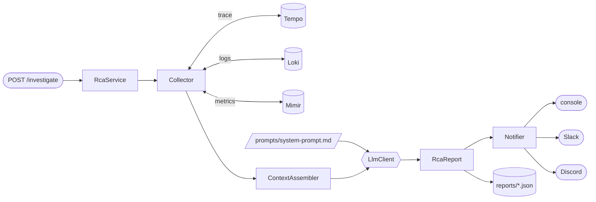
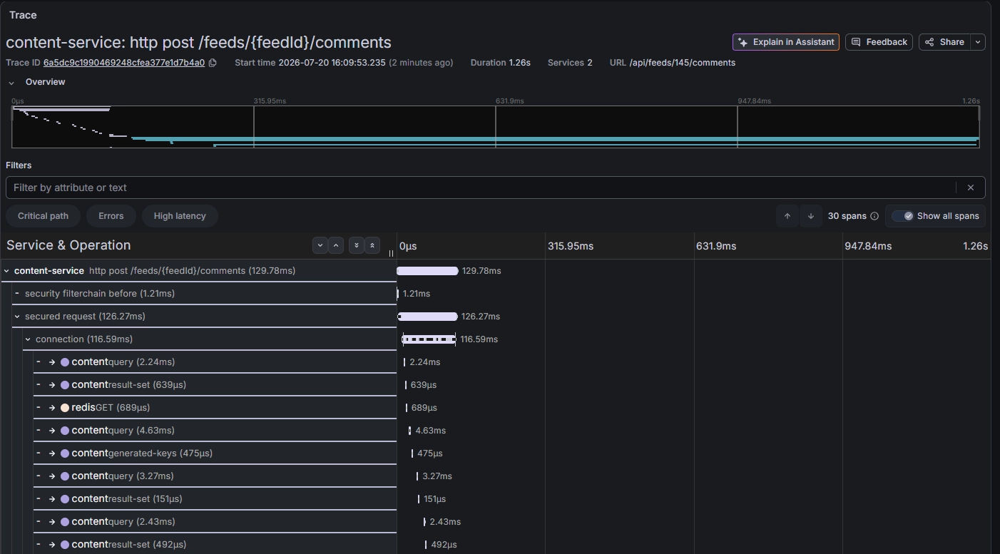

<div align="center">

# 🔍 rca-agent

**장애 traceId 하나로 시작하는 AI Root Cause Analysis**

Tempo·Loki·Mimir의 관측 데이터를 모아 LLM이 원인 후보를 랭킹하고,
근거·확신도·반증 데이터·다음 조치까지 담은 리포트를 만듭니다.


</div>

새벽에 알림이 늦게 왔다는 제보를 받으면, 대시보드 세 개를 오가며 트레이스·로그·메트릭을
직접 이어 맞춰야 합니다. rca-agent는 그 과정을 API 호출 하나로 줄입니다 — traceId를 주면
수집·조립·분석·통보까지 한 번에 끝납니다.

**v0 = baseline.** 에이전틱 루프 없이, 코드가 데이터를 모아 통째로 컨텍스트에 넣고
LLM을 한 번 호출합니다. 이후 버전의 성능을 비교할 기준선입니다.

## 데모

```bash
curl -X POST localhost:8080/investigate \
  -H 'Content-Type: application/json' \
  -d '{"traceId":"4bf92f3577b34da6a3ce929d0e0e4736","question":"왜 알림이 늦었어?"}'
```

리포트(예시 요약):

```markdown
## 1. 원인 후보 랭킹
1. chat 서비스 Kafka consumer lag로 인한 알림 발송 지연
2. HikariCP 커넥션 고갈로 인한 조회 지연

## 2. 후보별 근거
1. Kafka consumer lag
   - 근거: kafka_consumer_fetch_manager_records_lag가 10:02부터 1,200까지 상승,
     push-dispatcher#dispatch span 996ms (전체 1.26s 중 79%)
   - 확신도: 높음
   - 반증 데이터: 없음
...

## 3. 권장 다음 조치
- chat 컨슈머 스케일 아웃 후 lag 추이 확인
```

모든 조사는 토큰 수·단계별 소요시간·수집 실패 목록과 함께
`./reports/{traceId}-{ts}.json`에 남고, 원본 응답은 `./reports/raw/`에 보존됩니다.

## 아키텍처



- **한 소스가 죽어도 조사는 완주합니다.** 실패 사실을 컨텍스트에 명시하고, 모델에게
  그만큼 확신도를 낮추라고 지시합니다.
- **LLM/Notifier는 설정으로 선택합니다.** `LlmClient`·`Notifier` 인터페이스 뒤에서
  `@ConditionalOnProperty`로 구현체 하나만 뜹니다 (`claude-cli`는 API 키 없이 구독 계정 사용).
- **트레이스가 100KB를 넘으면** duration 상위 30개 span만 추려 넣습니다.
- **조사 중 모든 로그에 traceId가 MDC로 붙어** `./logs/`에서 조사 단위로 추적됩니다.

## 빠른 시작

```bash
cp .env.example .env       # 필수값과 설명은 .env.example 주석 참고
./gradlew bootRun          # JDK 21
# 또는
docker compose up --build  # 컨테이너엔 claude CLI가 없음 → RCA_LLM_PROVIDER=anthropic|openai
```

설정은 전부 env var입니다. 핵심 세 가지, 나머지는 `.env.example`에:

| 변수                                            | 값                                          |
|-------------------------------------------------|---------------------------------------------|
| `TEMPO/LOKI/MIMIR_URL·USER` + `GRAFANA_TOKEN`   | Grafana Cloud 접속 (필수)                   |
| `RCA_LLM_PROVIDER`                              | `claude-cli`(기본) · `anthropic` · `openai` |
| `RCA_NOTIFIER`                                  | `console`(기본) · `slack` · `discord`       |

## 프롬프트 튜닝 루프

시스템 프롬프트는 코드가 아니라 `prompts/system-prompt.md` 파일이고, **조사할 때마다
다시 읽습니다.**

```
프롬프트 수정 → /investigate 재호출 → reports/의 promptSource로 버전별 결과 비교
```

재시작·리빌드가 필요 없고, 도커에서도 볼륨 마운트라 동일하게 동작합니다.

## Engineering Decision — OTel Agent 전환 검토

> AI RCA의 품질은 관측 데이터 커버리지가 결정합니다. 그 커버리지를 어떻게 보장할지에
> 대한 의사결정 기록입니다.

AI 기반 RCA 시스템으로 확장하려면, AI가 분석할 관측 데이터(Trace, Metric, Log)의
커버리지가 구조적으로 보장되어야 한다고 판단했습니다. 기존 Brave 기반 라이브러리 계측은
개발자가 명시적으로 추가한 구간만 수집되는데, 실제로 Kafka observation 누락을 경험하며
계측 사각지대가 존재할 수 있음을 확인했습니다.

이에 따라 zero-code로 커버리지를 보장하는 OTel Agent 전환을 검토했습니다. 초기에는
48시간 A/B 실험을 설계했으나, 전환 이전에 더 낮은 비용으로 검증 가능한 방법을 우선
적용했습니다 — 대표 사용자 흐름(댓글 작성)을 기준으로 세 가지 시나리오의 E2E 트레이스를
실측했습니다:

1. 정상 요청 흐름 (HTTP → Service → Kafka Producer → Consumer → DB)
2. 에러 발생 흐름 (예외 발생 및 retry 포함)
3. 비동기 이벤트 처리 흐름 (fan-out 포함)

**검증 결과:**

- 전체 구간에서 trace context propagation 유지 확인
- span 누락 없이 실행 시간, 에러 정보, 서비스 간 연결 관계 수집 확인
- RCA 분석에 필요한 데이터 요건 충족



content-service의 `POST /feeds/{feedId}/comments` 트레이스(2 services, 30 spans).
security filter → JDBC 쿼리 → Redis까지 span과 실행 시간이 전부 잡힙니다.


같은 트레이스가 `notification-publish` → Kafka(`user.notifications`) → chat-service
consume → push dispatch까지 하나의 traceId로 이어집니다 — 비동기 경계에서도
trace context가 전파됨을 확인했습니다.

**결론:** OTel Agent 전환으로 얻을 추가 관측 이점은 제한적인 반면, Pod당 메모리 사용
증가, CPU 경합 환경에서의 오버헤드, 운영·전환 리스크 같은 비용이 실재한다고 판단해
현재 구조에서는 Brave 기반 계측을 유지하기로 결론 내렸습니다.

단, 라이브러리 기반 계측 특성상 누락 리스크는 남으므로 운영 가이드로 커버리지를
지속 관리합니다:

- 신규 기능 개발 시 Observation 체크리스트 적용
- 주요 사용자 흐름에 대한 주기적 트레이스 샘플링 검증

## 로드맵

| 버전   | 내용                                                | 상태    |
|--------|-----------------------------------------------------|---------|
| **v0** | 단일 패스 수집·분석 baseline                        | ✅ 현재 |
| v0.5   | Alertmanager webhook 수신, 스케줄 조사              | 계획    |
| v1     | 수집 데이터 요약·병목 자동 추출로 컨텍스트 최적화   | 계획    |
| v2     | 도구 호출 기반 에이전트 루프 (LLM이 직접 추가 조회) | 계획    |

## 개발

```bash
./gradlew test   # WireMock 클라이언트 테스트 + fake LLM 전체 흐름 테스트
```

```
api → service → collector(client) + analyzer → llm → notify → report
```

인터페이스는 `LlmClient`와 `Notifier` 둘뿐이고, 설정 record는 각 기능 패키지에 함께
둡니다. 기동 로그 `rca-agent ready: llm=... notifier=...`로 선택 결과를 확인할 수 있습니다.

## License

[MIT](LICENSE)
