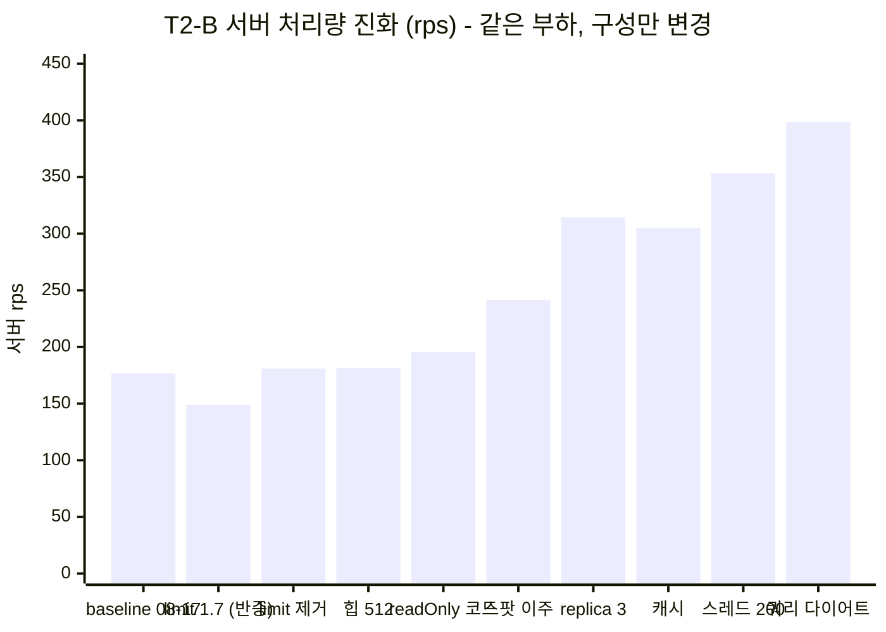
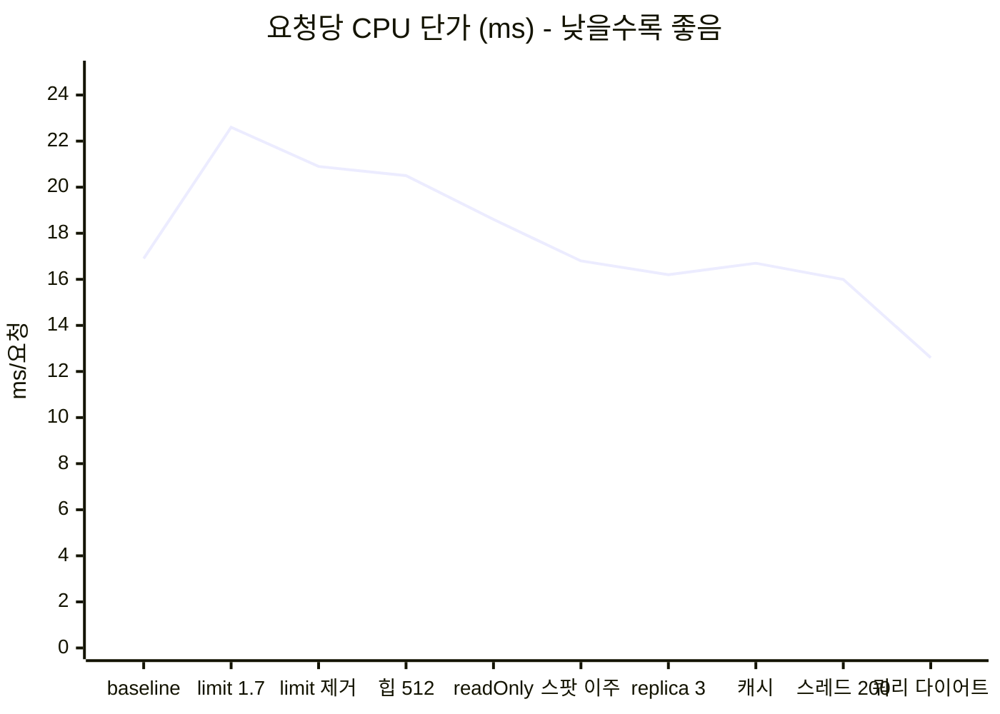
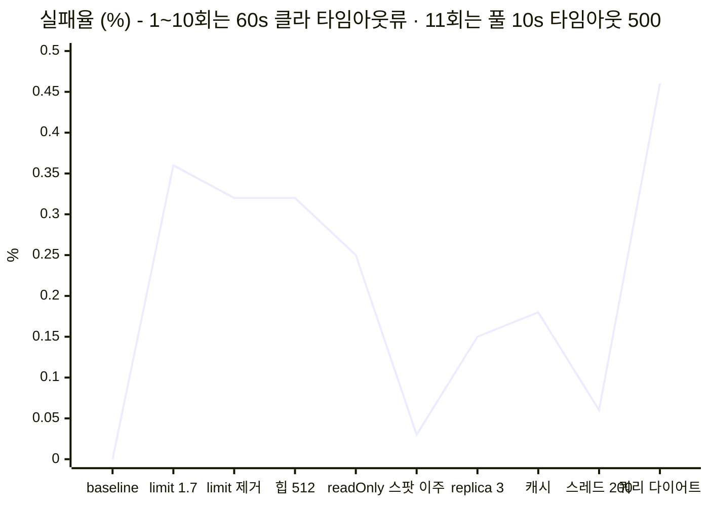

# T2-B 콘텐츠 폭주 테스트

> **결론:** 500 VU에서도 요청 실패는 없었지만, 두 content replica의 CPU가 포화하며 p99가 4.5~4.9초까지 악화됐다. HPA의 우선 적용 대상이다.

## 한눈에 보기 - 같은 시험 11회, 처리량 +126%의 여정

이 문서는 **같은 부하(500 VU·6분)를 구성만 바꿔가며 11번 돌린 기록**이다. 무엇이 통했고
무엇이 반증됐는지가 처리량 하나로 요약된다:







**여정의 판단들** (실행 상세는 아래 각 절):

```mermaid
flowchart LR
    A["CPU limit 상향<br/>+10~20% 예측"] -->|"실측 −16%<br/>반증!"| B["가설 소거<br/>메모리·데이터·앱 기각"]
    B -->|"서버 2.3s vs 클라 60s"| C["CFS 동결 확정<br/>→ limit 제거"]
    C -->|"+2% 회복<br/>med 9배 개선"| D["코드 readOnly<br/>단가 −20%"]
    D --> E["스팟 노드 이주<br/>+23%"]
    E --> F["replica 3<br/>+30%"]
    F -->|"RDS 59/60"| G["다음 벽 = DB 커넥션<br/>→ 캐시가 답"]
    G -->|"캐시 적중 100%인데<br/>처리량 등가"| H["숨은 상한 발견<br/>톰캣 스레드 40"]
    H -->|"200으로 상향<br/>+26%, med 3.3배"| I["다음 경합<br/>스레드 200 vs 풀 12"]
    I -->|"쿼리 다이어트<br/>단가 −21%"| J["CPU 벽 소멸 (노드 71~96%)<br/>남은 벽 = 풀 12 (acquire 10s)"]
```



**회차별 전수 비교 - 무엇을 바꿨고, 무엇이 유의미하게 움직였나** (전 수치 실측, 상세는 각 절):

| # | 변경 (단일 변수) | 서버 rps | 실패% | med / p95 | 파드 CPU max | 노드 CPU | content 메모리 (워킹셋/힙 사용) | 풀 (active·pending) | 유의미하게 변한 것 |
|---|---|---:|---:|---|---|---|---|---|---|
| 1 | - (08-17, limit 1.5·힙 1024·풀 20) | 176.7 | 0.00 | 1.93s / ~4s | 1.49·1.49 (limit 벽·스로틀 95.5%) | w1 **97.9%** · w2 74.8% | 1071Mi / 596 | 19·0 | baseline. CPU 단독 병목, 실패 0 |
| 2 | CPU limit 1.5→1.7 (08-20) | **148.8** | 0.36 | 373ms / 6.05s | 1.68·1.69 (새 limit 벽) | w1 99.6% · w2 86.6% | - / 361 | ≤2 pending | **반증** - p99 6.9~10s 폭발. 서버는 2.3s인데 클라 60s = CFS 동결 대기열 |
| 3 | CPU limit 삭제 | 180.8 | 0.32 | **229ms** / 4.87s | **1.93·1.85** (벽 소멸) | w1 100% · w2 98.7% | - / 361 | - | **스로틀 지표 자체 소멸** · med 9배 개선. 노드가 진짜 한계로 등극 |
| 4 | 힙 768→512 | 181.6 | 0.32 | 264ms / 4.89s | 1.92·1.83 | 동일 | **666→633** / 208 | - | 등가 성능. GC max 0.45s도 무해 - 다이어트 확정 |
| 5 | readOnly+조회수 분리 (코드) | 195.6 | 0.25 | 270ms / **4.53s** | 1.82·1.91 | 동일 | 동일 | active 18·12 | **단가 20.5→16ms** - dirty checking+조회수 UPDATE 몫 실측 |
| 6 | content 전용 노드 (스팟 이주) | **241.2** | **0.03** | 1.06s / **3.39s** | 1.94·1.89 | content 노드들 ~2.0 · **w1 0.59로 한가** | 동일 | - | **+23%** - auth·chat·관측과의 노드 경합 몫이 이만큼이었다 |
| 7 | (실험) micro / 힙440 | 192.6 / 200.3 | 0.39 / - | - | **0.95**(micro)·1.93 | micro 노드 1.9 (파드 밖 ~1코어) | 529 / 626~633 | - | **둘 다 기각** - micro는 시스템이 CPU 잠식(−20%), 힙440은 워킹셋 하한(논힙 420Mi) 때문에 무익 |
| 8 | replica 3 + 풀 12 (08-23) | **314.3** | 0.15 | **135ms** / 3.98s | 1.89·1.92·1.68(관측 동거) | content 3노드 **전부 2.0** · core 0.12 | 639~665 / 226 | **12 풀사용·pending 25·acquire 0.99s** | **+30% 신기록** · **RDS 59/60 = 종착 벽** (풀 상주 36+auth 10+chat 10) |
| 9 | 핫리스트 캐시 (08-23) | 305.1 | 0.18 | **92.9ms** / 4.43s | 1.68·1.88·1.92 | 동일 (풀가동) | 동일 | pending 21·타임아웃 0 | **적중 100%·hot med −55%** - 단 T2-B 처리량 등가(비싼 경로는 캐시 제외 대상) · RDS 59 그대로(풀 상주분) - **예측 3건 반증** |
| 11 | 쿼리 다이어트 + 조회수 이벤트 (C-3·C-4, 08-23) | **398.5 (유지·클라)** | 0.46 | 391ms / 3.25s | 1.43~1.80 (합 max 5.22) | **71~96% - 사상 첫 미포화** | 673~714Mi / - | active 11~12 · acquire max **10.1s** (부분 관측) | **단가 16.0→12.6ms (−21%)** · CPU 벽 소멸 · 남은 벽 = 풀 12 |
| 10 | 톰캣 스레드 40→200 (08-23) | **353.3** | **0.06** | 302ms / **4.00s** | 1.78·1.53·1.64 | 42-158만 풀포화 2.01 · 32-115 여유 0.45 | 650~710 / 243 | **12 풀사용·pending 174·acquire 9.1s·타임아웃 0** | **+26% 신기록** - 스레드 40이 8·9회의 숨은 상한이었다 · 대가는 med 3.3배 · **다음 경합 = 스레드 200 vs 풀 12** |

읽는 법: 실패는 1~10회 내내 **전부 60s 클라 타임아웃류**(5xx 없음)였고, 실패율이 가장 나빴던
회차(#2)가 CFS 동결, 가장 좋았던 회차(#10)가 스레드 상향이다. **11회부터 실패의 성격이 바뀐다** -
CPU 벽이 사라지자 대기가 풀로 옮겨가 **풀 획득 10초 타임아웃(500)**이 실패의 본체가 됐다
(단, 초 단위 분해 결과 유지 구간은 실패 0 - 전량이 종료 구간 단일 파드 버스트다. 재실행 11 판정 3). content 힙 사용은 어떤 구성에서도
196~361Mi라 메모리는 한 번도 병목이 아니었고, 병목은 CPU(1~5회) → 노드(6·7회) → **DB 커넥션(8회~)** 순으로 이동했고,
9회(캐시)는 "T2-B의 비싼 경로는 캐시 대상이 아니다"를 확정하며 극한 시험과 실트래픽의 무대 차이를 드러냈다.
10회는 그 등가의 나머지 절반을 해명했다 - **톰캣 스레드 40(동시 120)이 숨은 수용 상한**이었고,
200으로 열자 처리량이 +26% 나오는 대신 대기가 앱 내부(풀 대기 9.1s)로 들어왔다.

| 구분 | 내용 |
|---|---|
| 상태 | 실측 완료 · 2026-08-17 |
| 상황 | 핫 콘텐츠에 읽기 요청 집중 |
| 부하 | 최대 500 VU · 6분 · 62,441 요청(173 rps) |
| 대상 | `feeds/scroll` · `feeds/hot` · `feeds/{id}` 혼합 |
| 판정 | **Case A** — 앱 CPU 단독 포화 |

## 핵심 결과

| 항목 | 실측 | 임계값 |
|---|---:|---:|
| http_req_failed | **0.00%** | <1% (통과) |
| GET /feeds/scroll p99 | 4.73s | <800ms |
| GET /feeds/hot p99 | 4.53s | <800ms |
| GET /feeds/{id} p99 | 4.85s | <500ms |
| 중앙값(전체) | 1.93s | - |

## 서버 관측

500 VU 유지 구간에서 레플리카 2개 모두 CPU 0.99 · 풀 active 19/18(상한 부근) ·
**pending 0~1** · 스레드 84.

## 해석과 다음 조치

auth(T2-A)와 무너지는 방식이 다르다. auth는 CPU 포화 + 풀 기아 + 실패 30%로
부서졌지만, content는 **CPU 포화 단독**이고 풀은 버텼으며 실패가 0이다. 같은 "CPU 100%"
라도 실패 없이 전 요청이 균등하게 느려지는 우아한 포화 - 읽기 경로에 락·외부 의존이
없고 레플리카가 2개인 구조 차이가 붕괴 형태 차이로 나타났다.

부수 발견: 피드 조회 본경로는 Redis 캐시 없이 매번 MySQL로 가는데도(코드 확인)
**DB가 아니라 앱 CPU가 먼저 포화했다** (풀 pending 0~1 = 쿼리는 빨랐음). 현재 데이터
규모에서는 "DB가 먼저 무너진다"는 추정이 반증됨 - 데이터가 커지면 달라질 수 있다.

**Case A**로 판정한다. CPU만이 병목이고 DB·풀은 정상이다. 따라서 Chapter 2의 HPA 적용
1순위이며, replica 증가가 처리량 증가로 이어질 것이라는 가설을 재시험으로 검증한다.

원본: [output](2026-08-17-t2b-output.txt) · [summary](2026-08-17-t2b-summary.json)

---


## 소급 관측 (2026-08-19) - "노드 스펙이냐"를 가른 결과

시험 당시 노드 지표를 안 남겨서 **노드 포화인지 파드 limit인지 구분할 수 없는 상태**로
기록돼 있었다. Mimir 히스토리에 `max_over_time`을 적용해 창(23:09~23:16 KST)을 소급 조회했다
(99-소급관측과 같은 방법). 아래 쿼리와 실측치는 그대로 재현 가능하다.

### 노드 (전 노드 capacity 2.0 코어)

```promql
max_over_time( (sum by(node)(rate(node_cpu_usage_seconds_total[5m])))[7m:1m] )
```

| 노드 | 역할 | peak 코어 | 사용률 |
|---|---|---:|---:|
| ip-172-31-45-39 (worker1 t3.medium) | auth·chat·content | 1.957 | **97.9%** |
| ip-172-31-40-241 (worker2 t3.small) | content | 1.495 | **74.8%** |
| ip-172-31-38-225 (master) | control-plane | 0.071 | 3.6% |
| worker-proxy | ingress | 0.298 | 14.9% |

주: kubelet resource 메트릭은 스크레이프 간격이 1분이라 `rate[1m]`이 빈 결과다 - `[5m]`을 썼다.
따라서 이 값은 5분 평균의 최대이며, 순간 정점은 이보다 높을 수 있다.

### 파드 - 벽이 노드마다 달랐다

```promql
max_over_time( (sum by(pod)(rate(container_cpu_usage_seconds_total{pod=~"(auth|content|chat)-service.*",container!=""}[5m])))[7m:1m] )
sum by(pod)(rate(container_cpu_cfs_throttled_periods_total{pod=~"content-service.*"}[5m]))
  / sum by(pod)(rate(container_cpu_cfs_periods_total{pod=~"content-service.*"}[5m]))
```

| 파드 | 노드 | peak 코어 | limit | requests | CFS throttled 비율 |
|---|---|---:|---:|---:|---:|
| content sp24n | worker1 | 1.489 | 1.5 | 0.3 | **76.1%** |
| content v2pw9 | worker2 | 1.494 | 1.5 | 0.3 | **95.5%** |
| auth | worker1 | 0.005 | 0.5 | 0.15 | - |
| chat | worker1 | 0.051 | 0.3 | 0.15 | - |

### 판정 - "그냥 서버 스펙"이 아니다. 두 노드에서 벽이 다르다

| 노드 | 관측 | 벽 |
|---|---|---|
| worker2 | 노드에 0.5 코어(25%) 남았는데 파드가 스로틀 95.5% | **파드 limit**. 스펙 아님 - limit 상향만으로 그 0.5 코어가 나온다 |
| worker1 | 노드 97.9%로 여유 없음 | **노드 capacity**. limit을 올려도 줄 CPU가 없다 |

기각된 것:

- **GC 아님.** `rate(jvm_gc_pause_seconds_sum{application="content-service"}[5m])` = 0.055 s/s
  (2파드 합) → 파드당 2.8%.
- **이웃 서비스 간섭 아님.** 같은 창에서 auth 0.005 · chat 0.051 코어로 사실상 idle.

### 남는 진짜 숫자 - 요청당 CPU 16.9ms

```promql
sum(rate(http_server_requests_seconds_count{application="content-service"}[5m]))   # 176.7 rps
sort_desc(sum by(uri)(rate(http_server_requests_seconds_count{application="content-service"}[5m])))
```

서버측 176.7 rps(클라 173 rps와 일치, `/feeds/{feedId}` 59.2 · `/feeds/hot` 58.9 ·
`/feeds/scroll` 58.7로 균등)에 content가 **2.98 코어**를 태웠다 → **요청당 약 16.9ms CPU.**
캐시 없는 단순 읽기 경로치고 비싸다. **이 값을 안 줄이면 replica를 늘려도 코어를 선형으로
사가는 것이지 개선이 아니다.** 정체(쿼리 수 · 직렬화 · JDBC 매핑)는 미측정이며,
요청당 쿼리 수 계측이 다음 조치다.

### 이 관측이 흔드는 것 - HPA 1순위 결론의 전제

content limit 1.5 × 2 replica = **3.0**인데 워커 총 capacity는 **4.0**이고 시스템이
0.4~0.7을 쓴다. **3번째 replica가 앉을 CPU가 물리적으로 없다.** requests 0.3 / limit 1.5는
**5배 오버커밋**이라 스케줄러는 태연히 배치하고 실제로는 셋이 서로 스로틀된다.
따라서 위 "HPA 적용 1순위"는 **JVM 다이어트 + requests/limit 재설정이 선행되지 않으면
실행 불가**다 (서사 Ch2의 Pending Gate와 같은 지점).

### 여전히 미측정

**CPU steal · CPUCreditBalance.** k3s 노드에는 node-exporter가 없고(`infra-server`만 있다)
kubelet 메트릭에는 steal 모드가 없다. t3 크레딧 축은 그대로 공백이며 AWS CLI가 필요하다
(설계 Phase 0).

---

## 재실행 (2026-08-20 · CPU-2/MEM-1 적용 후) - 예측 반증: 더 느려졌다

> **결론:** limit 상향은 기계적으로 작동했다(파드 CPU 1.49 → 1.68, 새 limit 1.7에 붙음). GC도
> 정상이라 MEM-1은 반증되지 않았다. 그런데 **처리량이 173 → ~136 rps(−21%)로 떨어졌다** -
> 요청당 CPU가 16.9ms → **22.6ms(+34%)** 로 올랐기 때문이다. "CPU를 더 주면 +10~20%"라는
> 검증 설계 2번의 예측은 반증. 요청 단가가 왜 올랐는지가 새 질문이다.

| 지표 | baseline (08-17) | 재실행 (08-20) | 델타 |
|---|---|---|---|
| 요청 수 / 처리량 | 62,441 (173 rps) | 48,870 (~136 rps) | **−21%** |
| 서버 rps (2m rate max) | 176.7 | 148.8 | −16% |
| p99 | 4.5~4.9s | 6.9~10s (max 60s 타임아웃) | 악화 |
| 실패율 | 0% | 0.36% (177건) | 악화 |
| 파드 CPU (max) | 1.489 / 1.494 (limit 1.5) | **1.681 / 1.687 (limit 1.7)** | CPU-2 작동 |
| CFS 스로틀 | 76 / 95.5% | 83 / 95.8% | 여전 (새 limit에서) |
| 노드 CPU | w1 97.9% / w2 74.8% | **w1 99.6%** / w2 86.6% | w2 회수분 사용 |
| **요청당 CPU** | **16.9ms** | **22.6ms** (3.368코어/148.8rps) | **+34%** |
| GC pause | 0.055 s/s (2파드 합) | 0.047+0.025 s/s | 동급 - **MEM-1 반증 안 됨** |
| 힙 사용 max | 596Mi (Xmx 1024) | 361/294Mi (Xmx 768) | 여유 |
| Hikari pending | 0 | ≤2 | 여유 |

원인 후보 (N=1이라 미확정):

1. **데이터 상태 드리프트 (유력)** - baseline은 08-17, 그 뒤 커넥션풀 계단(리액션 토글 8.3만) ·
   T3-E 스와이프 · 댓글 쓰기가 쌓였다. 실행 규칙 *"쓰기 시나리오 뒤에 읽기를 재면 기준선과
   비교가 안 된다"* 의 실증. **델타 실험에는 데이터 상태 통제(시드 리셋 또는 쓰기 직후 재기준선)가
   필요하다** - 다음 재실행 전 절차로 승격할 것.
2. worker1 노드 완전 포화(99.6%) - limit을 올린 만큼 노드 여유가 사라져 시스템/이웃과의 경합 증가.
3. CloudFront 경유 변동.

의미: **설정 층(CPU-2)만으로는 안 된다는 것이 실측됐다.** 요청 단가(22.6ms)가 지배 변수이고,
그것은 코드 층(CPU-1 프로파일링 → CPU-3)과 캐시(실트래픽 최다인 대시보드 3종이 사용자 무관
응답 - cpu개선.md CPU-1 갱신 절)의 몫이다.

원본: [output](2026-08-20-t2b-rerun-output.txt) · [summary](2026-08-20-t2b-rerun-summary.json) · [timestamps](2026-08-20-t2b-rerun-timestamps.txt)

## 재실행 2 (2026-08-20 · CPU limit 제거) - 꼬리의 주범은 CFS 동결이었다

> **결론:** content의 CPU limit만 제거하자(requests·메모리 limit 유지) 처리량이 baseline 수준으로
> 회복되고(서버 180.8 rps - 오히려 +2%) 중앙값은 baseline의 9배(229ms), limit 1.7 대비 p99가
> 6.9~10s → 5.4~5.7s로 돌아왔다. **limit 1.7 실행의 회귀는 CFS 스로틀 동결이 만든 것**이고,
> 경합 방어는 requests(shares)로 충분했다. 남은 꼬리(p95 4.9s · 60s 타임아웃 0.32%)는
> 노드 완전 포화(2.000/1.974코어)의 몫 - 여기부터는 설정이 아니라 단가(캐시·코드)다.

| 지표 | baseline (limit 1.5) | limit 1.7 | **limit 제거** |
|---|---|---|---|
| 요청 수 (클라) | 62,441 (173 rps) | 48,870 (~136) | **61,437 (170 rps)** |
| 서버 rps (2m max) | 176.7 | 148.8 | **180.8** |
| med | ~2.0s | 373ms | **229ms** |
| p95 | ~4.0s | 6.05s | 4.87s |
| p99 (경로별) | 4.5~4.9s | 6.9~10s | 5.4~5.7s |
| 실패율 | 0% | 0.36% | 0.32% (60s 타임아웃 잔존) |
| 파드 CPU max | 1.489/1.494 | 1.681/1.687 | **1.925/1.848** |
| CFS 스로틀 | 76/95.5% | 83/95.8% | **0 (지표 소멸 확인)** |
| 노드 CPU | w1 97.9% | w1 99.6% | **w1 100.0% / w2 98.7%** |
| 서버측 최대 지연 | 3.4s | 2.3s | 2.4s |
| GC pause max | 0.20/0.17s | 0.09/0.14s | 0.08/0.10s |
| 요청당 CPU | 16.9ms | 22.6ms | 20.9ms |

판정 (전 절의 원인 후보 최종 정리):

1. **limit 1.7 회귀의 주범 = CFS 동결 (확정).** 단일 변경(limit 제거)으로 처리량 +21%p 회복.
   95.8%의 주기에서 "quota 소진 → 100ms 동결"이 반복되며 큐잉을 증폭시켰던 것.
2. **메모리(MEM-1) 무죄 재확인** - GC max 0.08/0.10s로 세 실행 중 최선.
3. **데이터 드리프트는 부차** - med가 baseline보다 9배 빠르므로 쿼리 자체는 안 무거워졌다.
   요청당 CPU 20.9ms(baseline 16.9)의 잔여 증가분은 노드 100% 포화의 스케줄링 오버헤드로 추정.
4. **남은 한계는 노드 2코어 그 자체** - 두 노드 다 ~100%. 60s 타임아웃 소수(0.32%)는
   시스템 데몬 기아 의심(이 클러스터는 kubeReserved 미설정). 완화 후보: 시스템 몫 예약.
   근본 해소는 요청 단가 - 캐시(대시보드 3종)·CPU-1~3.

처방 확정: **content는 CPU limit 없이 운용한다** (requests 700m이 경합 방어 · 메모리 limit은 유지).
auth(1500m)·chat(1000m)의 limit은 여유 천장이라 유지 - 스로틀이 관측되면 그때 재검토.
비고: 이 실행은 파드 콜드스타트 직후라 시작 전 웜업 897요청을 넣었다(JIT 공정성).

원본: [output](2026-08-20-t2b-nolimit-output.txt) · [summary](2026-08-20-t2b-nolimit-summary.json) · [timestamps](2026-08-20-t2b-nolimit-timestamps.txt)

## 재실행 3·4 (2026-08-20 밤 ~ 08-21) - 힙 512 검증 · 코드 변경군 C 1차

같은 조건(500 VU·CloudFront·limit 제거 구성) 연속 실행 둘. 원본:
[힙512 output](2026-08-20-t2b-heap512-output.txt) · [readOnly output](2026-08-21-t2b-readonly-output.txt)

| | limit 제거 (힙 768) | +힙 512 (MEM-2) | +readOnly·조회수 분리 (코드 C) |
|---|---|---|---|
| 처리량 (클라 / 서버 max) | 170.4/s / 180.8 | 168.3/s / 181.6 | **181.1/s / 195.6 (+7.7%)** |
| 요청당 CPU (부하 구간) | 20.9ms | 20.5ms | **18.6ms · 후반 안정 15.6~16.5ms** |
| p95 / p99 | 4.87 / 5.4~5.7s | 4.89 / 5.1~5.4s | **4.53 / 4.8~5.1s** |
| GC max | 0.10s | 0.45s (처리량 무영향 - 힙 512 통과) | 0.42/0.28s |

- **힙 512**: 성능 등가로 통과 → 워킹셋 666→633Mi, resources 640Mi/896Mi로 축소 근거.
- **코드 C 1차** (toy-content `7906ef1` - FeedService 읽기 readOnly + 조회수 단문 UPDATE 분리):
  단가 −10%(평균)~−20%(웜업 후), 처리량 +7.7%. **유의미하나 크지 않다** - dirty checking과
  조회수 트랜잭션의 몫이 요청당 ~4ms였다는 실측. 남은 ~16ms가 쿼리+직렬화 본체이고,
  다음 수는 핫리스트 캐시(사용자 무관 응답 - 대시보드 3종)다.
- 주의: 중간 실측에서 "9.7ms"로 오독한 기록 있음 - 인스턴트 쿼리가 파드 한쪽만 잡은
  측정 오류였고, 시각 정렬 곡선으로 정정했다.

## 재실행 5~7 (2026-08-22) - 토폴로지 실험 3연: 스팟 이주 · 힙 440 · micro 판정

판단 전체 기록은 [개선/ec2개선.md](../../../개선/ec2개선.md). 여기는 실행 색인만.

| 실행 | 구성 | 결과 (서버 rps) | 판정 |
|---|---|---|---|
| [스팟 이주](2026-08-22-t2b-spotnode-output.txt) | content = 스팟 small + 241 (worker1에서 분리) | **241.2 (+23%)** · p95 3.39s · 실패 0.03% | 전용 노드 효과 - 새 baseline |
| [힙 440](2026-08-22-t2b-heap440-output.txt) | 위 + content Xmx 512→440 | 200.3 · GC 등가 | 워킹셋 666→630뿐(논힙 바닥) - micro 목표 미달, 512 원복 |
| [micro 판정](2026-08-22-t2b-micro-output.txt) | content 1개를 od micro에 | 192.6 (−20%) · **파드 CPU 0.95/노드 1.9** | micro 기각 - 메모리(529Mi)는 통과, 시스템이 CPU ~1코어 잠식 |

부수 실측: RDS `max_connections=60 · Max_used=62`(천장 접촉 이력) → 풀 20→12 · replica 3.
**replica 3 + 풀 12 구성의 T2-B는 미측정** - 다음 실행이 새 baseline.

## 재실행 8 (2026-08-23 00:49~00:56 KST) - replica 3 + 풀 12 검증: 314 rps 신기록, 다음 벽은 RDS

> **결론:** 서버 **314.3 rps (+30%)** · med 135ms · 실패 0.15% - **새 baseline**. content가
> 세 노드에서 ~5.5코어를 태우며 처리량이 구성 진화 세 단계 만에 +61%(195.6→314.3) 됐고,
> 그 끝에서 **RDS Threads_connected 59/60**이 종착 벽으로 확정됐다. 다음 전진은 확장이
> 아니라 캐시(수요 자체 감소)다.

### 조건

500 VU·6분(스테이지 동일)·CloudFront 경유·인그레스 상향 후 원복·웜업 1,131요청.
구성: content **replica 3**(241·spot1·obs-spot 각 1) · **풀 12/파드** · CPU limit 없음 ·
힙 Xms256/Xmx512 · readOnly+조회수 분리 코드. 직전 비교 대상 = 재실행 5(스팟 이주, 241.2 rps).

### 클라이언트 (k6)

| 항목 | 값 |
|---|---|
| 요청 / 반복 | **104,497 (289.8/s)** / 34,829 iter · 500 VU max |
| 전체 지연 | avg 1.1s · **med 135ms** · p90 3.79s · p95 3.98s |
| 경로별 med / p95 | scroll 172ms/4.05s · hot **82ms**/3.90s · detail 138ms/3.99s |
| 실패율 | 0.15% (162건 - 60s 클라 타임아웃류) |

### 서버 전 계층 스냅샷 (시험 창 최대값, Mimir)

| 계층 | 항목 | 실측 |
|---|---|---|
| 파드 CPU | content ×3 | **1.89 / 1.92 / 1.68** (obs-spot 동거 파드가 alloy에 ~0.2코어 양보) |
| | auth / chat | 0.02 / 0.04 - 완전 idle (읽기 시험이라 정상) |
| 노드 CPU | content 3노드 | **1.97~2.00 / 2.0 - 전부 풀가동** |
| | core(45-39) / master / proxy | 0.12 / 0.10 / 0.45 - 여유 |
| 메모리 | content 워킹셋 | 639~665Mi / limit 896 (여유) |
| | auth / chat 워킹셋 | 530 / 488Mi (limit 768/896 - 여유) |
| JVM 힙 | content 사용/committed | 199~226 / 248Mi (Xmx 512 - 절반도 안 씀) |
| | auth / chat 사용 | 188 / 142Mi (Xmx 384 - 여유) |
| GC | content pause max | 0.28~0.41s · 처리량 영향 없음 |
| **풀** | Hikari active | **세 파드 전부 11~12 = 풀 12 풀사용** |
| | Hikari pending | 0 / 9 / **25** · acquire max 0.99s · **타임아웃 0** |
| **RDS** | Threads_connected | **59 / 60 (여유 1)** · Max_used 62 유지 |
| 단가 | 요청당 CPU (부하 구간) | avg **16.2ms** · min 10.4 (코드 C 이후 수준 유지) |

### 판정

1. **replica 3 = +30% 실현.** 노드·CPU 스케일아웃이 예산(RDS) 안에서 낼 수 있는 최대치에 도달.
2. **풀 12 반증 조건 부분 발현** - pending 25·acquire 0.99s. 단 타임아웃 0·실패 0.15%로
   처리량 이득과의 트레이드는 성립. 풀을 다시 키우는 건 RDS 예산상 불가라 논점 소멸.
3. **RDS 59/60 해부**: 사용 중 커넥션이 아니라 **풀이 쥔 상주분이 대부분**이다 -
   content 12×3=36(Hikari minimumIdle=max 기본) + auth 10 + chat 10 + 관리성 접속 ≈ 59.
   즉 부하가 없어도 56은 상시 점유. replica 4 또는 auth·chat 동시 폭주 = 즉시 초과.
4. **동거 비용 실측**: obs-spot의 content가 1.68코어(전용 노드 1.9 대비 −0.2) - 수용 범위.

| 구성 진화 | 서버 rps | 델타 |
|---|---:|---|
| 이주 전 (medium 공유, readOnly 코드) | 195.6 | - |
| content 전용 2노드 (스팟 이주) | 241.2 | +23% |
| **replica 3 + 풀 12** | **314.3** | **+30%** (누적 +61%) |

다음: **캐시(코드 C 2차)** - RDS 커넥션·쿼리 수요 자체를 줄이는 유일한 전진 경로.
journey-v2 기준선을 먼저 떠서 캐시 Before를 성립시킨다.

원본: [output](2026-08-23-t2b-replica3-output.txt) · [summary](2026-08-23-t2b-replica3-summary.json) · [timestamps](2026-08-23-t2b-replica3-timestamps.txt)

## 재실행 9 (2026-08-23 02:22~02:29 KST) - 핫리스트 캐시 After: 적중 100%인데 T2-B는 등가 - 무대가 달랐다

> **결론:** 캐시는 완벽 동작(적중 100%·hot med −55%)했지만 T2-B 처리량은 등가 -
> **예측 3건(rps ~500·단가 ~11ms·RDS 하락)이 반증**됐고 원인이 특정됐다: T2-B의 비싼 경로
> (scroll·detail)는 실시간이라 의도적 캐시 제외 대상이고 hot은 원래 싼 경로였으며,
> RDS 59는 풀 상주분(minIdle=max)이라 캐시가 못 줄인다. 해부 전문: [앱개선.md](../../../개선/앱개선.md) C-2.

### 조건

500 VU·6분 동일 · 캐시 배포(toy-content `4353753` - Redis 공유·TTL 5분·스케줄러 evict) 직후
롤아웃 + 웜업 1,038요청. 직전 비교 = 재실행 8 (replica 3, 314.3 rps).

### 클라이언트 (k6)

| 항목 | 재실행 8 (Before) | **재실행 9 (캐시)** |
|---|---|---|
| 요청 / 처리량 | 104,497 (289.8/s) | 96,547 (267.9/s) |
| 전체 med / p90 / p95 | 135ms / 3.79s / 3.98s | **92.9ms** / 4.08s / 4.43s |
| **실패율** | 0.15% | **0.18%** (180건 - 60s 타임아웃류, 5xx 없음) |
| 경로별 med - hot | 82ms | **37.2ms (−55%)** |
| 경로별 med - scroll / detail | - | 116.1 / 98.9ms (비캐시 - 예상대로 무변화권) |
| 경로별 p95 (hot/scroll/detail) | - | 4.13 / 4.58 / 4.48s (극한 대기열 꼬리 - 캐시 무관) |

### 서버 (시험 창 최대, Mimir)

| 항목 | 실측 | 판정 |
|---|---|---|
| 서버 rps | **305.1** (재실행 8: 314.3) | 등가 - 처리량 예측 반증 |
| **캐시 적중** | **hit 95.8/s · miss 0.0/s** (전체 ~290rps 중 hot 몫 1/3과 일치) | 적중률 ~100% - 캐시 동작 완벽 |
| 파드 CPU | 1.68 / 1.88 / 1.92 | 여전히 풀가동 (비캐시 경로가 소진) |
| 요청당 CPU | avg 16.7ms · min 11.7 | 단가 예측(~11ms) 반증 - hot이 원래 싼 경로였던 것 |
| Hikari pending | max 21 (1파드) · 타임아웃 0 | 재실행 8과 동급 |
| RDS Threads_connected | **59 / 60** | 그대로 - 풀 상주분(minIdle 36+auth 10+chat 10)이라 캐시 무관 |

원본: [output](2026-08-23-t2b-cache-output.txt) · [summary](2026-08-23-t2b-cache-summary.json) · [timestamps](2026-08-23-t2b-cache-timestamps.txt)

## 재실행 10 (2026-08-23 15:01~15:07 KST) - 톰캣 스레드 40→200: +26%는 공짜가 아니었다 - med 3배와 풀 대기 9초를 지불했다

> **결론:** 클라 처리량 **337.0 rps (재실행 9 대비 +26%)** · 실패 0.06% · 5xx 0 - 신기록.
> 단일 변경은 톰캣 `threads.max` 40→200 (prod yml 기본이 40이었고 env
> `SERVER_TOMCAT_THREADS_MAX=200`으로 상향). 동시 수용을 열자 대기가 톰캣 큐에서 앱 내부로
> 이동했다 - **med 92.9→302ms (3.3배)** · Hikari acquire **max 9.1s** (재실행 8: 0.99s).
> 대신 꼬리는 개선(p90 4.08→2.79s · p95 4.43→4.00s). 스레드 200 vs 풀 12의 경합이
> 다음 병목 후보로 실측됐다.

### 조건

500 VU·6분(스테이지 동일)·CloudFront 경유(`/api/content`)·인그레스 상향(2000/2000/120000)
상태에서 시험. 구성 = 재실행 9 + 톰캣 스레드 200: content replica 3(241·spot1·obs-spot) ·
풀 12/파드 · CPU limit 없음 · 힙 Xms256/Xmx512 · 캐시 on. 배포 롤아웃 67분 전 완료로 시험 창
간섭 없음. 웜업 2,495요청(3경로 200 확인·실패 0). 직전 비교 = 재실행 9 (267.9 rps).

- **무효 웜업 1회 폐기:** `CONTENT_URL=…/api`(경로 오기)로 6,548요청이 전부 SPA HTML을
  200으로 받았다 - CloudFront가 미매칭 경로를 프런트로 폴백하므로 **상태코드가 아니라
  content-type으로 백엔드 도달을 확인해야 한다.** 올바른 경로는 `…/api/content`.
- **동일 구성 1차 실행(14:24~14:31)이 같은 폴더에 있다** (`threads200-*`): 329.9 rps ·
  med 222ms · 실패 0.13%. 본 회차와 처리량 편차 +2% - 재현 성립. 1차는 서버 소급 미기록이라
  본 회차가 기록 기준.

### 클라이언트 (k6)

| 항목 | 재실행 9 (스레드 40) | **재실행 10 (스레드 200)** |
|---|---|---|
| 요청 / 처리량 | 96,547 (267.9/s) | **121,444 (337.0/s) +26%** |
| 전체 med / p90 / p95 | 92.9ms / 4.08s / 4.43s | **302ms** / **2.79s** / **4.00s** |
| 경로별 med (scroll/hot/detail) | 116.1 / 37.2 / 98.9ms | 406.5 / 187.6 / 372.3ms |
| 경로별 p95 (scroll/hot/detail) | 4.58 / 4.13 / 4.48s | **4.41 / 1.72 / 4.36s** |
| 경로별 p99 (scroll/hot/detail) | - | 6.37 / 2.10 / 6.33s |
| 실패율 | 0.18% | **0.06%** (79건 - 60s 클라 타임아웃류 · 서버 5xx **0**) |

### 서버 전 계층 스냅샷 (시험 창 max, Mimir rate[2m] 소급 + 60s ktop 로거)

노드 대응: 8qfvd=ip-…-40-241(241) · hnz5x=ip-…-32-115(spot1) · hss8h=ip-…-42-158(obs-spot).

| 계층 | 항목 | 실측 (max) |
|---|---|---|
| 서버 rps | content 합 | **353.3** · 파드별 119/119/116 - **분배는 균등** |
| 파드 CPU | content ×3 (8qfvd/hnz5x/hss8h) | **1.78 / 1.53 / 1.64** (avg 1.42/1.19/1.30) |
| | auth / chat | 0.005 / 0.033 - idle |
| 노드 CPU | 40-241 / 32-115 / 42-158 | 1.86 / 1.55 / **2.01(풀포화)** |
| | core(45-39) / infra | 0.12 / 0.11 - 여유 |
| 메모리 | content 워킹셋 | 650~710Mi / limit 896 (여유) |
| JVM 힙 | content 사용 / committed | 200~243 / 248~295Mi (Xmx 512 - 여유) |
| GC | content pause max | 0.443s |
| **톰캣** | busy threads (8qfvd/hnz5x/hss8h) | **193 / 81 / 200(상한 접촉)** · avg 57/16/137 |
| **풀** | Hikari active | 세 파드 전부 12/12 |
| | Hikari pending | 167 / 63 / **174** · **acquire max 9.1s** · 타임아웃 **0** |
| 캐시 | hit / miss | 117.8/s / ~0 - 적중 유지 |
| 단가 | 요청당 CPU (부하 구간 avg) | **16.0ms** (재실행 8·9와 동급) |
| 서버측 지연 | content p95 | max 4.09s (클라 p95 4.00s와 일치 - 지연은 서버 내부) |

미측정: RDS Threads_connected (이번 세션 원격 실행 권한 제한). Hikari 상주 36/36 유지
전제이므로 59/60 구도는 변하지 않았다고 본다 - 다음 실측 시 확인.

### 실패 79건 해부 - 서버는 아무것도 거절하지 않았다, 클라가 먼저 포기했다

79건 전부 k6 `request timeout`(60s, HTTP 응답 자체 없음 - 5xx도 504도 아님)이고,
**발사 시각이 전부 15:04:35~49의 15초 창 하나**에 몰려 있다(포기 로그 15:05:35~49).
그 창에 서버에서 일어난 일 (Mimir 60s step, hss8h):

| 시각 | hss8h busy threads | hss8h acquire max | 판독 |
|---|---:|---:|---|
| 15:03 | 69 | 3.4s | 수용 여유 |
| **15:04** | **200 (상한 도달)** | 5.6s | **이 순간 발사된 코호트가 79건** |
| 15:05~07 | 200 유지 | 8.5→9.1s | 스레드 전부 고착, 신규는 커넥터 큐 대기 |

기전: 500 VU 만재 진입 직후 hss8h(유일 풀포화 노드·acquire 최대 9.1s)가 스레드 200을
전부 잡았고, 그 뒤로 도착한 요청은 톰캣 커넥터 큐(max-connections 400)에서 스레드 배정을
기다렸다. 앞의 200건이 각각 수 초(CPU 공유 + 풀 대기)씩 걸리는 큐 맨 뒤 코호트는 총
대기가 60초를 넘었고, k6가 먼저 끊었다. 서버 관점에선 거절이 없다 - 5xx 0 · 풀 타임아웃
0(acquire 9.1s < 30s 한도) · 200 응답 123,658건. 즉 실패율 0.06%는 "에러율"이 아니라
**대기열 맨 뒤 p99.94의 인내심 한계**다. 재실행 1~9의 "60s 클라 타임아웃류" 추정이
이번에 발사 시각 단위로 확정됐다.

### 원인 해부 - CPU 포화가 근본, 풀 대기는 그 증폭기 (파드별 지표 대조)

같은 92 rps를 받은 세 파드의 시험 창 지표(Mimir rate[2m], avg 기준·괄호는 max):

| 지표 | hnz5x (spot1 전용) | 8qfvd (241) | hss8h (obs 동거) | 판독 |
|---|---:|---:|---:|---|
| 노드 CPU | 1.23 (1.55) - 여유 | 1.43 (1.86) | **1.59 (2.01 풀포화)** | 유일하게 천장 접촉 |
| 서버 평균 지연 | **0.100s** | 0.348s | **1.047s (10배)** | 같은 일, 다른 속도 |
| 서버 p95 | 0.356s | 1.20s | **3.19s (5.29)** | 전체 꼬리의 제조처 |
| 커넥션 점유시간(usage avg) | **63ms** | 95ms | **124ms (2배)** | DB가 아니라 CPU 경합이 점유를 늘림 |
| 커넥션 획득대기(acquire avg) | 36ms | 230ms | **1.20s (2.19)** | 점유 2배 → 풀 12 포화 → 대기 33배 |
| busy threads avg | 16 | 57 | **137 (200 상한)** | in-flight 누적 |
| GC CPU 지분 | 0.026 | 0.040 | 0.089 | 미미 (한 코어의 9% 이하) |

읽는 순서 - **인과가 한 방향으로만 설명된다**:

1. **DB는 느리지 않다.** CPU 여유 파드(hnz5x)의 커넥션 점유는 63ms고 풀 타임아웃은 전
   파드 0이다. RDS가 병목이면 세 파드가 같이 느려야 한다 - 같은 DB를 쓰는데 지연이 10배
   갈렸으므로 원인은 DB 밖, 즉 노드에 있다.
2. **CPU 포화가 점유시간을 2배로 늘렸다** (63→124ms) - 커넥션을 쥔 채 실행되는 앱 코드
   (결과 매핑 등)가 타임슬라이스를 못 받아서다. 요청당 커넥션 사용 ~0.67회(hot는 캐시라
   DB 미사용, scroll·detail만 사용)로 쿼리 수는 동일하다.
3. **점유 2배 × 풀 12 = 풀 포화.** 처리 능력이 12/0.124 ≈ 97회/s로 떨어진 채 62회/s
   수요를 받으니 피크마다 12/12 소진, acquire가 점유의 10배(1.2s)가 됐다 - 포화 대기열의
   전형. hss8h 평균 지연 1.047s 중 **약 0.8s(acquire 1.2s × 0.67회)가 풀 대기**다.
4. **스레드 200이 그 대기를 전부 응답시간 안으로 들였다** - busy 137~200으로 in-flight를
   쌓았고, 15:04 스톨에서 60s 코호트 79건을 만들었다.
5. 소거: 락이면 CPU가 놀아야 하는데 천장에 붙어 있고(4번 기각), 외부 I/O는 경로에
   없으며(캐시 적중 100%·sub-ms), URI별로는 scroll·detail(p95 avg 2.8s)이 hot(0.38s)보다
   비쌀 뿐 저부하에선 50ms로 정상 - 특정 API 결함이 아니라 단가 차이다.

결론: **근본 원인은 노드 CPU 포화(특히 obs 동거 노드), DB "대기"는 그 포화가 풀 12를
통해 증폭된 2차 대기열이다.** DB "성능"은 무죄. 따라서 처방 순서는 ① 쿼리 수·점유시간
자체 감소(커넥션 점유와 CPU 단가를 동시에 줄임) ② obs 동거 재배치 또는 부하 가중치
(느린 노드가 같은 몫을 받는 균등 분배가 편차를 키운다) ③ 풀·스레드 비율 재조정이다.

### 노드 비대칭 감사 - "같은 small인데 왜 다른가"에 대한 실측 (스왑·steal·동거 파드)

같은 t3.small급 3노드가 같은 92 rps에서 다르게 행동한 이유를 노드 층에서 감사했다:

| 항목 | 32-115 (spot1·22h) | 40-241 (od·79d) | 42-158 (obs-spot·20h) |
|---|---|---|---|
| 동거 파드 | alloy-logs만 | **coredns**(클러스터 DNS)+alloy-logs | **alloy-metrics-0·kube-state-metrics**+alloy-logs |
| **스왑 설정** | 0 | **3.8GB 설정·189MiB 점유** | 0 |
| 스왑 활동 (시험 창) | - | **0** (점유 189.236→189.238MiB - 고정) | - |
| **steal** (시험 창) | ~0 | **max 0.076 · avg 0.052 (~2.6%)** | 0 |
| MemAvailable (시험 창) | avg 733Mi | avg 544Mi | **avg 255Mi (최저)** |
| 노드CPU−파드CPU 갭 (avg) | ~0.04 | ~0.01 | **~0.29** (관측 스택+k3s 몫) |
| 시험 중 시스템 파드 CPU | alloy-logs 0.01 | coredns 0.003 (무시 가능) | alloy-metrics 0.015 등 |

판독:

- **스왑 가설은 기각** - 40-241에만 스왑 3.8GB가 설정돼 있는 건 사실이나(스팟 노드들은 0,
  45-39도 2GB), 시험 6분 내내 점유가 ±2KB로 고정 = 스왑 I/O 없음. 이번 지연의 원인은
  아니다. 단 **노드 구성 비대칭 발견**이고, JVM 노드의 스왑은 GC pause를 디스크 지연으로
  증폭시킬 수 있어 끄는 것이 맞다(swapoff 대기열에 등록).
- **40-241이 spot1보다 느린 몫은 steal(~2.6%) + 이용률 비선형** - 하이퍼바이저 steal이
  이 노드에서만 관측됐다(같은 "small"이어도 호스트 이웃은 다르다). 나머지는 같은 rps를
  더 높은 이용률(72% vs 60%)에서 처리한 대기이론적 비선형이 만든 차이로 해석되며,
  잔여분(파드 CPU +0.23코어)의 정확한 분해는 미측정 - 이용률 상승이 만드는 컨텍스트
  스위칭·GC 부가비용(지분 4.0% vs 2.6%)이 가설.
- **42-158이 최악인 이유는 재확인** - 관측 스택 동거로 노드-파드 갭 0.29코어 + 메모리도
  최저(255Mi). CPU와 메모리 여유가 동시에 가장 얇은 노드가 같은 몫을 받았다.
- swap-in/out·major fault 레이트 지표(node_vmstat_*)는 Mimir에 미수집 - 스왑 활동 판정은
  점유량 불변으로 갈음했다.

### 판정

1. **스레드 40이 재실행 8·9의 숨은 상한이었다.** 파드당 동시 40이 3파드 = 120 동시 처리에서
   500 VU를 받았으니 대기가 톰캣 큐에 쌓였고, 그 큐가 rps를 눌렀다. 200으로 열자 CPU가
   같은 단가(16ms)로 +26%를 처리했다 - 재실행 9의 "캐시 무효과" 해석에 이 상한이 겹쳐 있었다.
2. **트레이드는 명확하다: med 3.3배 vs 처리량 +26%·꼬리 개선.** 수용을 늘리면 같은 대기가
   응답시간 안(CPU 공유·풀 대기)으로 들어온다. med가 SLA 축이면 스레드를 다시 좁히는 게 맞고,
   처리량이 축이면 이 구성이 우세다.
3. **다음 병목은 스레드 200 vs 풀 12의 경합** - pending 174·acquire 9.1s (타임아웃 30s 안이라
   실패 0). 풀 확대는 RDS 60 예산상 불가이므로, 남은 수는 쿼리 수 자체 감소(N+1·불필요 조회)다.
4. **동일 rps인데 대기열은 hss8h(obs-spot 동거)에 쏠렸다** - busy 200 상한 접촉·acquire 9.1s·
   노드 유일 풀포화(2.01/2). 커넥션 고정 분배에서 느린 노드가 in-flight를 누적하는 형태로,
   재실행 8의 "동거 비용 -0.2코어"가 이번엔 대기열 편차로 발현. 32-115는 CPU 0.45 여유가 남았다.

원본: [output](2026-08-23-t2b-threads200-run2-output.txt) · [summary](2026-08-23-t2b-threads200-run2-summary.json) ·
[timestamps](2026-08-23-t2b-threads200-run2-timestamps.txt) · [ktop](2026-08-23-t2b-threads200-run2-ktop.txt) ·
1차 실행 [output](2026-08-23-t2b-threads200-output.txt) · [summary](2026-08-23-t2b-threads200-summary.json)

---

## 재실행 11 (2026-08-23 17:10~17:17 KST) - 쿼리 다이어트: 단가 −21%, T2-B 사상 처음 CPU가 벽이 아니게 됐다

> **결론:** 유지 구간 클라 **398.5 rps (재실행 10 서버 353.3 대비 +13%)** · 요청당 CPU
> **16.0 → 12.6ms (−21%)**. content 노드 3대가 **71~96%로 사상 처음 미포화** - 10회 내내
> 벽이던 CPU가 물러났고, 남은 병목이 풀 12(acquire max 10.1s)로 확정됐다. med 391ms
> (10회차 302ms 대비 악화)가 그 증거 - 스레드 200이 받아들인 동시성이 CPU가 아니라
> 커넥션 대기에 줄을 선다.

### 조건

500 VU·6분 동일 · CloudFront 경유 · **toy-content `ca93bca` 배포 직후** (C-3 쿼리 다이어트:
낭비 2+중복 1 쿼리 제거·user 캐시 MGET 배치화·levelTable 캐시 + C-4 조회수 AFTER_COMMIT
이벤트) · 웜업 11,829요청(med 35ms). 직전 비교 = 재실행 10 (스레드 200, 클라 337.0 · 서버 353.3).

배포 검증 스모크: detail 2회 연속 조회로 이벤트 조회수 반영 확인 (1차 응답 8442(+1 보정) →
2초 뒤 8443 - AFTER_COMMIT 리스너 정상 동작).

**실패한 1차 시도 보존** (`try1-sleep-*`): 시작 2.5분 만에 부하 소스 노트북이 유휴 절전 진입
(pmset 실측 16:48:56, 배터리 구동) - 19분 뒤 기상 후 k6 시계가 꼬인 채 계속 실행됐다.
**교훈: 배터리 노트북에서 부하 시험은 `caffeinate -im`으로 절전을 막고 돌린다** (재실행부터 적용).

### 클라이언트 (k6)

| 항목 | 재실행 10 | **재실행 11 (다이어트)** |
|---|---|---|
| 요청 / 평균 처리량 | 121,395 (337.0/s) | **129,536 (359.5/s)** |
| 유지 구간(500 VU) 처리량 | - | **398.5/s** (3m→5m 실측 분해) |
| med / p90 / p95 | 302ms / - / 4.00s | 391ms / 2.28s / **3.25s** |
| 경로별 med (hot/scroll/detail) | - | **227 / 499 / 463ms** |
| 실패율 | 0.06% | 0.46% (601건 - 60s 타임아웃 21 + 나머지 상태코드 미분해) |

### 서버 (kubectl top 50s 로거 + Mimir 부분 소급)

| 항목 | 실측 | 판정 |
|---|---|---|
| content 파드 CPU (유지) | 1.43~1.80 · **3파드 합 max 5.22코어** | limit 없음에도 벽 미접촉 |
| **노드 CPU (유지)** | **71~96% - 10회 내내 ~100%였던 것이 처음으로 내려옴** | **CPU 벽 소멸** |
| 요청당 CPU 단가 | 5.0~5.2코어 / ~400rps = **12.6ms** (16.0에서 −21%) | C-3 예측(−1~2ms)을 초과 달성 |
| Hikari (부분 관측) | active 11~12 풀사용 · pending 0~8 · **acquire max 10.1s** | **남은 벽 = 풀 12** |
| view-count executor 큐 | ~9 수준 · 적체 없음 | C-4 이벤트 소화 정상 |
| 캐시 hit (부분 관측) | 47/s | hot 캐시 동작 중 |

### 관측 한계 - Mimir 수집 공백 17:09~17:13

시험 램프업 구간에서 alloy(관측 수집기) 스크레이프가 밀려 앱 지표가 유실됐다 (17:14부터 회복).
따라서 **서버측 rps 2m max·전구간 acquire/pending 곡선은 소급 불가** - 처리량은 클라 유지
구간 실측(iteration 분해)으로, CPU는 metrics-server(kubectl top) 로거로 대체했다. 유일하게
전 회차와 축이 다른 수치이므로 표에 "유지·클라"로 명기했다. content와 alloy가 노드를 나눠
쓰는 구성에서 부하 시 관측이 굶는 문제는 별도 정리 대상.

### 판정

1. **C-3(쿼리 다이어트)의 본 효과가 단가로 실증됐다** - 16.0→12.6ms. 예측(−1~2ms)보다 큰
   폭인데, 제거된 것이 쿼리 수만이 아니라 scroll당 Redis 순차 20왕복(그동안 커넥션·스레드를
   쥔 채 대기하던 시간)이었기 때문으로 해석된다.
2. **CPU가 벽에서 내려온 첫 회차.** 1~10회 내내 "노드 ~100% = 공급 한계"였는데, 이제
   같은 부하에서 노드 여유가 남는다. 병목 이동의 다음 정거장은 CPU-1이 아니라 **풀 12**다
   (acquire 10.1s·med 상승이 신호).
3. **실패 601건의 정체 확정 (사후 로그 실측 - 두 번 정정됨)** - 클라 60s 타임아웃 21건 +
   나머지는 **풀 획득 10초 타임아웃 → 500** (`SQLTransientConnectionException ... timed out
   after 10000ms (total=12, active=12, idle=0, waiting=16)` · `connection-timeout: 10000`과
   acquire max 10.07s가 일치). 단 시간 분포를 초 단위로 쪼개자 서사가 바뀌었다:
   **유지 구간(500 VU 4분)은 실패 0이고, 832건 전부가 종료 구간 wd4jd 한 파드의
   2회 버스트**(17:17:18~22 519건 · 17:17:28~31 313건, 각 ~5초)다.
   - **"인그레스 분배 편중" 가설 기각**: 요청 분배는 파드당 1/3(fsjrn 141.4rps 실측),
     CPU도 1.75/1.64/1.84로 ±6% - 커넥션풀 시험 때의 편중 추정은 이 실측으로 약화됐다.
   - 스케줄러 evict 아님(핫스코어 cron은 정시) · TTL 5분 창도 불일치. **유력 정황은 GC** -
     wd4jd만 major GC pause 0.401s(타 파드 0/0.3s). 이미 한계 부근이던 풀 FIFO 대기에
     0.4초 정지가 얹혀 10초 상한을 넘겼다는 해석이나, GC 로그 미활성이라 **미확정**.
   - 부수 관측: reactor `TimeoutException ... 11000ms` (외부 호출) 소수 - 경로 특정은 다음 과제.
4. C-4(조회수 이벤트)는 극한에서도 큐 적체 없이 소화됐다 (부분 관측 executor 큐 ~9).

원본: [output](2026-08-23-t2b-diet-output.txt) · [summary](2026-08-23-t2b-diet-summary.json) ·
[timestamps](2026-08-23-t2b-diet-timestamps.txt) · [ktop](2026-08-23-t2b-diet-ktop.txt) ·
[절전 오염 1차](2026-08-23-t2b-diet-try1-sleep-output.txt)

## 수용성 측정 300 VU (2026-08-23 17:36~17:42 KST) - 실패 0의 완전 수용: 500 VU의 초과분은 처리량이 아니라 대기열과 실패만 사던 것이었다

> **결론:** 300 VU에서 **141,989요청 전량 성공 - 실패 0.00% · 5xx 0 · 체크 100%**.
> 처리량은 **394.1 rps**로 500 VU 극한(재실행 11 유지 398.5)과 사실상 같다 - 즉 현재 구성의
> 최대 처리량 ~400 rps는 300 VU로 이미 다 나오고, 500 VU의 추가 200 VU는 처리량을 1도 못
> 늘리면서 p95를 2.16→3.25s로, 실패를 0→0.46%로 만드는 순수 대기열 비용이었다.
> **300 VU가 현재 구성의 "전량 수용 운영점"이다.** 부수 수확: 관측 분리(micro spot 이주)의
> 첫 실측 검증 - 직전 회차 최악이던 42-158이 **최우수 파드**(busy 8·pending 0)가 됐다.

주: 이 측정은 500 VU 회차 시리즈(재실행 1~11)와 **부하 자체가 달라** 한눈에 보기 차트에
넣지 않는다. 목적이 극한 탐색이 아니라 "이 부하를 실패 없이 다 받아내는가"의 수용성 검증.

### 조건

**target 300** (스테이지 모양 동일: 1m 램프→2m→2m 유지→1m 다운) · 6분 · CloudFront 경유 ·
인그레스 상향 상태. 구성 = 재실행 11과 동일(쿼리 다이어트 C-3·C-4 배포, 파드 54~59분 경과 ·
replica 3 · 풀 12 · 스레드 200 · 캐시 on · **관측 중앙부는 micro spot 33-159로 분리 후 첫 T2-B 계열 실행**).
웜업 2,957요청(3경로 200·실패 0). 재실행 11(17:10~17:17)과 19분 간격, 사이 배포 없음.

### 클라이언트 (k6)

| 항목 | 재실행 11 (500 VU 극한) | **300 VU (수용성)** | 델타 |
|---|---|---|---|
| 요청 / 처리량 (전체 평균) | 129,536 (359.5/s) · 유지 398.5 | **141,989 (394.1/s)** | **+9.6% - VU를 줄였는데 총처리가 늘었다** |
| **실패율** | 0.46% (601건 - 풀 10s 타임아웃 500) | **0.00% (0건) · 체크 100%** | −100% |
| 전체 med / p90 / p95 | 390.7ms / 2.28s / 3.25s | **233.7ms / 1.40s / 2.16s** | −40% / −39% / −34% |
| 평균 / 최대 지연 | 905ms / 60s (클라 상한 접촉) | **508.7ms / 7.67s** | avg −44% · 60s 꼬리 소멸 |
| 경로별 med (scroll/hot/detail) | 499.4 / 226.9 / 462.7ms | 299.0 / 153.9 / 268.3ms | −40% / −32% / −42% |
| 경로별 p95 (scroll/hot/detail) | 3.73 / 1.80 / 3.72s | 2.58 / 1.17 / 2.53s | −31% / −35% / −32% |
| 경로별 p99 (scroll/hot/detail) | - | 3.91 / 1.74 / 3.87s | - |

### 서버 전 계층 스냅샷 (시험 창 max, Mimir rate[2m] 소급 + 60s ktop 로거)

파드 대응: fsjrn=42-158(전 obs 동거, 이번 회차부터 전용) · l9l2w=32-115(spot1) · wd4jd=40-241(od·steal ~2.6%·coredns 동거).

| 계층 | 항목 | 실측 (max / avg) |
|---|---|---|
| 서버 rps | content 합 | **417.6 / 300.2** |
| 파드 CPU | fsjrn / l9l2w / wd4jd | 1.60/1.14 · 1.59/1.24 · 1.82/1.22 - **미포화** |
| 노드 CPU | 42-158 / 32-115 / 40-241 | 1.64 / 1.66 / **1.91** (2.0 중) - 벽 접촉 없음 |
| | **obs 노드 33-159** | **1.34 / 0.73** - receiver가 트레이스(샘플링 1.0·~400rps)로 소비. 분리 전이면 이만큼이 content 노드 경합이었다 |
| | core(45-39) | 0.06 - idle |
| 메모리 | content 워킹셋 | 691~**795Mi**/limit 896 - wd4jd 89% (주의 항목·다이어트 코드에서 상승 경향) |
| JVM 힙 | 사용 / committed | 154~227 / 258~374Mi (Xmx 512 여유) |
| GC | content pause max | 0.319s |
| 톰캣 | busy (fsjrn/l9l2w/wd4jd) | **8 / 66 / 200(상한 접촉)** · avg 4/13/111 |
| 풀 | Hikari active | 5 / 11 / 12 |
| | pending / acquire max | **0**/1.4s · 43/2.1s · **84/6.4s** - 타임아웃 0 (10s 한도 안) |
| 캐시 | hit / miss | 139.5/s / ~0 |
| 단가 | 요청당 CPU (유지 구간: CPU합 avg 3.61코어 ÷ 300.2rps) | **~12.0ms** - 재실행 11의 12.6과 일치 |
| 서버측 지연 | content p95 | max 2.30s / avg 0.95s |

### 판정

1. **전량 수용 확정.** 실패 0/141,989 · 5xx 0 · 풀 타임아웃 0 · 60s 꼬리 없음(max 7.67s).
   현재 구성은 300 VU(폐루프 ~394 rps)를 실패 없이 받아낸다.
2. **~400 rps가 현재 구성의 처리량 상한이고, 300 VU로 이미 도달한다.** 500 VU(재실행 11)와
   처리량이 같으므로(398.5 vs 394.1), 완전 수용점과 극한 처리량 사이 격차가 사실상 소멸 -
   초과 VU는 대기열(p95 +50%)과 실패(0→0.46%)로만 전환된다.
3. **관측 분리 첫 검증 성공** - 42-158이 최악(재실행 10: busy 200·acquire 9.1s)에서
   **최우수**(busy 8·pending 0·acquire 1.4s)로. obs 노드가 시험 중 1.34코어를 따로 소비한
   것이 그 격차의 실체다. 단 **쏠림 패턴 자체는 구조적** - 이번엔 가장 느린 노드가
   40-241(steal ~2.6%·coredns)로 바뀌며 busy 200·pending 84가 그리로 이동했다.
   느린 노드가 누구든 "커넥션 고정 분배 + in-flight 누적" 기전은 남는다.
4. 주의 1건: wd4jd 워킹셋 795Mi/896(89%) - 쿼리 다이어트 코드에서 힙 committed가 374Mi까지
   올라간 개체가 있다. OOM 여유 100Mi - 다음 회차에서 추세 확인.

원본: [output](2026-08-23-t2b-300vu-output.txt) · [summary](2026-08-23-t2b-300vu-summary.json) ·
[timestamps](2026-08-23-t2b-300vu-timestamps.txt) · [ktop](2026-08-23-t2b-300vu-ktop.txt)
