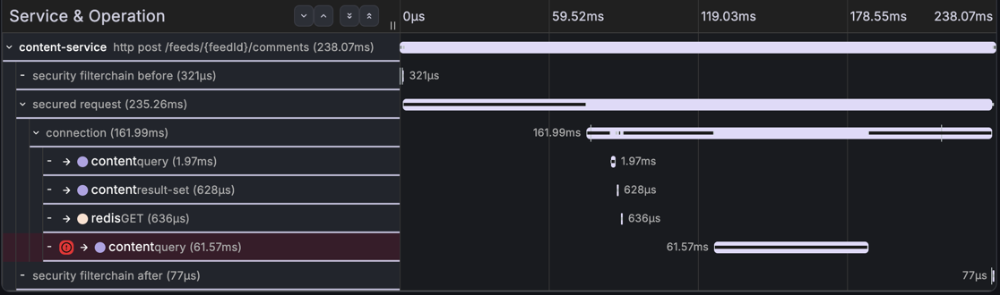

# AP-1 회차 1 — 250자 댓글 1건: 검증 구멍이 500을 만든다

## 한눈 요약

| | |
|---|---|
| **실제 원인** | 댓글 DTO에 `@Size` 부재 → 250자가 검증을 통과해 `varchar(200)` INSERT에서 Data too long → 롤백 → 500. DB가 아니라 **앱 검증 구멍** (+미매핑으로 400 아닌 500) |
| **실제 영향** | 해당 요청만 500 — 직후 정상 댓글은 200 (부분 장애). 롤백으로 데이터 부작용·알림 발행 없음 |
| **에이전트 파악 원인** | 1순위 "본문이 컬럼 한도 초과 → INSERT 절단 → 롤백 → 500" (span error 원문·`jdbc.query` INSERT문·**connection span의 `rollback` 이벤트** 인용). 2순위로 "앱 검증 부재" 파생 가설(확신도 낮음 — 코드 미확보 명시). 인프라 4종은 지표 인용으로 배제, "Kafka/chat은 도달조차 안 함" |
| **§8 채점** | **75 / 100** — 근본 20 · 근거 **30** · 오귀인 20 · 조치 5. 근거 경로는 채점자 판정 2건으로 성립: 로그↔span **정보 등가 대체**(개정 원칙 ⑤ — 동일 원문) + "정상 200 공존"은 입력 구조상 불가라 IN-2 선례로 면제. 감점 25는 전부 "설계 결함(@Size·매핑) 확정 실패" — 코드 못 보는 v0의 상한. 상세는 [채점 대장](../scoring/README.md#ap-1-회차-1--75--100) |
| **토큰·비용·시간** | in 34,935 / out 2,719 tok · **$0.2849** · 51.3s — **5회 조사 중 최단·최저** (트레이스 9 span) |
| **에이전트 보고서 전문** | [round-1-rca-report.md](round-1-rca-report.md) |

## §8 채점 근거 (항목별) — 몇 점을, 무슨 사실 때문에

앵커(`scenarios/AP-1/answer.md` v1, 채록 전 박제)와 대조한 결과다. 각 점수는 **리포트에서
실제로 인용된 신호**를 근거로 하며, 판정의 authoritative 기록·개정 이력은
[채점 대장](../scoring/README.md#ap-1-회차-1--75--100)에 있다(숫자·근거 동일).

| 항목 | 배점 | 점수 | 무슨 사실 때문에 이 점수인가 |
|---|---|---|---|
| 근본 원인 | 40 | **20** | 리포트 1순위는 사건 사슬(본문 컬럼 한도 초과→절단→롤백→500). 앵커 만점 요건인 **앱 검증 구멍(@Size 부재)**은 후보2·확신도 낮음·"파생 가설" 표기로만 도달했고 **원인으로 확정하지 못함**. 0점 사유(DB 장애 지목)는 없음 → CH-1 회차1 선례("방향 맞힘·확신 낮음"=20) 적용 |
| 근거 경로 | 30 | **30** | INSERT `query` span의 error 원문·`jdbc.query` INSERT문·connection span의 **rollback 이벤트**·`notification-publish` 부재를 **한 트레이스 인과 체인**으로 연결 + 경쟁 가설 4종을 지표로 반증. 만점 3요건 중 ①"Data too long 로그"는 span error가 **동일 원문**을 담아 정보 등가 대체(개정 원칙 ⑤), ②"정상 200 공존"은 traceId 1개 입력이라 관측 불가 → IN-2 선례로 면제. ③ INSERT span error는 문언 이상 충족 |
| 오귀인 | 20 | **20** | 커넥션 풀(pending 0)·GC(0.00005s/s)·auth(필터체인 정상)·Kafka("도달조차 안 함")를 각각 **지표 인용으로 배제**. DB를 장애로 지목하지 않고 데이터 절단을 제약의 정상 동작으로 서술("DB는 제약을 지켰다") |
| 조치 | 10 | **5** | 조치3의 `@Size` 추가→400 반환은 명확. 그러나 **검증을 뚫는 경로의 예외 매핑**(`DataIntegrityViolation`→400)은 명시 없음("500 대신 명확한 오류"가 검증 기반 400에 묶여 매핑 의도로 단정 불가). 앵커 만점="@Size + 매핑" / 부분5="매핑만 또는 검증만" → **5** |
| **합계** | **100** | **75** | 감점 25 = 근본 20(검증 구멍을 후보로만) + 조치 5(예외 매핑 불명시). 둘 다 **코드를 못 보는 v0의 상한** |

## 장애 상황

- 주입: `fc AP1-over250` — 250자 댓글 1건, `POST /api/feeds/145/comments` → **HTTP 500**
  (14:13:26 UTC = KST 23:13:26). 게이트(정상 댓글 200) 통과 후 실행, 원복 없음(롤백이 곧 원복)
- 직후 확인: symptom·recover 단계의 정상 댓글 모두 200 — 전면 장애 아님
- Loki 카운트(1h): `datatoolong` 4건 · `integrity` 1건 (단발 주입인데 4건인 것은 예외
  체인이 드라이버/ORM/서비스 계층에서 각각 로그를 남긴 것으로 추정 — 채록 노트)
- 스크립트 채록의 `content-error: trace 0건`은 **주입 8초 후 조회로 Tempo 적재 전**
  (CH-1 회차 1의 6초와 같은 패턴, 세 번째 재발). 트레이스는 실재하며 아래 traceId로 확인
  — `symptom` 재실행로 정식 채록 예정

## 스크린샷용 traceId

| 용도 | traceId |
|---|---|
| **에러 트레이스** (INSERT error 태그 + rollback 이벤트 + publish 부재) | `6a67678730d34d2319861c21cf6a84b4` |

## 실제 신호 발췌 (출제자 판독)

**Tempo — 에러 트레이스의 모양** (14:13:27Z, 238ms, 9 spans)

```
http post /feeds/{feedId}/comments   238ms [루트 ERROR]
 └ connection (162ms) — events: acquired → rollback
    ├ query 2.0ms · result-set · redis GET     ← 앞단 조회 정상
    ├ query 61.6ms [ERROR]                     ← INSERT
    │    error = "Data truncation: Data too long for column 'content' at row 1"
    └ (notification-publish 없음 — 정상 트레이스엔 있음. 롤백으로 AFTER_COMMIT 미발행)
```

판독 포인트: ① 근본 원인이 span error 태그에 **MySQL 원문으로 자백**되어 있는 문항,
② `notification-publish` 부재 = 실패 시 알림 부작용 없음까지 한 트레이스로 판정,
③ 루트만 ERROR + 직후 요청 200 = 부분 장애.



## 앵커 노트 (채점 시 참고 — §8.2에 따라 이번 회차 앵커는 그대로 적용)

근거 경로 30의 만점 조건 3종 중 2종이 v0 에이전트의 접근 범위 밖이다:

1. "Data too long **로그**" — Loki 셀렉터 결함(`{app=~...}`)으로 5회 연속 로그 0건 (v0.1 수정 예정)
2. "**정상 요청 200 공존**" — 단일 traceId 조사 설계상 다른 요청을 볼 수 없고, 에러율
   메트릭(`http_server_requests` 5xx rate)도 수집 목록에 없음 — **도구 설계상 원리적 불가**

②는 CH-2 앵커 부적합("수집 목록 밖 신호 요구")과 같은 계열이며, v0.1에 에러율 메트릭
수집을 추가할 근거. 부적합 여부 판정은 채점 대장에서, 앵커 개정은 다음 회차부터.

## 도구 관찰 (v0 조건 일관성)

- Loki 0건 조사 지속 — 에이전트 스스로 "로그 파이프라인 점검"을 조치 5번으로 제안 (결함을
  공백으로 정직 처리)
- -120s 시각 밀림은 이번 리포트에선 raw ns 위주 인용이라 표면화될 자리가 적었음
- CLI 샌드박스 격리 활성 (레포 컨텍스트 차단) 상태에서 조사됨

- 평가 상세(채점 후 작성): AE-05 예정 · 대비: 같은 500이라도 인프라 원인인
  [CH-1 round-2](../ch-1/round-2.md)와 "앱 결함" 원인인 이 문항의 신호 차이
