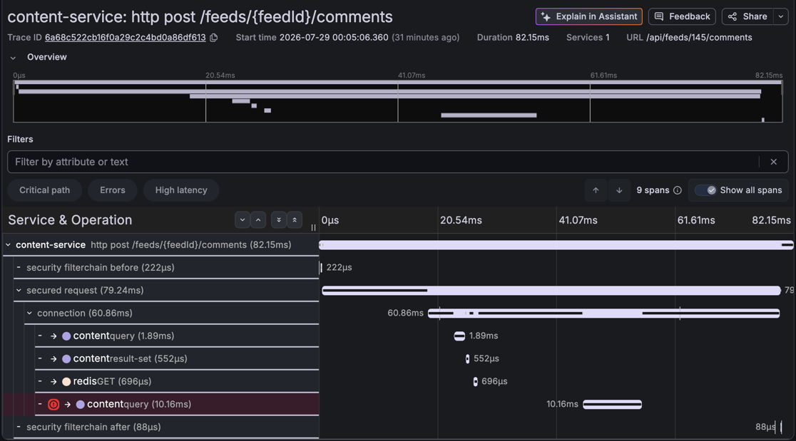

# AP-1 회차 2 — 자연어 진입 첫 조사 · **90 / 100** (회차 1과 비교 불가)

## 한눈 요약

| | |
|---|---|
| **실제 원인** | 댓글 DTO에 `@Size` 부재 → 250자가 검증을 통과해 `varchar(200)` INSERT에서 Data too long → 롤백 → 500. DB가 아니라 **앱 검증 구멍** (+미매핑으로 400 아닌 500) |
| **입력** | **traceId 없음.** 자연어 한 줄 — "최근 1시간 안에 댓글 작성이 실패했다는 제보가 있다. 원인을 조사해줘" |
| **탐색 결과** | 1시간 창 → **15:03:00~15:10:53Z(약 8분)** · 대상 `content-service` · traceId `6a68c522cb16f0a29c2c4bd0a86df613` **자력 선정** |
| **에이전트 파악 원인** | 1순위 **"애플리케이션 입력 검증 부재"**(확신도 높음·"직접 원인"), 2순위 예외 매핑 결함(500 오분류), 3순위 스키마 정의 부족(데이터 부족 명시) |
| **§8 채점** | **90 / 100** — 근본 **30** · 근거 **30** · 오귀인 **20** · 조치 **10**. 앵커 v2([anchors.md](../scoring/anchors.md#ap-1--250자-댓글--varchar-위반-v2), 채록 전 박제) 기준 |
| **모델** | `claude-opus-5` · `num_turns=1` (리포트에는 `claude-haiku-4-5`로 **오기록** — 아래 결함 ①) |
| **비용·시간** | 탐색 $0.3585 · 35.2s + 분석 $0.7561 · 109.8s = **$1.1146 · E2E 146.4s**<br>**10회 조사 중 최고 비용** — 구독 계정이므로 **API 환산 추정치**이지 청구액이 아니다 |
| **에이전트 보고서 전문** | [round-2-rca-report.md](round-2-rca-report.md) |

## 토큰 — [기준](../round-1-input-tokens.md)대로 오버헤드를 분리한다

**총 `in`을 그대로 인용하면 틀린다.** CLI 고정 오버헤드가 섞여 있고, 그 대부분이 이 에이전트가
한 번도 쓰지 않는 툴 설명서다.

`coverage.contextTokens`(실측 경로)는 **이 회차에도, 앞으로도 없다.** `TokenCounter`가 쓰는
`count_tokens` API에는 API 키가 필요한데 이 프로젝트는 **구독 CLI로 돌리기로 확정**돼 있다.
즉 **추정이 표준이고, 실측으로 대체할 계획은 성립하지 않는다.** 두 경로로 추정하고 둘 다 적는다.

**오버헤드 `C`는 조사 당일(07-29) 재측정값 21,247을 쓴다** — 문서에 박혀 있던 26,626은
**하루 만에 −20% 움직였다**([재측정 §2.1](../round-1-input-tokens.md#21-재측정-2026-07-29--오버헤드는-상수가-아니다)).

| 단계 | 총 `in` | 문자 | ① `in − 21,247` | ② `chars × 0.524` | 격차 |
|---|---|---|---|---|---|
| 탐색 | 43,025 | **미기록**(당시) | **21,778** | — | — |
| 분석 | 71,071 | 90,775 (컨텍스트 90,200 + 프롬프트 575) | **49,824** | **47,566** | **+4.7%** |
| **합계** | **114,096** | | **≈ 71,602** | | |

- **`▓ 추정`이다. `█ 실측`이라고 쓰지 않는다.**
- **새 `C`가 검산과 더 맞는다** — 26,626으로 계산하면 ①이 44,445가 되어 ②와 **−6.6%** 어긋나는데,
  21,247이면 **+4.7%**로 붙는다. 두 경로가 서로를 확인하는 쪽이 옳은 `C`다.
- **탐색 행의 `chars`가 "미기록"인 것은 측정 불가가 아니라 구현 공백이었다** —
  `RcaReport.Triage`에 문자 수 필드가 없어 ② 경로를 아예 못 만들었다.
  **이번에 `contextChars`·`promptChars`를 추가해 메웠다**(다음 회차부터 두 경로 다 나온다).
- 컨텍스트 ≈71,602 tok은 회차 1(AP-1, 추정 8,309)의 **8.6배**다. 탐색 단계가 통째로 붙었고
  분석 창도 8분으로 넓어졌다 — **자연어 진입의 대가가 숫자로 찍혔다.**
- `num_turns=1` 확인 — 90,200자 컨텍스트에서도 단일 패스가 유지됐다. (지시문 없는 원시 JSON을
  던지면 CLI가 도구를 쓰기 시작해 4턴까지 가는 것이 프로브에서 확인됐다. 시스템 프롬프트가
  과업을 지정하는 실제 경로는 안전하다.)

> ## 🔴 이 점수는 회차 1과 평균 낼 수 없다 (§8.1 N≥2 미충족)
>
> 회차 1(75)과 회차 2(90) 사이에 **변수 셋이 동시에 바뀌었다.** 어느 것이 +15를 만들었는지
> 이 회차만으로는 가릴 수 없다.
>
> | | 회차 1 | 회차 2 |
> |---|---|---|
> | 입력 모델 | traceId 직접 지정 | **자연어만 + 탐색 단계** |
> | Loki 수집 | **0건** (셀렉터·`logfmt` 결함) | **9줄** (B-1·B-2 수정 반영) |
> | 출력 분량 | out 2,719 | out **7,159** (2.6배) |
> | 앵커 | v1 | **v2** |
> | ~~모델~~ | ~~미기록~~ | ~~haiku~~ → **정정: 둘 다 확인 불가/opus-5. 변수 아님** |
>
> 세 번째 줄이 특히 위험하다 — AU-4에서 **같은 v0의 두 실행이 출력 분량 차이만으로 25점**
> 벌어졌다. 이 회차는 AP-1의 **두 번째 표본이 아니라 다른 구성의 첫 표본**으로 기록한다.

## 🔴 계측 결함 2건 (이 회차에서 새로 드러남)

### ① 모델 **라벨**이 잘못 기록됐다 — 모델 자체는 정상이었다

리포트에 `claude-haiku-4-5-20251001`로 찍혔으나 **실제 본답변은 `claude-opus-5`가 맞다.**
CLI 프로브로 확인한 결과 응답의 `modelUsage`에 **모델이 둘 들어온다** — 본답변(요청 모델)과,
CLI가 보조 작업에 함께 쓰는 작은 모델이다.

```
modelUsage: { "claude-haiku-4-5-20251001": {in 521, out 12},
              "claude-opus-5":             {in 2, out 4, cacheRead 21,251} }
```

`reportedModel()`이 **`fieldNames().next()`로 첫 키를 그냥 집어서** 보조 모델이 기록됐다.
토큰·비용은 무관하다 — 최상위 `usage`가 요청 모델의 실측이고, `total_cost_usd`만 보조 몫을
포함하는데 실측상 본답변의 0.1% 미만이다.

- **수정 완료**: 요청한 모델이 `modelUsage`에 있으면 그것을 본답변으로 삼고, **아예 없을 때만**
  진짜 대체로 보아 WARN + 별도 구성으로 기록하도록 고쳤다.
- **하마터면 이 회차를 폐기할 뻔했다.** 처음엔 "모델 고정이 깨졌다"고 판단했으나, 프로브로
  반증됐다. **[앵커 감사에서 나온 규칙("반증 근거도 실측이어야 한다")이 계측에도 적용된다.**
- **findings 등재 필요** (NF 신규) — 이 문서에만 남기면 다음 회차에서 또 놓친다.

### ② 오버헤드 `C`가 하루 만에 −20% 움직였다

문서에 **26,626(07-28 실측·편차 0)** 으로 박혀 있던 값을 조사 당일 같은 방법으로 다시 재니
**21,247/21,567**(표본 11회, 두 값만)이었다. 감소분 대부분이 툴 정의다(23,201 → 10,762).

**`C`는 상수가 아니다.** 07-26~27 검산값 ~22,000까지 합치면 **세 번째 값**이고, 문서에 박힌
숫자를 그대로 빼는 방식은 성립하지 않는다 → **조사할 때 프로브를 돌려 그 회차 옆에 남긴다.**
소급 추정은 불가능하다. 측정법·표본은
[§2.1 재측정](../round-1-input-tokens.md#21-재측정-2026-07-29--오버헤드는-상수가-아니다).

> **`contextTokens`가 `-1`인 것은 결함이 아니다.** `TokenCounter`는 `count_tokens` API(=API 키)로
> 재는데 이 프로젝트는 **구독 CLI로 돌리기로 확정**돼 있다. 즉 이 축은 **추정이 표준**이고,
> "다음 회차엔 키를 채워 실측한다"는 계획은 성립하지 않는다.

## §8 채점 근거 (항목별)

앵커 **v2**([anchors.md](../scoring/anchors.md#ap-1--250자-댓글--varchar-위반-v2))와 대조했다.
채록 전 박제된 자이고, 회차 1은 v1로 채점됐다 — **자가 다르므로 이것도 직접 비교를 막는다.**

| 항목 | 배점 | 점수 | 무슨 사실 때문에 이 점수인가 |
|---|---|---|---|
| 근본 원인 | 40 | **30** | 앵커 만점 = "앱 검증 구멍(`@Size` 부재) + **책임이 DB가 아니라 앱**임을 분리". 리포트는 1순위를 **"애플리케이션 입력 검증 부재"**로 명명하고 **확신도 높음·"직접 원인"**으로 확정 — 회차 1(후보2·확신도 낮음·"파생 가설")을 넘어 부분점 20("도달했으나 확정 못 함")을 벗어났다. 다만 **후보 3에서 "스키마 정의가 요구사항보다 작음"을 열어두고 조치 8에서 `TEXT` 확장 마이그레이션을 제안**해 책임 소재를 앱으로 닫지 못했다 → 부분점 30("500까지 정확하나 **앱/DB 책임 분리 모호**") 문언에 정확히 해당 |
| 근거 경로 | 30 | **30** | 앵커 만점 3요건을 **문언 그대로** 충족. ① INSERT span error: `status.code=STATUS_CODE_ERROR` + `error="Data truncation: Data too long for column 'content' at row 1"` + INSERT SQL 원문 인용. ② 예외 원문 ✓. ③ **Loki 동일 로그 병기**: `SQL Error: 1406, SQLState: 22001` / `Data truncation: Data too long...` 원문 인용. **회차 1은 로그 0건이라 채점자 판정(정보 등가 대체)으로 30을 받았는데, 이번엔 판정 개입 없이 30이다** — 앵커 v2 + 로그 수정의 합작 |
| 오귀인 | 20 | **20** | 앵커 만점 충족. 배제표로 커넥션 풀(`pending` 전 구간 0·획득 2ms)·인프라(`up`/`mongodb_up`/`kafka_brokers` 전부 1)·GC(7.08e-5s/s)·Kafka lag(0)·auth(필터체인 12/12)·타임아웃 **6종을 지표 인용으로 반증**. DB를 장애로 지목하지 않고 1406/22001을 "클라이언트가 보낸 값이 컬럼 길이를 넘었다는 뜻으로 **서버 자원/네트워크 문제가 아님**"으로 서술 — "DB는 제약을 지켰다"와 동치(§8.2 충분 근거 원칙). 후보 3(스키마 부족)은 **확신도 낮음·"검증도 반증도 할 수 없는 상태"**로 명시해 오귀인에 해당하지 않음. 부가: 401 메트릭 수집 실패를 근거로 **auth 배제의 확신도를 스스로 하향** |
| 조치 | 10 | **10** | 앵커 만점 = "`@Size(max=200)` + `DataIntegrityViolation` → 400 매핑". 조치 6 = 요청 DTO `@Size(max=N)` → DB 도달 전 400 차단 ✓, 조치 7 = `GlobalExceptionHandler`에 `DataIntegrityViolationException`/SQLState `22001` 전용 핸들러 → 400 반환 ✓. **회차 1이 5점이던 이유(예외 매핑 불명시)가 해소**됐고, "현재처럼 `handleAllException`으로 떨어지면 알람·SLO가 실제 서버 장애와 구분되지 않는다"는 운영 근거까지 붙였다 |
| **합계** | **100** | **90** | 감점 10 = 근본 원인 단독. **앱/DB 책임 분리를 닫지 못한 것 하나뿐** |

### 회차 1의 델타 예측이 반증됐다

회차 1 기록은 *"AP-1의 개선 여력은 +25점이고 **전량이 Phase 4(코드 인지 RCA)** 에 걸려 있다.
프롬프트·셀렉터 수정으로는 안 오르는 회차"* 라고 못박았다. 그리고 [anchors.md](../scoring/anchors.md)의
AP-2 절은 **"AP-2만 오르고 AP-1은 그대로여야 로그 수정의 기여가 분리된다"** 며 AP-1을
**대조군**으로 지정했다.

**둘 다 틀렸다.** 코드 인지 없이 +15가 났고, 그것도 예측이 "안 오른다"고 한 근본(+10)·조치(+5)에서 났다.

| | 회차 1 예측 | 회차 2 실측 |
|---|---|---|
| 근본 원인 | +20은 Phase 4에서만 | **+10** (코드 미확보 상태 그대로, 랭킹·확신도만 바뀜) |
| 조치 | +5는 Phase 4에서만 | **+5** (같은 관측값에서 매핑을 명시) |
| 근거 경로 | 유지(30) | 유지(30) — 단 판정 개입 → 문언 충족으로 **성립 방식이 바뀜** |

**해석은 보류한다.** 위 세 변수(+앵커 v1→v2)가 섞여 있어 "에이전트가 나아졌다"고 말할 수 없고,
가장 그럴듯한 설명은 **출력 분량 2.6배**(AU-4에서 25점 차를 만든 그 변수)다.
**모델은 변수가 아니다** — 두 회차 모두 `claude-opus-5`였음이 확인됐다(위 결함 ①).

분리 방법은 두 갈래다.

| 무엇을 재나 | 어떻게 | 읽는 법 |
|---|---|---|
| 실행 편차 | **같은 자연어 입력**으로 한 번 더 | 90 근처 = 구성 효과 · 75 근처 = 분량/실행 편차 |
| 회차 1의 진짜 N=2 | **회차 1 구성(traceId 직접 입력)** 으로 한 번 더 | 이쪽이 §8.1 평균에 들어갈 표본이다 |

## 탐색 단계 (신규 — 별도 채점 대상)

루브릭 v3의 **3) 탐색 15점**은 앵커 재배치가 끝나지 않아 이번 회차에 적용하지 않는다.
다만 재현율 판정에 필요한 사실은 기록한다.

| 항목 | 값 | 판정 |
|---|---|---|
| 시간창 해석 | "최근 1시간" → `14:10:53Z ~ 15:10:53Z` (결정적 파싱) | ✅ 주입 시각(15:05:06Z) 포함 |
| 스윕 | Tempo 1건 · Loki 곡선 1버킷 · Mimir 5/5 · **실패 0** | ✅ |
| 대상 선정 | `content-service`, 창 `15:03:00~15:10:53Z` | ✅ 주입 시각 포함, 8분으로 축소 |
| traceId | `6a68c522cb16f0a29c2c4bd0a86df613` | ✅ **실제 주입 트레이스와 일치** |
| 후보 개수 | 1건 (오탐 0) | — 정상 구간 대조군은 아직 0회 |

**선정 근거로 인용한 것**: 에러 트레이스 시각과 유일한 ERROR 로그 버킷(15:05–15:10Z)의
겹침, 트레이스에 auth·chat span 부재, 인프라 신호 전 구간 정상(`up`=1 등).
**부재를 근거로 쓴 사례가 탐색 단계에서도 나왔다.**

> **단 이 문항은 탐색 난도가 최저다.** 1시간 창에 에러 트레이스가 **1건뿐**이었다.
> CH-2·AU-2처럼 트레이스가 아예 생성되지 않는 문항에서 같은 결과가 나오는지가 진짜 시험이다.

## 장애 상황

- 주입: 250자 댓글 1건, `POST /api/feeds/145/comments` → **HTTP 500**
  (2026-07-28 **15:05:06.360Z** = KST 07-29 00:05:06). 롤백이 곧 원복이라 원복 절차 없음
- 조사 시각: 15:10:53Z 스윕 시작 → 15:13:19Z 분석 완료 (주입 **약 6분 후**)
- 관측된 전개: `select tb_feed` 성공(1.89ms) → Redis `GET` 캐시 HIT(0.70ms) →
  **INSERT 실패(10.16ms)** → connection span `rollback` 이벤트 → 500 (총 82ms)
- Loki 9줄 확보 (회차 1은 0건) — `SQL Error: 1406`·`Data truncation`·`handleAllException`·
  `[HTTP] POST /api/feeds/145/comments 500 - 80ms`
- 수집 누락 1건: `401 rate` 메트릭 no series (에이전트가 이를 인지하고 auth 배제 확신도를 낮춤)

## 트레이스 — 탐색이 스스로 고른 대상



`6a68c522cb16f0a29c2c4bd0a86df613` · 9 spans · 82.15ms · **1 service**.
**traceId를 사람이 준 적이 없다** — 탐색이 1시간 창에서 골라낸 것이 이 트레이스다.

워터폴이 채점 근거를 그대로 보여준다.

| 보이는 것 | 채점에서 쓰인 자리 |
|---|---|
| `content` **query 10.16ms에 붉은 에러 표식** (마지막 자식) | 근거 경로 — INSERT span error |
| 그 앞의 `content` query 1.89ms · `result-set` 552µs · **`redis` GET 696µs 전부 성공** | 근본 원인 — 인증·조회·캐시는 정상, INSERT에서만 실패 |
| `connection` 60.86ms가 실패 span을 감싸고 끝남 | 근거 경로 — 롤백 구간 |
| `security filterchain before/after` 정상 통과 | 오귀인 — auth 배제 |
| **`notification-publish` span 부재** (9 spans가 전부 content-service) | 오귀인 — Kafka·chat "도달조차 안 함" |

> 회차 1 그림([round1-trace-insert-error.png](round1-trace-insert-error.png))과 **같은 모양**이다.
> 장애 재현이 안정적이라는 뜻이고, 그래서 두 회차 점수 차(75 → 90)를 **장애 쪽 변동으로는
> 설명할 수 없다** — 조사 구성이 바뀐 것이다.
