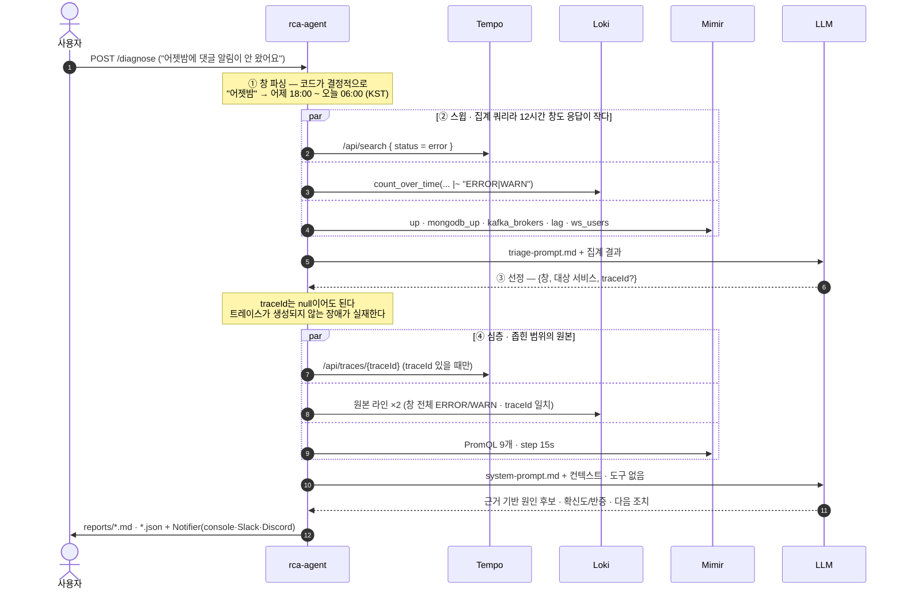

# 아키텍처 — 조사 한 번의 전체 흐름

> 컴포넌트 구조와 요약은 루트 [README](../README.md#아키텍처)에 있다. 이 문서는 그 안에서
> 실제로 어떤 쿼리가 나가고 무엇이 컨텍스트에 들어가는지를 코드 기준으로 적는다.
>
> **자연어 한 건이 단계마다 어떤 값으로 바뀌는지**(실측 수치 · 빈 값과 실패 처리)는
> [README의 같은 절](../README.md#자연어-한-줄이-코드-안에서-무엇으로-바뀌나)에 있다.
> 여기서는 그 단계들이 **어느 소스에 무슨 쿼리를 던지는지**만 다룬다.

## 계층과 클래스

| 계층 | 클래스 | 역할 |
|---|---|---|
| `api` | `RcaController` | 두 진입점. `/diagnose`는 자연어, `/investigate`는 traceId |
| `triage` | `TriageService` | 4단계를 엮고, 마지막은 `RcaService`에 그대로 넘김 |
| | `TimeExpressionParser` | 자연어 → 시간창. **LLM을 안 쓴다** — 창이 흔들리면 재현이 깨진다 |
| | `Surveyor` · `SurveyProperties` | 3채널 집계 스윕. 무엇을 날릴지는 설정이 정한다 |
| | `TriagePlan` | LLM 계획 JSON → `Scope`. 못 읽으면 스윕 창을 그대로 쓰고 기록을 남김 |
| `collector` | **`Scope`** | `(창 + 대상 서비스 + traceId?)` — 탐색↔분석 계약 |
| | `Collector` | 좁힌 범위의 원본 수집. 한 소스가 죽어도 완주 |
| `client` | `TempoClient` · `LokiClient` · `MimirClient` | 스윕과 심층이 **같은 클라이언트를 재사용** |
| `analyzer` | `ContextAssembler` | 가공 없이 6개 섹션으로 이어붙임 |
| | `EvidenceExtractor` | 원본 JSON → 회고 가능한 관측값 (span·로그 원문·0 구간) |
| `report` | `RcaReport` | 분석 + `Triage`(선정 근거) + `Evidence`(관측값)를 한 문서로 |

## 순서

자연어로 들어오면 **스윕 → 선정 → 심층 → 분석** 네 단계를 돈다.
LGTM 호출은 스윕 7번 + 심층 12번, LLM은 단계마다 **한 번씩** 총 2번이다.



**①은 LLM이 아니라 코드가 한다.** 12시간 창 앞에서 모델은 무엇을 물어야 할지 모르고,
물어보게 하면 회차마다 다른 창이 나와 재현이 깨진다. LLM은 ③의 판단부터 들어온다.

**`POST /investigate`(traceId 직접 입력)는 ④부터 시작한다** — 기존 v0 경로 그대로이고,
같은 `Collector`·같은 프롬프트를 쓴다. 두 진입점의 분석 코드가 같아야 점수를 비교할 수 있다.

## 어느 소스에서 무엇을 왜 가져오나

| 소스 | 호출 | 실제 쿼리 | 왜 |
|---|---|---|---|
| **Tempo** | 1회 | `GET /api/traces/{traceId}` | span 트리 — 서비스 경계·구간별 소요·에러 태그. **동시에 시간창의 기준점**이라 나머지 두 소스의 조회 범위가 여기서 파생된다 |
| **Loki** | 2회 | ① `{service_name=~"content-service\|auth-service\|chat-service"} \|~ "ERROR\|WARN"`<br>② `{service_name=~"..."} \|= "<traceId>"` | ②는 **이 요청**에 무슨 일이 났나, ①은 **같은 시각 다른 곳**에서 뭐가 터졌나. ①이 있어야 "여러 서비스의 다른 증상이 사실 한 뿌리"가 보인다 |
| **Mimir** | 9회 | `up` · `mongodb_up` · `kafka_brokers` · `kafka_consumergroup_lag` · `websocket_active_users` · `hikaricp_*` · gc · 401 rate | 트레이스에 안 남는 장애를 잡는 채널. **파드가 사라지면 시계열이 끊기는 것 자체가 신호**다 |

**세 채널이 다 필요하다는 건 실측으로 확인됐다** — 실제 회차에서 결정타가 매번 다른 곳에 있었다.

| 회차 | 결정적 신호 | 어디에 |
|---|---|---|
| IN-2 | producer span **60,015ms** + `not present in metadata` 로그 원문 | 트레이스 + 로그 |
| AU-2 | 트레이스가 **아예 없음** → `up` 등 3계열 단절만으로 auth 다운 도달 | 메트릭 단독 |
| AP-2 | 트레이스는 4 span에 `exception=none` → NPE 스택은 로그에만 | 로그 단독 |

## 조립과 분석

수집한 것을 **가공 없이** 한 덩어리 텍스트로 잇는다. 요약도 병목 추출도 하지 않는 것이 v0의
설계다 — 사람이 미리 골라준 것이 아니라 원본을 주고 추론을 맡긴다
([왜 루프도 도구도 없나](decisions/adr-002-single-pass-baseline.md)).

```
# 조사 대상          traceId · 질문 · 조회 시간창(UTC)
# 수집 실패/누락      ← "이 공백을 감안해 결론의 확신도를 낮춰라"
# 트레이스 (Tempo)    원본 JSON · 100KB 초과 시 duration 상위 30 span으로 대체
# 로그 - ERROR/WARN (Loki)
# 로그 - traceId 일치 (Loki)
# 메트릭 (Mimir)      PromQL별 원본 응답
```

시스템 프롬프트는 **출력 구조를 강제**한다 — ① 원인 후보(최대 3) ② 후보별 근거·확신도·
**반증 데이터** ③ 권장 다음 조치. 그리고 세 가지를 금지·요구한다: 근거 없는 원인 생성 금지 ·
판단 불가면 "데이터 부족"과 **추가로 수집할 것**을 명시 · 수집 실패가 있으면 확신도를 낮출 것.

- **한 소스가 죽어도 조사는 완주한다.** 실패는 문자열로 모여 컨텍스트 맨 앞에 그대로 들어간다.
- **LLM·Notifier는 설정으로 갈아끼운다.** 인터페이스 뒤에서 `@ConditionalOnProperty`로 구현체 하나만 뜬다.
- **원본 응답은 `reports/raw/`에 보존**되고, 조사 중 모든 로그에는 traceId가 MDC로 붙는다.

## 리포트에는 결론만이 아니라 근거가 남는다

모델의 서술만 남기면 **나중에 그 서술이 맞았는지 확인할 방법이 없다.** 회고와 채점은
바꿔 쓴 문장이 아니라 원문 위에서만 성립하므로, 리포트가 관측값을 함께 싣는다.

| 절 | 무엇이 남나 |
|---|---|
| **탐색 (Triage)** | 시간창을 어떻게 해석했는지 · 스윕 창 → 좁힌 창 · 선정 이유와 근거 · **고르지 않은 트레이스 후보까지** |
| 수집 범위 (Coverage) | 얼마나 봤나 — 바이트·span 수·누락 메트릭·컨텍스트 토큰 |
| 분석 | 근거 기반 원인 후보 · 확신도/반증 · 다음 조치 |
| **관측 증거 (Evidence)** | 무엇을 봤나 — duration 상위 span(시각 포함) · **로그 원문** · 메트릭 시계열의 min/max/last와 **값이 0이던 구간** |

```
### 메트릭 시계열
| 쿼리          | series               | 점 | min | max | last | 값이 0이던 구간                       |
| `mongodb_up`  | `{instance=mongo-0}` |  4 |   0 |   1 |    1 | **2026-07-27T17:31:00Z ~ 17:32:00Z**  |
```

**0으로 꺾인 구간을 따로 뽑는 이유**는 실측이다 — 트레이스가 아예 없는 장애에서 `up`이 끊긴
것이 유일한 도달 경로였던 회차가 있다. 원본 전체는 `reports/raw/`에 남고, 리포트가 그
접두사를 적어 되짚어갈 수 있게 한다.

## 알려진 공백

- **서비스 그래프를 코드가 모른다.** 토폴로지가 세 프롬프트 파일에 복붙된 한 문장이고,
  `TraceSpans`가 `parentSpanId`를 읽지 않아 **트레이스를 갖고도 호출 그래프를 못 만든다.**
  IN-1(Redis 다운 → 3서비스 상이한 증상을 단일 근원으로 수렴)이 이것에 가장 크게 걸린다.
- **공유 인프라 의존은 서비스 그래프로 안 잡힌다.** Tempo가 만드는 service graph는
  서비스↔서비스만 담는데 12문항은 인프라 원인이 다수다 — 정적 의존 맵이 따로 필요하다.
- **장애 때는 동적 그래프가 빈다.** CH-2·AU-2는 트레이스가 생성되지 않아, *"평소엔 있던
  엣지가 지금 없다"* 를 신호로 쓰려면 **평시 그래프를 대조군으로** 들고 있어야 한다.

> 이 공백을 메우는 변경은 **점수를 움직인다.** baseline 9회는 "프롬프트 한 문장"으로 받은
> 점수이므로, 토폴로지 추가는 [변경군으로 측정할 대상](round-2/README.md)이지 슬쩍 끼울 것이 아니다.
