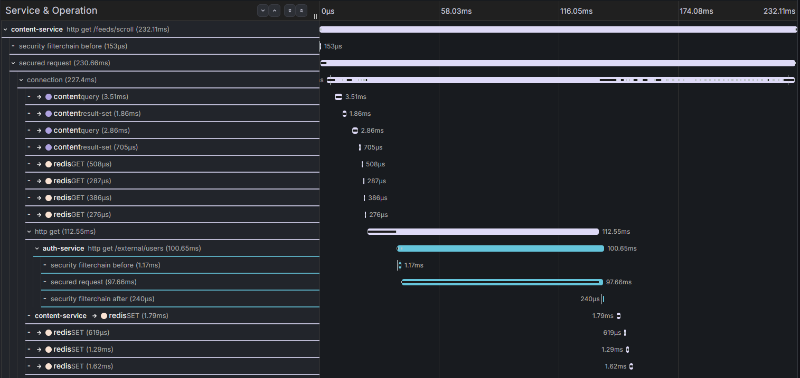
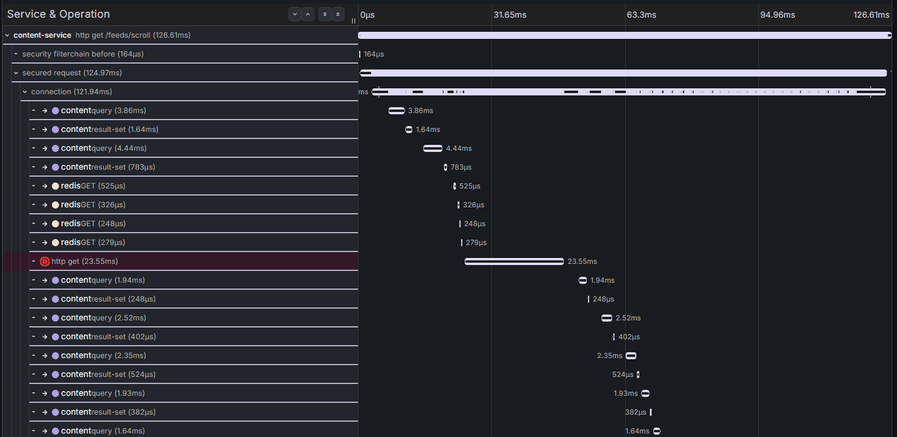

# AU-4 회차 1 (재실행) — auth 다운 + 캐시 만료: 익명 fallback, refused가 트레이스에 자백

> **구 회차 1(07-27 07:00Z 채록, 22분 51초 다운)은 폐기하고 이 재실행(14:29Z~)을 회차 1로
> 한다.** 폐기 사유: 구 회차는 앵커가 틀린 사실("3s timeout" — 실측은 Connection refused
> 23.5ms)을 만점 요건으로 요구하는 상태에서 채록·조사돼 채점 불가(채점 대장 유형 C)로
> 끝났다. 앵커 정정 후 재주입한 이 회차를 유효 회차 1로 삼는다(출제자 결정, 2026-07-27).
> 스크린샷 3장(img*.png)은 폐기 회차 트레이스 기준이지만, 재실행 symptom과 **모양이 동일**
> (external/users span의 refused)하여 그대로 사용한다.

## 한눈 요약

| | |
|---|---|
| **실제 원인** | `kubectl scale deploy/auth-service --replicas=0` + user 캐시(TTL 10분) 만료 — content가 auth 직행 → **Connection refused** → `createFallbackUserInfo`(익명 "사용자N") 저하 |
| **갈래** | A — fallback 정상 저하 (T2 200 + 작성자 익명). 붕괴(5xx) 아님 |
| **에이전트 파악 원인** | 1순위 "auth 연결 불가로 작성자 조회 실패 → 익명 폴백 렌더링" — client span의 refused 원문·`userIds=3,7,9,56` 벌크 조회·auth 의존 필드만 결손된 구조 인용. 2순위 폴백 로직('사용자{id}' 생성 지점 — 낮음, 코드 미확보 명시). 3순위 근본 인프라 — **"refused는 타임아웃이 아니라 Endpoints 부재(Pod 0)를 시사"**로 정확 감별, 단 auth 파드 상태 미수집으로 유보(정당) |
| **§8 채점** | **75 / 100** (v3 갈래 A) — 근본 **30** · 근거 **20** · 오귀인 20 · 조치 5. 07-27 라운드는 파일럿(폐기)로 v3 도출, 재실행이 유효 회차 1(v3가 재실행 주입보다 앞서 §8.2 충족). 감점 25 = 캐시 만료 미식별(근본 10·조치 5) + baseline 대조 없음(근거 10) — 도구 결함 아닌 실행 분산. 상세는 [채점 대장](../scoring/README.md#au-4-회차-1-재실행--75--100-v3-갈래-a) |
| **토큰·비용·시간** | in 56,325 / out 2,980 tok · **$0.5209** · 58.2s — 파일럿 장황본 대비 −$0.19 · −107s (출력 10,511→2,980 tok) |
| **에이전트 보고서 전문** | [round-1-rca-report.md](round-1-rca-report.md) |

## §8 채점 근거 (항목별) — 몇 점을, 무슨 사실 때문에

**v3 갈래 A 앵커**(`scenarios/AU-4/answer.md`, 4단계 부분점)와 대조. authoritative 기록은
[채점 대장](../scoring/README.md#au-4-회차-1-재실행--75--100-v3-갈래-a).

| 항목 | 배점 | 점수 | 무슨 사실 때문에 이 점수인가 |
|---|---|---|---|
| 근본 원인 | 40 | **30** | 부분점(상) "auth 다운 확정, **캐시 만료 발현 조건 미언급**"에 정확 해당. refused→익명 폴백을 확신 1순위로 확정(강함)했으나 캐시 만료 트리거 미식별 — 벌크 호출 발생만 언급, Redis GET↔캐시 미스 미연결. 관측 불가 아니라 **놓친 것**(파일럿 장황본은 특정). v3의 30 중간 구간이 이 케이스를 정확히 담음 |
| 근거 경로 | 30 | **20** | 부분점(상) "3종 중 2종". 실패방식 구별 ✓(refused, timeout 아님)·익명 전환 ✓, **baseline auth span 대조 ✗**(단일 traceId 입력이라 미수행). v3가 baseline 대조를 이 문항 고유 판별 신호(AU-2 vs AU-4)로 만점에 명시 |
| 오귀인 | 20 | **20** | 만점. content/Redis 미지목, 200을 graceful degradation으로 정확 프레이밍. Pod 부재는 후보 3 계층 분리·확신도 낮음 유보 |
| 조치 | 10 | **5** | 부분점(상) "auth 복구만". endpoints/svc/pod + auth 스크레이프 갭 발견했으나 만점의 **캐시 TTL·워밍 없음** — 근본원인 캐시 만료 미식별과 같은 뿌리 |
| **합계** | **100** | **75** | 감점 25 = 근본 10 + 근거 10 + 조치 5 |

> **개선 추적**: 캡이 둘로 갈린다. 근거경로 −10(baseline 대조)은 **v0.1이 입력에 baseline 창을
> 넣으면 오른다(도구 델타)**. 근본 −10·조치 −5(캐시 만료 미식별)는 도구 결함이 아니라 간결본
> 누락이라 **프롬프트 튜닝/N≥2 평균으로만** 오른다. 파일럿 장황본은 이 둘 다 잡아 ~95였다 —
> 같은 v0, thoroughness 차이. (대조: AP-1·CH-2는 순수 v0.1 델타 문항)

## 장애 상황

- 주입: auth-service scale 0 — **14:29:49Z(마지막 auth 스크레이프)부터 부재**. 원복 시각은
  서버 `evidence/timeline.log` 참조
- 증상 T2: 주입 ~15분 후(캐시 TTL 10분 경과) 피드 스크롤 — **HTTP 200인데 작성자 익명**.
  에러율·지연 어느 쪽에도 안 잡히는 "성공한 장애"
- 로그인 경로는 auth 파드 부재로 전면 불가(트레이스 미생성 — AU-2에서 확인된 특성)

## 스크린샷용 traceId

| 용도 | traceId | spans | duration |
|---|---|---|---|
| **장애 창** (symptom, 캐시 만료 + auth 다운) | `6a676edbd07a4b966d03330e318ef61d` | 66 | 174ms |

## 실제 신호 발췌 (출제자 판독)

**Tempo — 증상 트레이스의 모양** (14:44:43Z, 루트 `http get /feeds/scroll` 200/174ms)

- 피드 목록 DB 조회 정상(`tb_feed` 11건, `jdbc.row-count=11`) → **`http get` CLIENT span
  1개만 ERROR**: `Connection refused: auth-service...:8081`,
  `http.url=.../api/external/users?userIds=3,7,9,56`
- 루트는 200 SUCCESS — 실패를 삼키고 익명으로 저하(graceful degradation)
- refused = 즉시 거절(타임아웃 아님) — Endpoints 부재의 시그니처. 지연 기반 알람으로는
  원리적으로 못 잡는다

**baseline (auth 정상) — 대조군**: `http get /external/users` 서버 span이 100.65ms에 정상
성공하고, 그 앞에 **redisGET 4건**(작성자 4명 캐시 읽기) → auth 조회 → redisSET(캐시 쓰기)
흐름이 보인다.

**symptom (auth 다운)**: 같은 위치의 `http get`이 **23.55ms에 ERROR(빨간 마커) = Connection
refused**. 그 앞의 **redisGET 4건**이 캐시 미스(TTL 만료)로 auth 벌크 조회를 유발했다는
증거다 — 폐기 장황본은 이 "redisGET 4 = 작성자 4명" 대응으로 캐시 만료를 특정했고, 이번
간결본은 이 그림 속 증거를 활용하지 못해 근본원인 20점에 그쳤다(채점 근거 참조).

## 도구 관찰 (v0 조건 일관성)

- Loki 0건 조사 지속 — 에이전트가 확신도를 "높음 → 중간~높음"으로 명시 하향 (규칙 준수)
- 에이전트 입력에 auth 파드/k8s 상태 신호 없음 — 근본 원인(스케일다운 vs crash vs 포트
  오구성)은 후보 3으로 유보하고 확인 명령(kubectl endpoints/svc)을 조치로 제시
- CLI 샌드박스 격리 활성

- 대비쌍: 같은 주입에서 트레이스가 **무신호**였던 [AU-2 round-1](../au-2/round-1.md) —
  캐시 상태 하나로 관측 가능성이 뒤집히는 것이 이 문항의 존재 이유
