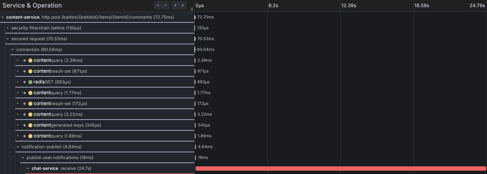
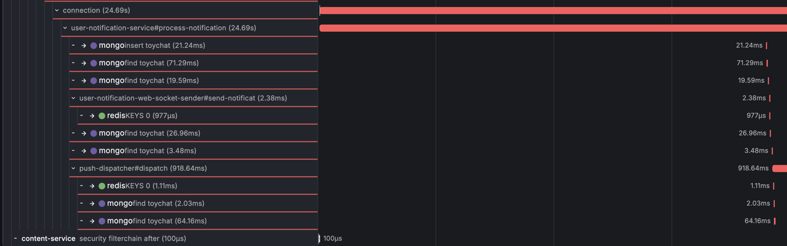

# CH-1 회차 1 — 다운 73초: 경계 안쪽, 지연으로 흡수

## 한눈 요약

| | |
|---|---|
| **실제 원인** | Mongo 컨테이너 정지 73초 — 드라이버 대기(30s) 안에 복구돼 첫 시도가 그대로 성공, 재시도 미발동 |
| **실제 영향** | 알림 24.7초 지연 도착, 유실 0 |
| **에이전트 파악 원인** | "미계측 블로킹 구간"(위치 특정, 확신도 높음) + "Mongo 서버 셀렉션 대기" **가설·확신도 낮음** — 방향은 맞았으나 확정 실패 |
| **판정** | 위치·오귀인 배제 정확 / 원인 확정 실패 (계측 공백 + 에이전트 Loki 셀렉터 결함) |
| **§8 채점** | **채점 불가 (앵커 부적합)** — 근본 20/40 · 오귀인 20/20은 산출됐으나, 근거 경로·조치는 앵커가 "재시도→DLQ" 전개를 전제해 **이 회차엔 발생하지 않은 신호**를 만점 요건으로 요구한다. 사유·처리는 [채점 대장](../scoring/README.md#ch-1-회차-1--채점-불가-앵커-부적합) |
| **토큰·비용·시간** | in 44,798 / out 9,162 tok · **$1.0845** · 135.4s |
| **에이전트 보고서 전문** | [round-1-rca-report.md](round-1-rca-report.md) |

## 장애 상황

- 주입: 인프라 노드 `docker stop mongodb` — **07:53:51 ~ 07:55:04 UTC (73초)** = KST 16:53:51 ~ 16:55:04
- 트리거: 주입 중 배틀 아이템 댓글 1건(T1) → 알림 이벤트 발행 → chat-service 컨슈머가 Mongo에 저장하는 경로
- 결말: 알림 **24.7초 지연 도착, 유실 0**. 컨슈머의 Mongo 드라이버가 서버 셀렉션을 기다리는 동안(기본 30s) Mongo가 복구돼 예외 없이 통과했다. 재시도·DLQ 미발동.

## 스크린샷용 traceId

| 용도 | traceId |
|---|---|
| **장애 트레이스** (23.44초 공백) | `6a65bd43c41bfa6c5c18a89e1f855373` |
| 정상 대조 트레이스 (같은 경로, 주입 직전 baseline) | `6a65bd09aed73deb72fbb82ac56c66b8` |

## 실제 신호 발췌

**Tempo — 장애 트레이스의 모양** (트레이스 `6a65bd43...` 워터폴)



- content `http post /battles/{battleId}/items/{itemId}/comments` **72.75ms** → `notification-publish` 4.64ms → `publish user.notifications` 18ms — 업스트림 전부 정상, 사용자는 200을 받음. 붉은 막대는 chat `receive`(24.7s)부터다.



- chat `user-notification-service#process-notification` **24.69초** — 그런데 자식 span들(mongo `insert toychat` 21.24ms, find, websocket sender, `push-dispatcher#dispatch` 918ms)은 전부 타임라인 **오른쪽 끝에 몰려 있다**. 막대 왼쪽의 빈 구간이 **자식 없는 23.4초 공백** = Mongo 드라이버의 서버 셀렉션 대기.
- 같은 스샷에서 chat의 JDBC `connection` span도 **24.69초** — 컨슈머가 Mongo를 기다리는 내내 MySQL 커넥션을 잡고 있었다는 뜻 (NF-01의 실물).

**Loki — 처리 완료 로그** (지연의 끝 지점)

```
16:53:56 KST  [Kafka] 알림 처리 완료  traceId=6a65bd09...  ← baseline (정상, 즉시)
16:55:08 KST  [Kafka] 알림 처리 완료  traceId=6a65bd43...  ← 장애 건 (Mongo 복구 4초 후)
```

쿼리: `{service_name="chat-service"} |= "알림 처리 완료"` · 시간 범위 KST 16:53~16:56
`알림 처리 실패`·`DLQ`·`Retry`는 **0건** — 예외가 안 터졌으니 당연하고, 그 부재 자체가 "경계 안쪽" 판정의 근거다.

**Mimir — 원인 메트릭**

쿼리: `mongodb_up` · 시간 범위 KST 16:50~17:00 → **1 → 0(16:53:45~16:54:00 부근 2샘플) → 1** 딥이 보인다.

## 원인 대조

| | 내용 |
|---|---|
| **실제 원인** | Mongo 컨테이너 정지 73초. 다운이 드라이버 `serverSelectionTimeoutMS`(30s) 안에 끝나 예외 없이 지연으로만 발현 |
| **에이전트 파악 원인** | ① "process-notification 내부 미계측 블로킹 구간"(위치 특정, 확신도 높음) ② "첫 Mongo 작업 직전 대기 — 커넥션/서버 셀렉션 지연 **가설**"(확신도 낮음) — **정답 방향이지만 확정 실패** |
| **판정** | 위치 특정·오귀인 배제(lag 1.45ms, Hikari pending 0, GC 정량 반증)는 정확. 원인 확정을 못 한 이유는 모델이 아니라 데이터: 공백 구간에 span·로그·드라이버 메트릭이 전무했고, 에이전트의 Loki 셀렉터 결함으로 로그 0건 조사 |

- RCA 리포트: [`reports/6a65bd43...-20260726T080237.md`](../../reports/6a65bd43c41bfa6c5c18a89e1f855373-20260726T080237.md) — in 44,798 / out 9,162 tok · $1.0845 · 135.4s
- 평가 상세: [AE-01](../findings/ae-01-rca-v0-ch1-blind-eval.md) · 시스템 발견: [NF-07](../findings/nf-07-notification-delay-loss-boundary.md)
