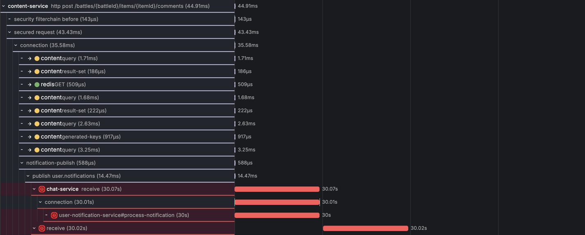
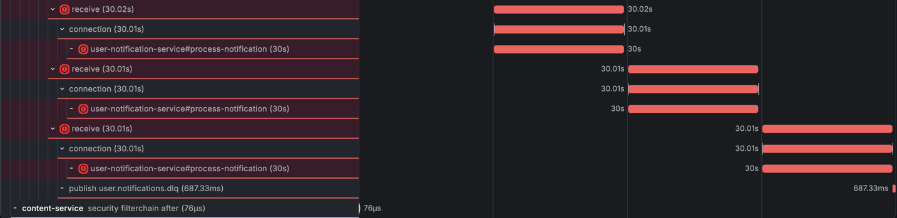
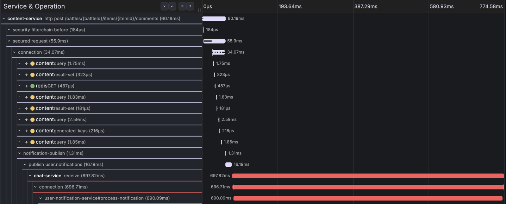
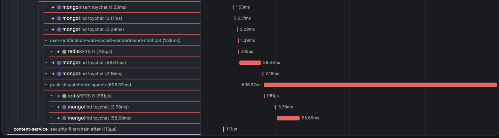

# CH-1 회차 3 — 다운 4.5분: 경계 바깥, DLQ 경유 복구

## 한눈 요약

| | |
|---|---|
| **실제 원인** | Mongo 컨테이너 정지 4분 31초 — 드라이버 대기(30s) 초과, 소비 4회 실패 → DLQ → 재처리 반복 → 복구 후 성공 |
| **실제 영향** | 알림 3분 36초 지연 도착, 유실 0 (수정 전 코드였다면 유실) |
| **에이전트 파악 원인** | "MongoDB 다운(mongod 미리스닝, Connection refused)" **확신도 높음 — 정답** |
| **판정** | 원인 정답 / 영향 오판 1건 — "유실"로 판정했으나 실제는 DLQ 복구 도착 (DLQ trace 단절 + Loki 셀렉터 결함 탓) |
| **토큰·비용·시간** | in 47,503 / out 6,756 tok · **$1.0200** · 101.8s |
| **에이전트 보고서 전문** | [round-3-rca-report.md](round-3-rca-report.md) |

## 장애 상황

- 주입: `docker stop mongodb` — **08:20:33 ~ 08:25:04 UTC (4분 31초)** = KST 17:20:33 ~ 17:25:04
- 트리거: 다운 상태에서 댓글 1건(T1, 08:21:31Z) — 이후 3.5분간 다운 유지 (회차 2가 무효가 된 지점을 교정: 대기는 트리거 **후**)
- 결말: 소비 4회 실패(각 30.0초) → **DLQ 발행** → 재처리 1차 실패(다운 중) → 1분 백오프 → **복구 3초 후 재처리 성공**. 총 **3분 36초 지연, 유실 0**. 예외 삼킴 수정(toy-chat `5eecb0a`)이 실전 장애에서 검증된 회차.

## 스크린샷용 traceId

| 용도 | traceId |
|---|---|
| **장애 트레이스** (30s 에러 span ×4 + DLQ 발행) | `6a65c38bea0e08d50df7b169594a2844` |
| 정상 대조 트레이스 (주입 2초 전 baseline — Mongo 정지 직전 마지막 정상 처리) | `6a65c3519ad1ba44949328c318998908` |

주의: DLQ **재처리** 이후 사건은 이 trace에 없다 — 재처리는 `traceId=NONE`으로 끊긴다([NF-08](../findings/nf-08-dlq-trace-discontinuity.md)). 그 구간은 아래 Loki 로그가 유일한 증거라, 로그 스샷이 trace 스샷만큼 중요하다.

## 실제 신호 발췌

**Tempo — 장애 트레이스의 모양** (트레이스 `6a65c38b...`, KST 17:21:31 시작)



- content POST **44.91ms** → `publish user.notifications` **14.47ms** 성공 — 업스트림 무결. 첫 `receive`가 에러 배지(⊘)를 달고 **30.07초**, 그 안의 `process-notification` 30s에는 자식 span이 **하나도 없다** (전부 서버 셀렉션 대기).



- 소비 4회가 각각 **정확히 30.0초**(`serverSelectionTimeoutMS=30000` 기본값)로 계단을 그리며 실패: 17:22:01 / 17:22:32 / 17:23:03 / 17:23:34 KST. 매 시도마다 JDBC `connection` span도 30초씩 — 실패 4회 동안 MySQL 커넥션을 총 2분간 점유(NF-01)했고, 이벤트는 `acquired → rollback`.
- span error 원문: `Timed out while waiting for a server ... MongoSocketOpenException ... Connection refused`
- 마지막 실패 직후 **`publish user.notifications.dlq` 687.33ms** — 이 trace의 마지막 장면.

**정상 대조** (트레이스 `6a65c351...`, 주입 2초 전 — 같은 경로의 평상시 모양)




- 같은 경로가 receive **697.82ms**에 완료(장애 시도 1회의 1/43). 내부는 mongo `insert` 1.53ms, `push-dispatcher#dispatch` 606ms — 장애 트레이스에서 사라졌던 자식 span들이 전부 여기 있다.

**Loki — 재시도·DLQ·재처리 전체 체인** (스샷 포인트: 실패 4줄의 31초 간격)

```
17:22:01 KST  [Kafka] 알림 처리 실패  traceId=6a65c38b...   ← 1차 (30s 타임아웃)
17:22:32 KST  [Kafka] 알림 처리 실패  traceId=6a65c38b...   ← 2차 (백오프 1s + 30s)
17:23:03 KST  [Kafka] 알림 처리 실패  traceId=6a65c38b...   ← 3차
17:23:34 KST  [Kafka] 알림 처리 실패  traceId=6a65c38b...   ← 4차 → DLQ 발행
17:23:35 KST  [Kafka] DLQ 알림 재처리        traceId=NONE   ← 재처리 1차 (여기부터 trace 단절)
17:24:05 KST  [Kafka] DLQ 알림 재처리 실패   traceId=NONE   ← Mongo 여전히 다운
17:25:05 KST  [Kafka] DLQ 알림 재처리        traceId=NONE   ← 1분 백오프 후
17:25:07 KST  (재처리 성공 — 이후 실패 로그 0건)
```

쿼리: `{service_name="chat-service"} |~ "알림 처리|DLQ"` · 시간 범위 KST 17:20~17:27

**Mimir — 원인 메트릭**

쿼리: `mongodb_up` · 시간 범위 KST 17:15~17:30 → **17:20:33~17:25:04 구간 0** (약 4분 30초짜리 딥 — 회차 1의 2샘플짜리와 대조된다).

## 원인 대조

| | 내용 |
|---|---|
| **실제 원인** | Mongo 컨테이너 정지 4.5분. 드라이버 대기(30s)를 넘겨 예외 발생 → 수정된 컨슈머가 rethrow → 재시도(1s×3)→DLQ→재처리 백오프(1분)로 이어져 복구 직후 도착 |
| **에이전트 파악 원인** | "MongoDB 인스턴스 다운 — mongod 미리스닝, Connection refused" **확신도 높음 — 정답**. 30.0s×4=드라이버 기본값 대조, refused/timeout 구분, 같은 호스트 Redis 0.5ms 정상을 반증으로 호스트·네트워크 장애 배제 |
| **오판 1건** | 영향을 "미발송(**유실**)"으로 판정 + "DLQ 재처리 컨슈머가 없다면 수동 재발행 필요" — 실제로는 재처리 리스너가 이미 성공. 에이전트가 볼 수 있는 마지막 데이터가 "DLQ 발행"이었기 때문(trace 단절 + 자체 Loki 셀렉터 결함) |
| **판정** | 원인 1줄은 정답, 영향 판정은 관측 구조의 한계로 오판. 회차 1과의 차이는 계측(`cdca2a5`·`5eecb0a`)이 만든 것 — 같은 모델이 trace가 자백하자 확정까지 갔다 |

- RCA 리포트: [`reports/6a65c38b...-20260726T082912.md`](../../reports/6a65c38bea0e08d50df7b169594a2844-20260726T082912.md) — in 47,503 / out 6,756 tok · $1.0200 · 101.8s
- 평가 상세: [AE-02](../findings/ae-02-rca-v0-ch1-round3-eval.md) · 시스템 발견: [NF-07](../findings/nf-07-notification-delay-loss-boundary.md) · [NF-08](../findings/nf-08-dlq-trace-discontinuity.md)
