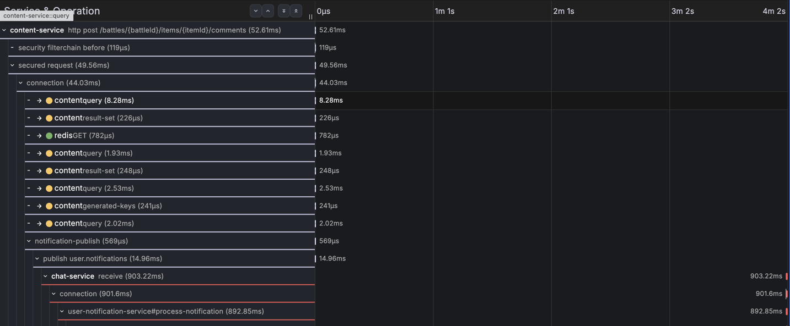
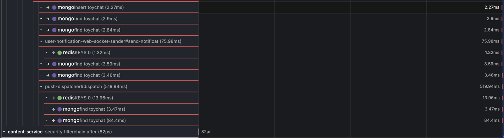

# CH-2 회차 1 — 컨슈머 9분 정지: lag 누적, 복구 후 몰아서 도착

## 한눈 요약

| | |
|---|---|
| **실제 원인** | chat-service `--replicas=0` 스케일다운 9분 5초 — 발행측 무결, 소비자만 부재. 메시지 25건이 브로커에 적체(lag 25) |
| **실제 영향** | 알림 4~10분 지연 후 복구 시 **일괄 도착, 유실 0** (lag 25→0 즉시 소진) |
| **에이전트 파악 원인** | "chat 소비자 파드 부재로 인한 소비 지연 ~4분 — 안 온 게 아니라 늦게 처리됨" — **본질 정답**. 구 파드 메트릭 시계열 소멸 + 신 파드 등장 직후 소비 재개라는 메트릭 고고학으로 도달. 부재의 사유(스케일다운 vs crash)는 k8s 이벤트 미수집으로 미확정(정당한 유보) |
| **판정** | 지연 소비 확정(241.4초 갭)·발행측 무결 판정·지연/유실 구분 모두 정확. "최종 발송(FCM/WS) 여부는 계측 공백으로 미확정"이라는 유보도 옳음 — NF-02를 독립 재발견 |
| **§8 채점** | **채점 불가 (앵커 부적합)** — 근본원인 **40/40** · 오귀인 **20/20**은 만점이나, 근거 경로는 앵커가 요구한 3종 중 2종(lag 곡선·`active_users`)이 **에이전트 수집 목록에 없고**, 조치는 앵커가 "복구 전 조사"만 상정해(조사 시점엔 이미 복구 완료) 구간이 없다. 상세는 [채점 대장](../scoring/README.md#ch-2-회차-1--채점-불가-앵커-부적합) |
| **토큰·비용·시간** | in 45,935 / out 5,083 tok · **$0.9040** · 76.1s (4회 조사 중 최단) |
| **에이전트 보고서 전문** | [round-1-rca-report.md](round-1-rca-report.md) — 주의: 리포트 내 절대 시각은 -120s 밀림(아래 참고) |

## 장애 상황

- 주입: `kubectl scale deploy/chat-service --replicas=0` — **09:43:51 ~ 09:52:56 UTC (9분 5초)** = KST 18:43:51 ~ 18:52:56. 신 파드 ready 09:53:05, **lag 25 → 0 소진 09:54:0x**
- 트리거: 다운 중 댓글 다수(10~20초 간격 루프) + 증상 T1(09:49:30) — 발행은 전부 성공(발행측 무결), 소비만 정지
- 결말: 복구 직후 밀린 25건 일괄 소비 — `알림 처리 완료` 50줄(25건×로그 2곳)이 1분 안에 몰림. **CH-1(소비 실패→DLQ)·IN-2(발행 실패→유실)와 달리, 이번엔 아무것도 실패하지 않았다 — 그냥 멈춰 있었을 뿐**

## 스크린샷용 traceId

| 용도 | traceId |
|---|---|
| **장애 트레이스** (publish→consume 사이 4분 갭이 한 트레이스에) | `6a65d82afd3e2638aa9c2020f0a1fbe9` |
| 정상 대조 트레이스 (주입 1초 전 baseline) | `6a65d6d63b86c06776444fc83773c72e` |

## 실제 신호 발췌

**Tempo — 장애 트레이스의 모양** (KST 18:49:30 시작)

- content POST + `publish user.notifications` 즉시 성공(09:49:30.082) — 발행측 완전 무결
- chat `receive`가 **09:53:31.503에야 시작** — 발행에서 **241.4초 뒤**. 그 사이 트레이스는 텅 빈 구간 (CH-1 회차 1의 23초 공백과 같은 문법, 다른 위치 — 그쪽은 소비 "안"의 공백, 이쪽은 발행과 소비 "사이"의 공백)
- 소비 후 처리는 전부 정상: Mongo insert·설정 조회·dispatch 520ms, 에러 0 — 백로그 소비가 원 트레이스에 이어 붙어 "늦은 결말"까지 한 트레이스에 남았다

발행과 소비 "사이"의 4분 공백이 한 트레이스에 그대로 담겼다. 아래는 늦게 시작된 소비의
내부 — 처리 자체는 전부 정상이고, **Mongo `insert`/`find` span**(07-25 배포한 계측)이
실전 장애 채록에서 처음으로 찍혔다:

**Mimir — 이 문항의 주인공 메트릭** (쿼리: `kafka_consumergroup_lag{consumergroup="notification-processors"}` · KST 18:43~18:56)

댓글이 쌓일 때마다 계단식 상승(0→25) → 복구 시점에 수직 낙하(25→0). 에러·5xx·실패 로그가 전부 0인 장애에서 **유일하게 우는 신호**. (chat 자체의 앱 메트릭 `ws_active_users`·spring lag는 소비자가 죽었으니 함께 부재 — 부재 아닌 신호는 exporter뿐)

**Loki — 복구 직후 몰림** (쿼리: `{service_name="chat-service"} |= "알림 처리 완료"` · KST 18:53~18:55)

9분간 0건이던 처리 완료가 복구 직후 1분 안에 50줄(25건) — "몰아서 도착"의 로그 증거.

## 원인 대조

| | 내용 |
|---|---|
| **실제 원인** | 의도적 스케일다운(replicas=0) 9분 — 소비자 부재 |
| **에이전트 파악** | "파드 교체로 인한 소비자 부재 → 4분 지연 소비" 확신도 중간(지연 자체는 높음) — 부재 판정은 정답, 사유(스케일다운/OOM/롤링)는 k8s 이벤트·lag 메트릭 결측으로 판별 불가 처리 |
| **근거 경로 백미** | 메트릭 고고학: 구 파드(`zcsh7`) `jvm_gc_pause` 시계열 소멸 ↔ 신 파드(`s5fbl`) `hikaricp` 첫 등장(09:53:15) ↔ 그 16초 뒤 소비 재개 — 트레이스와 메트릭 시계열의 출현/소멸을 교차시켜 "부재 창"을 재구성 |
| **정확했던 유보 2건** | ① "안 왔는지"가 아니라 "늦게 처리됨" — trace에 늦은 consume이 붙어 있어 지연/유실을 바르게 구분 (DLQ처럼 trace가 끊기는 CH-1 회차 2에선 같은 에이전트가 오판했다 — **영향 판정은 trace 연속성을 따라간다**), ② 최종 FCM/WS 발송은 span 부재로 미확정 — NF-02 재발견 |
| **도구 결함** | -120s 시각 밀림 3번째 재발 — 이번 리포트엔 **raw ns가 병기돼 있어 결정적**: ns(1785059370... = 09:49:30)는 정확한데 변환 시각(09:47:30)만 틀림 → 어셈블러의 시각 포맷이 조회창 시작 기준임이 사실상 확정. Loki 셀렉터 결함 지속(로그 0건 조사) |

- 평가 상세: [AE-04](../findings/ae-04-rca-v0-ch2-blind-eval.md) · 대비쌍: 소비 실패 [CH-1 round-1](../ch-1/round-1.md) · 발행 실패 [IN-2 round-1](../in-2/round-1.md)
