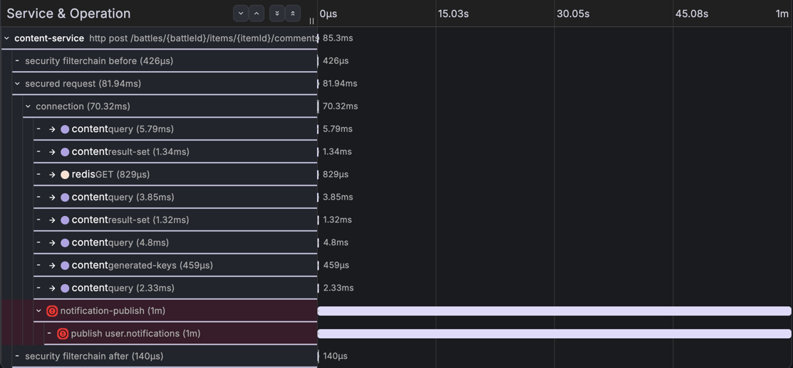
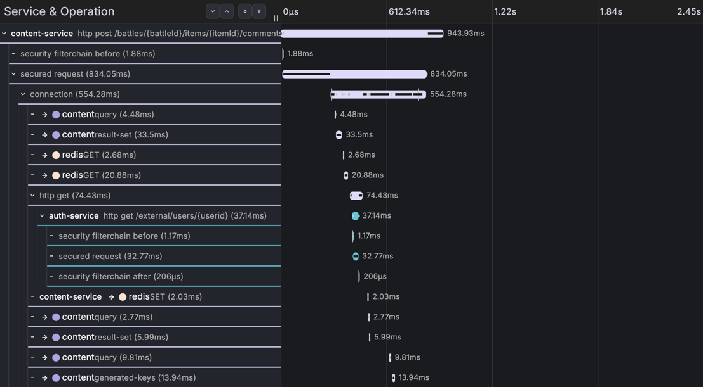
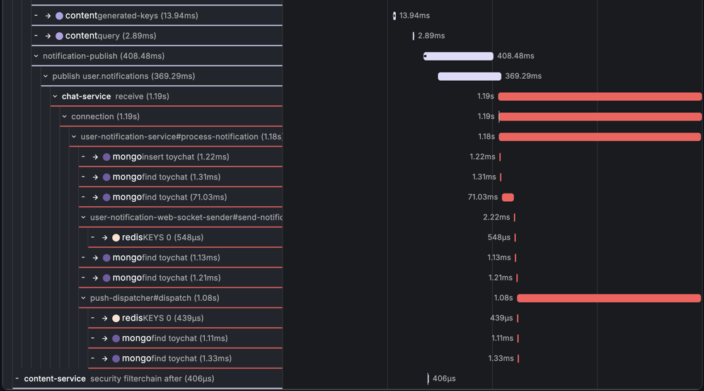

# IN-2 회차 1 (재실험) — Kafka 7분 다운: 발행측 유실, 복구 불가

> **구 회차 1(07-26 09:14Z 채록, 5분 17초 다운, traceId `6a65d039…`)을 폐기하고 이 재실험
> (07-27 15:45Z~)을 회차 1로 한다.** 폐기 사유: 구 회차는 **CLI cwd 격리 도입(07-27) 전**에
> 실행돼 `ProcessBuilder`가 레포 루트를 cwd로 물려줬을 가능성이 있다(CLAUDE.md·`.claude/skills`
> 자동 로드 = 블라인드 오염). 이 재실험은 `ClaudeCliLlmClient`가 `rca-cli-sandbox-*` 임시
> 디렉터리에서 CLI를 실행(실패 시 예외)하는 격리 상태에서 돌았음을 코드·실행으로 확인했다.
> 유실 갈래(발행 실패)는 동일하게 재현됐다(출제자 결정, 2026-07-27).

## 한눈 요약

| | |
|---|---|
| **실제 원인** | Kafka 브로커 정지(7분 21초) — 트리거 시점(주입 +5분 55초)엔 `metadata.max.age.ms`(기본 5분) 경과로 캐시 메타데이터가 만료 → producer `send()`가 `max.block.ms`(60s) 동기 대기 후 `TimeoutException: Topic user.notifications not present in metadata after 60000 ms` → 발행 경로엔 재시도·DLQ·outbox가 없어 그 자리서 영구 유실 |
| **실제 영향** | 트리거 댓글은 200(85ms), 알림 1건 영구 유실. chat 소비 스팬 전무(= 브로커에 진입조차 못 함) |
| **에이전트 파악 원인** | 직접 원인 "content의 Kafka 발행 실패 → chat은 소비할 것 자체가 없음" **확정**(확신도 높음) + "60초 블로킹 후 실패하면 유실 → 재시도·outbox 검토" **정답**. 하위 원인 1위는 "토픽 부재(또는 메타데이터 미확보)"로 오선정 — 실제 = 후보 2 "브로커 다운"(확신도 낮음~중간) |
| **판정** | 발행 실패·유실·소비측 배제 전부 정확 / 하위 원인 감별 실패 — **구 회차 1과 동일한 오선정 재현**. 단 구 회차의 핵심 오독(`peer.service` 클러스터 ID를 "연결 성립" 근거로 읽음)은 **이번엔 안 함** — "클러스터 지정은 돼 있으나 up/down·연결 성공 여부는 이 데이터로 알 수 없다"고 정확히 유보 |
| **§8 채점** | **80 / 100** (근본 20/40 · 근거 30/30 · 오귀인 20/20 · 조치 10/10) — 감점 전액이 하위 원인 감별. 근거·판정은 [채점 대장](../scoring/README.md#in-2-회차-1--80--100). **구 회차와 동일 점수·동일 감점 지점으로 N=2 재현성 시사(단 구 회차 오염 가능성으로 평균 인용은 보류)** |
| **토큰·비용·시간** | in 37,932 / out 2,657 tok · **$0.2976** · 49.4s — 구 회차($0.9237·123.4s) 대비 −$0.63 · −74s (출력 8,266→2,657 tok) |
| **에이전트 보고서 전문** | [round-1-rca-report.md](round-1-rca-report.md) |

## 장애 상황

- 주입: 인프라 노드 `docker stop kafka` — **15:45:58 ~ 15:53:19 UTC (7분 21초)** = KST 07-28 00:45:58 ~ 00:53:19
- 트리거: symptom 채록(④) 댓글 1건, **15:51:53 UTC**(주입 +5분 55초, `kafka_brokers` 이미 부재 확인) — 댓글 저장(MySQL)은 커밋 성공(`generated-keys=134`), 알림 이벤트만 Kafka 발행 시도
- 결말: producer `send()`가 **60,000ms 동기 블로킹** 후 `TimeoutException: Topic user.notifications not present in metadata after 60000 ms` — 리스너가 catch(설계상 유실 허용). **CH-1과 달리 받아줄 재시도 경로가 없어 즉시 영구 유실.**
- 갈래 주의: 이 문항은 **다운 시간이 5분(메타데이터 만료)을 넘느냐**로 갈린다. 같은 날 80~100초만 죽인 3회 시도는 메타데이터가 살아 있어 producer가 레코드를 버퍼에 쥐고 있다가 복구 후 발행 성공(18.7s·26.2s·94.5s **지연 도착**, 유실 아님)했다. 유실은 **트리거 후 60초 이상 다운 유지 + 메타데이터 만료(5분+)** 라야 난다 — 회차 1이 그 조건. (지연 갈래 트레이스: `6a6776b0…`·`6a6779a5…`·`6a677a55…`, reports/에 보존)

## 스크린샷용 traceId

| 용도 | traceId |
|---|---|
| **장애 트레이스** (60,020ms error span, chat 부재) | `6a677e9905de505f67b409e2d5a97ca3` |
| 정상 대조 (주입 전 게이트 댓글, 2-서비스 완전체) | `6a67764bb9e8927bf235c3bb9fdcbd13` (07-27 15:16:27Z) |

## 실제 신호 발췌 (출제자 판독)

**Tempo — 장애 트레이스의 모양** (15:51:53.715Z 시작, content-service 단독)

```
http post /battles/{battleId}/items/{itemId}/comments   85ms · 200 SUCCESS
 ├ query / generated-keys=134 · commit          ← 댓글 저장(MySQL)은 정상 커밋
 └ notification-publish  60,020ms [ERROR]  error="Send failed"
     └ publish user.notifications  60,015ms [ERROR]
         "Topic user.notifications not present in metadata after 60000 ms"
 (chat-service span 0개 — 메시지가 브로커에 진입 못 해 소비 단계 자체가 없음)
```

판독 포인트: ① 근본이 producer span error 원문에 **자백**(60,000ms = `max.block.ms` 기본값),
② 본문 트랜잭션(INSERT 커밋)과 알림 발행이 분리돼 **API 200 + 알림 유실**이 한 트레이스에 공존,
③ **chat span 전무** = CH-1(소비측 30s 에러 span 4개 + DLQ)과의 결정적 차이 — "소비자가 애초에
등장하지 않는 장애".



**정상 대조** (주입 전 게이트 댓글 `6a67764b`, 2-서비스 완전체) — 같은 요청이 정상일 때는
발행이 수백 ms에 끝나고 **chat-service가 소비**한다. 장애 트레이스에서 "사라진 것"이 무엇인지
알아보는 기준.

앞부분(진입·조회):



뒷부분(발행→소비): `publish user.notifications`(369ms) 뒤에 **chat-service `receive` 1.19s →
process-notification → mongo insert → push-dispatcher**까지 소비 체인이 붙어 있다 = 알림 도착.
장애 트레이스에선 이 아래 절반이 통째로 없다.



## 원인 대조

| | 내용 |
|---|---|
| **실제 원인** | Kafka 브로커 전면 다운 (`docker stop kafka`, 7분 21초) |
| **에이전트 파악** | 상위: "발행 실패로 유실, 소비 단계 미도달" 확정 — 정답. 하위 랭킹: ① 토픽 부재/메타데이터 미확보(높음) ② 브로커 다운(낮음~중간) ③ chat 소비측(낮음) — **실제는 ②인데 ①에 무게** |
| **구 회차와 차이** | 구 회차의 핵심 오독(`peer.service` 클러스터 ID를 "연결 성립" 증거로 사용)을 **이번엔 반복하지 않음** — "클러스터 지정은 돼 있으나 up/down·연결 성공은 이 데이터로 알 수 없다"고 유보. 다만 최종 랭킹은 여전히 토픽 부재 1위라 근본 점수(20)는 동일 |
| **판별 불가의 구조적 이유** | 브로커 측 데이터 전무: `kafka_brokers` 수집 목록 밖, `kafka_consumer_fetch_manager_records_lag` 시계열 없음(수집 실패), Loki ERROR/WARN·traceId 모두 0건 |
| **정확했던 것** | 유실 판정(재시도·outbox 없어 60초 후 유실), 소비측 배제(chat span 0개 근거), DB/풀/GC 배제, outbox·발행 재시도 권고, 60s=max.block.ms 대조 |

## 도구 관찰 (v0 조건 일관성)

- **CLI 샌드박스 격리 활성** — `rca-cli-sandbox-*` 임시 cwd에서 실행 확인(구 회차와의 결정적 차이)
- Loki 0건 조사 지속(ERROR/WARN·traceId 매칭 모두 `totalEntriesReturned:0`) — 에이전트가 "로그 교차검증 불가"로 확신도 하향 명시
- `-120s 시각 밀림`은 이번 리포트 분석 본문엔 없음(에이전트가 raw ns/실제 시각 15:51:53으로 인용). 수집 창 자체는 window padding으로 15:49:53Z 시작(트리거 −120s)
- 대비쌍: 같은 "알림 안 와요"라도 소비측 원인인 CH-1 [round-2](../ch-1/round-2.md) — 재시도·DLQ가 받아주느냐(CH-1) 아무도 못 받느냐(IN-2)의 차이
