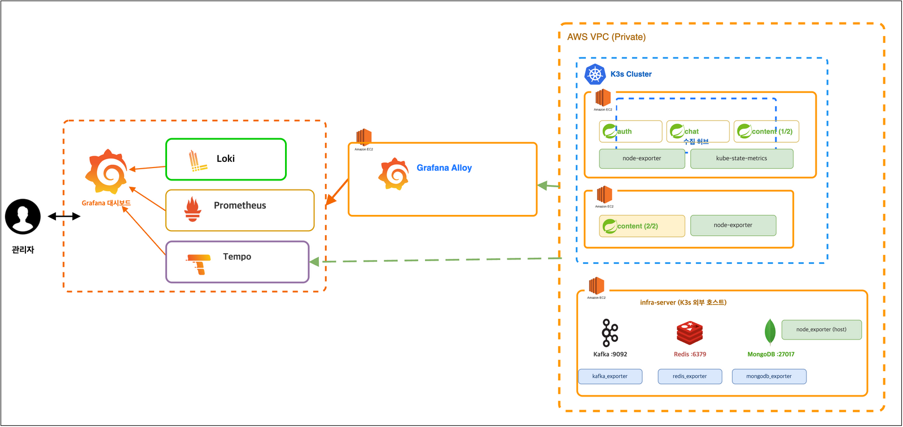

# 관측성 아키텍처 (Monitoring)

이 문서는 rca-agent가 읽는 관측 파이프라인의 실제 구성을 기록한다. 여기 적힌 컴포넌트와
수치는 추정이 아니라 **2026-07-22 Prometheus `up` 쿼리와 Tempo/Loki 실조회로 확인한
실측값**이다. AI RCA의 분석 품질은 이 파이프라인의 커버리지가 상한을 결정하기 때문에,
"무엇이 어디서 수집되고 있고, 무엇이 빠져 있는지"를 정확히 아는 것이 에이전트 개선의
전제 조건이다.

## 전체 흐름

AWS VPC(Private) 안에 K3s 클러스터와 infra-server(K3s 외부 EC2 호스트)가 있다.
Spring MSA 3종(auth / chat / content)은 K3s 위에서 돌고, Kafka·Redis·MongoDB는
infra-server에 있다. 모든 텔레메트리는 **Grafana Alloy(수집 허브)**를 거쳐
Grafana Cloud의 Loki(로그) / Prometheus·Mimir(메트릭) / Tempo(트레이스)로 나간다.
관리자는 Grafana 대시보드로 조회하고, rca-agent는 같은 백엔드 3종을 **읽기 전용
API로 직접 조회**한다 (Basic Auth `인스턴스ID:토큰`, read 스코프 3개 — 연동 검증
과정은 [ADR-004](decisions/adr-004-grafana-cloud-connectivity.md)).

## 수집 인벤토리 (실측: 2026-07-22, `up` 쿼리 기준 23개 타깃)

### 애플리케이션 계층 — Micrometer (:8090)

| job | instance | 비고 |
|---|---|---|
| auth-service | 10.42.3.34:8090 | 1 replica |
| chat-service | 10.42.1.28:8090 | 1 replica |
| content-service | 10.42.1.27:8090, 10.42.3.37:8090 | 2 replicas |

앱이 직접 노출하는 메트릭: `hikaricp_*`(커넥션 풀), `jvm_gc_*` 등.
**주의: Spring Kafka 클라이언트 메트릭(`kafka_consumer_fetch_manager_*`)은 노출되지
않는다.** 이는 실측으로 확인된 공백이며, consumer lag은 아래 exporter 계층에서
관측한다 ([ADR-005](decisions/adr-005-kafka-lag-exporter-metric.md)).

### 미들웨어 계층 — infra-server의 전용 exporter

infra-server는 K3s 밖 단일 호스트로, 미들웨어 3종과 **각각의 전용 exporter**가 함께 떠 있다.
node-exporter는 호스트 CPU/메모리/디스크만 내보내므로, 미들웨어 내부 상태(lag, 커넥션 수,
연산 지연)는 반드시 전용 exporter가 필요하다 — 초기 다이어그램은 이 계층을 node-exporter로
뭉뚱그려 그렸다가 실측 후 수정했다.

| job | 실체 | 대표 메트릭 (실측 존재 확인) |
|---|---|---|
| kafka | kafka_exporter | `kafka_consumergroup_lag`, `kafka_brokers`, `kafka_consumergroup_current_offset`, `kafka_topic_partitions` |
| redis | redis_exporter | `redis_*` |
| mongodb | mongodb_exporter | `mongodb_*` |
| node-infra | node_exporter (host) | 호스트 리소스 |

실측 예 — `kafka_consumergroup_lag`는 consumergroup/topic/partition 라벨로 나오며,
확인 시점 기준 `chat-service-fcm-tokens`(topic `user.fcm-tokens`),
`chat-service-notification-settings`(topic `user.notification-settings`),
`db-writer`(topic `chat.messages`) 전 파티션 lag=0이었다.

### 클러스터 계층 — Alloy k8s 통합

| job | 노드 수 | 내용 |
|---|---|---|
| integrations/kubernetes/cadvisor | 4 | 컨테이너 리소스 |
| integrations/kubernetes/kubelet | 4 | 노드/파드 상태 |
| integrations/kubernetes/resources | 4 | 리소스 사용량 |
| integrations/kubernetes/kube-state-metrics | 1 | 오브젝트 상태 |
| integrations/node_exporter | 2 | K3s 노드 호스트 |

## 트레이스 계측

계측은 **Brave(라이브러리 계측)**다. OTel Agent로의 전환을 검토했으나 대표 흐름 E2E
실측으로 커버리지를 검증한 뒤 유지로 결정했다 — 배경·수치·트레이드오프는
[ADR-001](decisions/adr-001-brave-over-otel.md)에 있다.

실측 트레이스(`6a5dc9c1990469248cfea377e1d7b4a0`, 댓글 작성 → 알림 발송)로 확인된 특성:

- **span 명명 규칙**: 서비스 코드 구간은 `bean#method` (예: `push-dispatcher#dispatch`,
  `user-notification-service#process-notification`). 이 규칙은 kebab→PascalCase 변환으로
  소스 클래스에 기계적으로 매핑된다 — `push-dispatcher#dispatch` →
  `PushDispatcher.dispatch(Long, PushPayload)` 실재 확인. Phase 4 코드 인지 RCA의 기반.
- **JDBC 계측 단위**: SQL 1회가 `query` + `result-set`(+ `generated-keys`) 2~3개 span으로
  나뉜다. 실제 쿼리 수는 `query` span 수로 세야 한다.
- **비동기 경계 전파**: content → Kafka(`user.notifications`) → chat consume까지 단일
  traceId 유지 (1.26s, 2 services, 30 spans).
- **resource attribute 실측**: `cluster`, `host.name`, `k8s.cluster.name`,
  `k8s.deployment.name`, `k8s.namespace.name`, `k8s.node.name`, `k8s.pod.name`,
  `os.type`, `service.name`. — **`service.version`/commit SHA는 없다.**

## 알려진 한계 (실측으로 확인된 것만)

이 목록은 "고칠 것"이 아니라 **에이전트가 분석 시 감안해야 하는 관측 공백의 실체**다.
각 항목에 발견 경위와 해소 계획(전략 문서의 Phase)을 함께 적는다.

1. **외부 호출(FCM) span 부재** — 실전 조사에서 `push-dispatcher#dispatch` 996ms 중
   994ms가 자식 span 없이 비어 있었고, 소스 확인 결과
   `firebaseMessaging.sendEachForMulticast()` 동기 호출(타임아웃 미설정, 예외는 catch 후
   로그만)이었다. 라이브러리 계측의 전형적 사각지대. → Phase 4(코드 인지)가 이 갭을
   메우는 직접적 근거이며, 계측 자체의 보강도 별도 후속.
2. **Spring Kafka 클라이언트 메트릭 미노출** — `kafka_consumer_fetch_manager_records_lag`
   쿼리가 항상 "no series". Mimir label API로 확인 결과 해당 계열 자체가 없음.
   → broker-side `kafka_consumergroup_lag`로 대체 (ADR-005, 적용은 Phase 3 E3).
3. **배포 버전 태깅 부재** — 트레이스에 `service.version`이 없어 "장애 시점에 어떤
   커밋이 돌고 있었나"를 pin할 수 없다. 코드 인지 RCA에서 로컬 HEAD와 prod 코드의
   불일치 리스크. → Phase 4c에서 `service.version=$GIT_SHA` 태깅.

## 부록 — rca-agent 자체 리소스 실측 (2026-07-21, M1 macOS/JDK 21)

| 조건 | RSS |
|---|---|
| 기동 직후 (기본 JVM 옵션) | 170 MB |
| 요청 10회 처리 후 | 196 MB |
| `-Xmx256m -Xss512k` | 217 MB |

힙 실사용 28.9MB(커밋 69.6MB), Metaspace 44.4MB. 컨텍스트가 요청당 수백 KB 수준이라
힙 요구량이 작다. 서버 배포 시 권장: requests 256Mi / limits 512Mi,
`-XX:MaxRAMPercentage=75`. 단 `claude-cli` provider는 조사마다 별도 Node 프로세스가
떠서 수백 MB를 추가로 쓴다 ([ADR-003](decisions/adr-003-llm-provider-claude-cli.md)).
