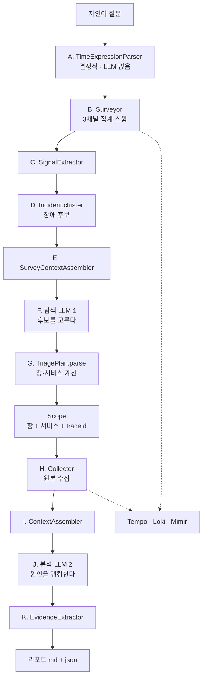

# 워크플로 A-Z — 자연어 한 줄이 리포트가 되기까지

> **이 문서는 "무엇이 무엇으로 바뀌는가"를 그림과 단계로 본다.**
> 어떤 쿼리가 실제로 나가는지는 [architecture.md](architecture.md), 어떤 숫자를 개선 근거로
> 쓰는지는 [measurement.md](measurement.md)에 있다. 여기서 같은 표를 반복하지 않는다.
>
> 읽는 목적이 **토큰 절감**이라면 [§7 토큰은 어디서 부풀어 오르나](#7-토큰은-어디서-부풀어-오르나)부터 봐도 된다.

---

## 1. 한 장으로

```
  자연어 질문
  "최근 1시간 안에 문의가 몇 건 들어왔어요. (1) 로그인이 느리다 ..."
        |
========|=================== 탐색 TriageService ===========================
        v
  [A] TimeExpressionParser      질문 문자열 -> TimeWindow + 확신도
      * 결정적. LLM 안 쓴다 *          "최근 1시간" -> 00:52Z~01:52Z EXACT
        |
        v
  [B] Surveyor                  창 전체에 3채널 집계 쿼리 7회  ---------.
      Tempo 에러 / Tempo 지연 / Loki 발생률 / Mimir 5종                 |
        |                                                              |
        v                                                              |
  [C] SignalExtractor           집계 JSON -> Signal[]                   |
      임계값 안 쓴다. 변화 / 부재 / 존재만                              |
        |                                                              |
        v                                                              |
  [D] Incident.cluster          Signal[] -> INC-1, INC-2, ... INC-15    |
        |                                                              |
        v                                                              |
  [E] SurveyContextAssembler    후보 + 채널요약 + 무신호 (+ 원본JSON)   |
      include-raw=false (회차 5 기본) -> 컨텍스트의 94%던 원본을 뺐다   |
        |                                                              |
        v                                                              |
  (F) 탐색 LLM (1)   <<< 여기서 모델이 하는 일은 "번호 고르기" 뿐 >>>   |
      출력: "INC-7,8,...,15를 고른다. INC-1~6은 시각 불일치로 기각"     |
        |                                                              |
        v                                                              |
  [G] TriagePlan.parse          고른 후보 -> 창 / 서비스 / traceId      |
      * 창은 모델이 아니라 코드가 계산한다 *                            |
        |                                                              |
========|==============================================================|===
        v                                                              |
   << Scope >>   창 + 서비스 + traceId[]     <- 탐색과 분석의 유일한 계약|
                 traceId는 필수가 아니다                                |
        |                                                              |
========|=================== 분석 RcaService ==========================|===
        v                                                              |
  [H] Collector                 좁힌 범위의 *원본* 쿼리 12회+  ---------'
      트레이스 전문 / 로그 1000줄 / 메트릭 9종           (Tempo Loki Mimir)
        |
        v
  [I] ContextAssembler          6개 절로 이어붙임. 가공 최소
        |                       조사대상 / 실패 / 호출그래프
        |                       / 트레이스(압축 B-35) / 로그x2(접기 B-34) / 메트릭(요약 B-25)
        v
  (J) 분석 LLM (2)   <<< 원인 랭킹 + 근거 + 영향 + 조치 >>>
        |
        v
  [K] EvidenceExtractor + ServiceGraphExtractor
        |
        v
     리포트 (md + json)  ---->  ReportStore  reports/
                         ---->  Notifier     console / slack / discord
```

<details>
<summary>같은 그림 (mermaid · GitHub에서 렌더링됨)</summary>



</details>

**핵심 두 가지만 먼저.**

1. **LLM은 딱 2번 부른다.** 루프도 도구 호출도 없다 — v0는 직선 실행이다.
2. **LLM이 하는 일은 생각보다 작다.** 탐색 LLM은 *"후보 번호"* 만 고르고,
   **창·대상 서비스·traceId는 코드가 그 후보에서 계산한다.**

---

## 2. 단계 A-Z 한눈표

| | 단계 | 클래스 | 입력 → 출력 | LLM |
|---|---|---|---|:-:|
| **A** | 시간창 파싱 | `TimeExpressionParser` | 질문 문자열 → `TimeWindow` + 확신도 | ✗ |
| **B** | 스윕 | `Surveyor` | 창 → 3채널 **집계** JSON | ✗ |
| **C** | 신호 추출 | `SignalExtractor` | 집계 JSON → `Signal[]` | ✗ |
| **D** | 후보 군집 | `Incident.cluster` | `Signal[]` → `Incident[]` (INC-1, INC-2…) | ✗ |
| **E** | 탐색 컨텍스트 | `SurveyContextAssembler` | 후보 + 원본 → 텍스트 | ✗ |
| **F** | **후보 선정** | 탐색 LLM | 텍스트 → **"INC-3, INC-7을 고른다"** | **①** |
| **G** | 계획 파싱 | `TriagePlan.parse` | 고른 후보 → **창·서비스·traceId 계산** | ✗ |
| — | **계약** | `Scope` | `(창 + 서비스 + traceId?)` | — |
| **H** | 심층 수집 | `Collector` | `Scope` → **원본** 트레이스·로그·메트릭 | ✗ |
| **I** | 분석 컨텍스트 | `ContextAssembler` | 원본 → 6개 절 텍스트 | ✗ |
| **J** | **원인 분석** | 분석 LLM | 텍스트 → 원인 랭킹 · 근거 · 조치 | **②** |
| **K** | 증거 추출 | `EvidenceExtractor` · `ServiceGraphExtractor` | 원본 → 회고 가능한 관측값 | ✗ |
| — | 출력 | `ReportStore` · `Notifier` | → `reports/*.md` + `.json` | ✗ |

---

## 3. A~G 탐색 — "어디를 볼지" 정하는 구간

### A. TimeExpressionParser — 일부러 LLM을 안 쓴다

```
"최근 1시간 안에 문의가…"  →  TimeWindow(00:52Z ~ 01:52Z) + Confidence.EXACT
```

**왜 결정적인가.** 이걸 LLM에 맡기면 같은 질문이 회차마다 다른 창을 만들어
**재현이 깨지고**, 채점의 "시간창을 맞게 잡았는가"(탐색 T)를 분석 점수와 분리할 수 없다.

인식과 정책이 갈려 있다 — 문장에서 **무엇이 보이는지**는 `com.yogurtte.rca.time`(`TimeCandidates`),
그 후보로 **창을 만드는 규칙**은 파서다.

**우선순위 (구체적인 것이 이긴다)**

| 순위 | 표현 | 예 | 확신도 |
|---|---|---|---|
| 1 | 시각 **구간** | `"14시~15시"` | EXACT |
| 2 | 절대 **시각** | `"22시 45분"` → **±30분** | **APPROX** |
| 3 | 밤 | `"어젯밤"` → 어제 18:00~오늘 06:00 | EXACT |
| 4 | 시간대 | `"저녁에"` | EXACT |
| 5 | 날짜 | `"어제"` → 하루 전체 | EXACT |
| 6 | **상대** | `"최근 1시간"` | EXACT |
| — | **실패** | → **기본 24시간** | **FALLBACK** |

세 가지 규칙이 더 붙는다 — **미래는 `now`로 자르고**, 날짜 없는 시각은 **가장 가까운 과거**로 읽고,
`max-window-hours`(48h)를 넘으면 **끝을 기준으로** 자른다(장애는 대개 창의 끝에 있다).

> 🔴 **여기가 토큰의 첫 분기점이다.** `FALLBACK`이면 창이 24시간이 되고,
> 실측으로 **탐색 `in`이 52,657 → 254,002 tok**, 비용이 **$0.45 → $2.66**으로 튀었다.
> `"30분쯤 전"` 같은 **분 단위 상대 표현이 사전에 없어서** 생긴 일이다
> ([round-4 B-31](round-4/README.md)).

### B. Surveyor — 창 전체에 3채널을 싹 날린다

**무엇을 날릴지는 코드가 정한다.** 12시간 창 앞에서 LLM은 무엇을 물어야 할지 모르고,
물어보게 하면 회차마다 다른 것을 물어 재현이 깨진다.

| 채널 | 쿼리 | 왜 |
|---|---|---|
| Tempo **에러** | `{ status = error }` | 실패형 장애 |
| Tempo **지연** | `{ duration > 3s && status != error }` | **200인데 느린** 장애. 따로 던진다 — 합치면 *"어느 채널로 도달했는지"* 가 사라진다 |
| Loki | `sum by (service_name) (count_over_time(… \|~ "ERROR\|WARN" [5m]))` | 서비스별 발생률 곡선 |
| Mimir ×5 | `min_over_time(up[5m])` · `mongodb_up` · `kafka_brokers` · `max_over_time(lag)` · `websocket_active_users` | **부재가 곧 신호**인 것들 |

**전부 집계 쿼리다.** 그래서 창이 몇 시간이어도 응답 크기가 **스텝 수로만** 정해진다.

**`min_over_time`/`max_over_time`을 쓰는 이유**: 순간값을 5분마다 찍으면 그 사이의 짧은 장애가
사라진다 — CH-3의 23초 다운이 `mongodb_up` 05:20:09=1 / 05:25:09=1 사이로 빠졌다.
step을 15s로 줄이면 응답이 10~20배가 되므로, **각 스텝이 그 5분의 최소/최댓값을 담게** 했다.
**점 개수가 같아 응답 크기는 불변이다.**

> **0건과 실패는 삼키지 않고 `failures`에 남긴다.** 이 조사에서 공백은 결측이 아니라 **근거**다.
> *"에러 검색 0건"* 이 곧 *"실패가 아니라 지연 장애"* 라는 정보다.

### C·D. 코드가 후보를 만든다 — SignalExtractor → Incident

```
집계 JSON  →  Signal[]  →  (시각·리소스·지문으로 군집)  →  INC-1, INC-2, … INC-15
```

**임계값으로 판정하지 않는다.** 변화·부재·존재만 신호로 센다. 이유 셋 —
① 평시 baseline이 없다 ② 문항별 임계값을 코드에 박으면 **정답을 심는 것**이다
③ 에이전트가 이미 같은 기준을 쓴다.

**`zero-is-abnormal`이 중요하다.** 지표마다 0의 뜻이 반대다:

| 지표 | 0의 뜻 | 신호? |
|---|---|:-:|
| `up` · `mongodb_up` · `kafka_brokers` | **다운** | O |
| `kafka_consumergroup_lag` | 안 밀림 = **정상** | X |
| `websocket_active_users` | 접속 없음 = **정상** | X |

구분하지 않으면 멀쩡한 시리즈마다 *"전 구간 0이었다"* 신호가 생기고, 군집 키가 지표명이라
그것들이 후보 하나로 뭉쳐 **조사 창이 스윕 창 전체로 벌어진다** —
실측: lag 정상 파티션 36개가 41개 신호로 뭉쳐 **컨텍스트 363,268자 · $2.78**, 정답 트레이스는 상한에 밀렸다.

### E·F·G. LLM ①은 "번호"만 고른다

**탐색 LLM이 받는 것**: 후보 목록 + 채널별 도달 요약 + 무신호/실패 목록 + (선택 · **회차 5부터 기본 제외**) 스윕 원본 JSON
**탐색 LLM이 내는 것**: 고른 후보 ID · 기각한 후보와 사유 · 선정 이유

```
F. LLM: "INC-7, INC-8 … INC-15를 고른다. INC-1~6은 시각이 안 맞아 기각"
                    ↓
G. 코드: 고른 후보의 신호 시각 → 창 계산 (01:35:00Z ~ 01:52:02Z)
         고른 후보의 리소스   → 서비스 목록
         고른 후보가 문 traceId → 후보 목록 앞자리
```

> **모델에게 시각을 직접 쓰지 말라고 지시한다.** 창은 고른 후보에서 **코드가 파생**한다.
> 모델이 시각을 쓰면 그 숫자가 어디서 왔는지 검증할 수 없고, 재현도 안 된다.

**계획을 못 읽으면 스윕 창을 그대로 쓰고 `parsed=false`를 기록에 남긴다** — 조사를 멈추지 않는다.

---

## 4. Scope — 탐색과 분석 사이의 유일한 계약

```java
Scope(TimeWindow window, List<String> services, List<String> traceIds, List<TimeWindow> windows)
```

**traceId는 필수가 아니다.** 이게 설계의 핵심 판단이다 —
컨슈머가 전멸하거나 파드가 없으면 **트레이스 자체가 생성되지 않는다**(CH-2·AU-2).
후단이 traceId를 요구하면 그런 장애에서 파이프라인이 통째로 끊긴다.
그래서 계약은 **(시간창 + 대상 서비스 + 신호 종류)** 이고, traceId는 **있으면 딸려가는 값**이다.

**후보별 창을 따로 넘긴다** — `plan.window()`는 후보들의 **합집합**이라 사이의 빈 구간까지 덮는다.
로그·트레이스는 **점 사건**이라 그 구간에 정보가 없으므로 나눠 조회하고,
메트릭은 합집합 창을 그대로 쓴다(시계열이 조각나면 **회복 시점**을 잃는다).

---

## 5. H~K 분석 — "무엇이 원인인지" 정하는 구간

### H. Collector — 여기서 원본이 들어온다

| 대상 | 쿼리 | 상한 |
|---|---|---|
| 지목된 traceId | `/api/traces/{id}` 전문 | 개당 `max-trace-bytes` **100KB** |
| **창 안 후보 트레이스** | TraceQL **`{}`** (상태 안 거름) | 총 `max-traces` **10건** |
| 로그 ERROR/WARN | 후보별 창마다 `query_range` | `log-limit` **1000줄** |
| 로그 traceId 일치 | 후보별 창마다 | 1000줄 |
| 메트릭 ×9 | 합집합 창 `query_range` step **15s** | — |

**검색 TraceQL이 `{}`인 이유**: **정답이 정상 트레이스인 문항이 있다**
(AU-2 — *"정상 요청에 auth 호출 span이 **없다**"* 가 요건이라 error/slow 어느 채널에도 안 걸린다).

**한 소스가 죽어도 완주한다.** 실패는 `failures`에 남아 그대로 컨텍스트에 실린다.

### I. ContextAssembler — 요약하지 않는다, 접을 뿐이다

6개 절을 이어붙인다. v0는 **모델에게 원본을 주고 추론을 맡긴다** — 값을 고르거나 지우는
가공은 없고, 예외는 전부 **더하거나(그래프) 같은 정보의 반복을 접는(나머지)** 것이다.

```
# 조사 대상          질문 · 창
# 수집 실패/누락      ← 공백을 근거로 쓰라고 알린다
# 호출 그래프         ← 유일한 "요약" (원본을 대체하지 않고 더한다)
# 트레이스 (Tempo)    ← 압축(B-35): OTLP 래퍼 평탄화 + 끝시각→durNs + 공통 속성 호이스팅.
#                       span·속성 손실 0 · 저장 원본 238건 실측 −30.0%
# 로그 ERROR/WARN     ← 접기(B-34): 라이브러리 프레임·반복 블록·줄 안 잡음.
#                       앱 프레임·메시지·수치는 원문 · 저장 원본 112건 실측 −57.0%
# 로그 traceId 일치   ← 중복 접기(B-10) + 접기(B-34)
# 메트릭 (Mimir)      ← metric-summary=true면 요약(B-25), false면 원본
```

접기·압축은 **어셈블 단계에서만** 일어난다 — `reports/raw/`는 원본 그대로라 채점 감사가
성립한다. 그리고 **접은 쪽이 실제로 더 짧을 때만** 접는다 — 작은 절은 안내문이 절약분보다
커서 되레 늘었고(실측 +6.0%), 그래서 절마다 바이트를 재보고 짧은 쪽을 싣는다.
⚠ 위 수치는 저장 원본 기준이고 **전체 실행 델타(정확도·점수)는 미측정**이다 —
`enabled` 두 팔을 같은 창에 고정해 한 회차에 하나씩 잰다([round-5](round-5/README.md)).

**대표 트레이스를 세우지 않는다** — 하나를 앞세우면 그 선택이 분석의 초점을 끌어간다(AP-1 회차 3 실측).
순서는 **우선순위가 아니라 수집 순서**라고 모델에게 명시한다.

### J·K. 분석 LLM ② → 리포트

프롬프트는 코드가 아니라 **`prompts/system-prompt.md` 파일**이고 **조사할 때마다 다시 읽는다** —
재시작 없이 튜닝하고 `promptSource`로 버전을 구분한다.

리포트에는 분석 결과 + **탐색 기록**(무엇을 왜 골랐는지) + **증거**(span·로그 원문·0 구간)가 함께 실린다.
*"다른 걸 골랐어야 했나"* 는 그때 무엇이 보였는지가 있어야 판단된다.

---

## 6. LLM이 하는 일과 안 하는 일 — 경계가 설계다

| | 코드 (결정적) | LLM |
|---|---|---|
| 시간창 | **전부** | — |
| 무엇을 쿼리할지 | **전부** (고정 목록) | — |
| 신호 판정 | **전부** (변화·부재·존재) | — |
| 후보 군집 | **전부** | — |
| **어느 후보인가** | — | **①** |
| 조사 창 계산 | **전부** (고른 후보에서 파생) | — |
| 무엇을 수집할지 | **전부** | — |
| **무엇이 원인인가** | — | **②** |

**LLM에 맡긴 것은 두 가지 판단뿐이다.** 나머지를 결정적으로 둔 이유는 하나 —
**같은 입력이 같은 결과를 내야 개선 델타를 측정할 수 있다.**

> ⚠️ 그런데 **같은 입력에도 점수가 흔들린다** — 같은 문안 재실행에서 IN-2가 96↔100,
> CH-2가 85↔100으로 움직였다. 결정적 구간을 넓혀도 LLM 두 호출의 분산은 남는다.
> **N=1을 인용하지 않는 규칙**(§8.1)이 여기서 나온다.

---

## 7. 토큰은 어디서 부풀어 오르나

### 실측 해부 (IN-1 회차 3 · 2026-08-04)

| 단계 | 총 `in` | **컨텍스트 토큰** | 비용 |
|---|---:|---:|---:|
| **탐색** | 62,195 | **32,771** | $0.4722 |
| **분석** | 246,620 | **217,196** | $2.4662 |
| **합계** | 308,815 | **249,967** | **$2.9384** |

> 컨텍스트 토큰 = `in − overheadTokens`(이 회차 실측 **29,424**).
> **오버헤드는 상수가 아니다** — 하루 만에 20% 움직인 적이 있어 소급 추정이 안 된다([measurement.md](measurement.md)).

**분석이 87%다.** 그 안을 원본 바이트로 가르면:

| 원본 | 크기 | 비고 |
|---|---:|---|
| **트레이스 16건** | **204,177B** | 건당 약 12.8KB |
| **로그 ERROR/WARN** | **179,041B** | 1000줄 상한 |
| 로그 traceId 일치 | 22,956B | 중복 접기 후 |
| 메트릭 9종 | 120,535B | **요약으로 실려서** 컨텍스트엔 훨씬 작게 들어간다 |
| → 실제 컨텍스트 | **431,819 chars** | |

**트레이스 + 로그가 컨텍스트의 대부분이다**(원본 합 약 406KB ≈ 컨텍스트 432K자).
이 해부(08-04)가 회차 5의 표적이 됐다 — 메트릭은 요약(B-25)이 먼저 걸려 있었고,
**가장 큰 둘에 회차 5부터 로그 접기(B-34)·트레이스 압축(B-35)이 걸렸다**
(저장 원본 실측 −57.0% · −30.0%, 합산 산술 추정 컨텍스트 약 −46% — 전체 실행 미측정).

### 토큰을 직접 움직이는 손잡이

| 설정 | 기본 | 무엇이 바뀌나 | 위험 |
|---|---|---|---|
| `rca.collect.max-traces` | **10** | **컨텍스트가 여기 비례한다** (건당 ~13KB) | 줄이면 정답 트레이스가 상한에 밀릴 수 있다 — **AU-2에서 감점 24 전량이 이것이었다** |
| `rca.collect.log-limit` | **1000** | 로그 절 크기 | 잘린 구간이 근거였을 수 있다 |
| `rca.collect.max-trace-bytes` | 100KB | 트레이스 개별 절삭 → 상위 span만 | **합계 상한은 없다** |
| `rca.collect.metric-summary` | **true** | 메트릭 원본 → 요약 (B-25) | **적용 완료.** 저장 원본 −64.5% 실측 |
| `rca.collect.log-fold.enabled` | **true** | 로그 절 접기 (B-34) | 저장 원본 −57.0% 실측. **점수 델타 미측정** — 대조군 스위치 |
| `rca.collect.trace-compact.enabled` | **true** | 트레이스 재인코딩 (B-35) | 저장 원본 −30.0% 실측 · span·값 손실 0. **점수 델타 미측정** |
| `rca.survey.include-raw` | **false** (회차 5) | 탐색 원본 JSON 포함 여부 | 제외로 탐색 컨텍스트 **−82.8%**. 저장 스윕 재생 A/B로 기각 품질 동등 확인 — 단 **N=1**이고 트레이스 없는 문항(CH-2·AU-2) 미검증 |
| `rca.survey.trace-limit` | 20 | 스윕 후보 수 | 낮추면 정답이 후보에서 빠진다 |
| `TimeExpressionParser` 실패 | **24시간** | **탐색 비용 $0.45 → $2.66** | B-31 |

### 아직 안 재 본 것

1. **로그 접기·트레이스 압축(B-34·35)의 전체 실행 델타** — 저장 원본 실측과 산술 추정
   (컨텍스트 약 −46%)뿐이고 **조사를 실제로 돌린 적이 없다.** `enabled` 두 팔을 같은 창에
   고정해 **한 회차에 하나씩** 켜서 토큰·점수를 함께 잰다 → [round-5](round-5/README.md)
2. **`max-traces`의 근거값** — 창 안 트레이스가 실제 몇 건인지 세어 정한 값이 아니다.
   회차 3 실측이 **16건 / 204KB**이므로 이제 정할 수 있다.
3. **로그 1000줄의 실효** — 179KB 중 모델이 실제 인용한 줄이 몇 %인가.
   B-34의 수요 측정이 부분 답이다(리포트 44건의 코드 위치 인용 32회 전부 앱 프레임) —
   **줄 수 상한 자체의 실효는 여전히 미측정.**

> `include-raw`는 이 목록에서 **빠졌다** — 회차 4가 우려한 *"기각 품질이 원본에 기댄다"* 는
> 저장 스윕 재생 A/B에서 **반증**됐고(B팔이 원본 통계 없이 같은 기각을 함), 회차 5부터
> 기본 `false`다. 단 N=1 · 창 하나 · 트레이스 없는 문항 미검증이라는 한계가 남아 있다.

> 🔴 **토큰 축은 점수와 함께 움직인다.** CH-1 회차 4에서 창을 60분 → 21분으로 좁혔더니
> 신호 71 → 34, **점수는 93 → 100**이었다. 반대로 IN-1은 트래픽이 늘자 컨텍스트가 1.8배가 되며
> 점수도 올랐다. **"싸다"를 개선으로 쓰려면 같은 관측 조건에서 재야 한다** —
> 그래서 [round-4](round-4/README.md)가 토큰 축(B)을 프롬프트(C)와 **다른 단계로 뺐다.**

---

## 8. 안 하는 것

- **루프가 없다.** 수집 → 분석 한 번이 끝이다. 모델이 *"이것도 봐 줘"* 라고 못 한다.
- **도구 호출이 없다.** 모델은 프롬프트에 실린 것만 본다.
- **`count_tokens`를 못 쓴다.** 구독 CLI 경로에 API 키가 없어 **보내기 전 예측이 불가**하다
  (`contextTokens = -1`). 그 자리를 **1자 프롬프트 프로브**가 메운다.
- **인터페이스는 둘뿐이다** — `LlmClient`와 `Notifier`. `@ConditionalOnProperty`로 구현체 하나만 뜬다.

---

## 9. 어디를 고칠지 정할 때 보는 곳

| 증상 | 의심 단계 | 문서 |
|---|---|---|
| 창이 장애를 못 덮음 | **A** | [round-4 B-31](round-4/README.md) |
| 정답 신호가 후보에 없음 | **B·C** (채널·`zero-is-abnormal`) | [round-3](round-3/README.md) B-17·B-30 |
| 후보는 맞는데 창이 넓음 | **D** (군집 간격) | [incident-clustering-spec](round-3/incident-clustering-spec.md) |
| 엉뚱한 후보를 고름 | **F** (탐색 프롬프트) | `prompts/triage-prompt.md` |
| 정답 트레이스가 안 실림 | **H** (`max-traces`) | 위 §7 |
| 값은 다 있는데 결론을 안 냄 | **J** (분석 프롬프트) | [round-4 C-4](round-4/README.md) |
| 토큰이 큼 | **H·I** | 위 §7 · [round-5](round-5/README.md) |
